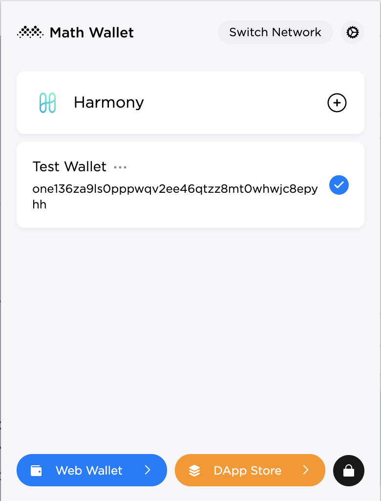
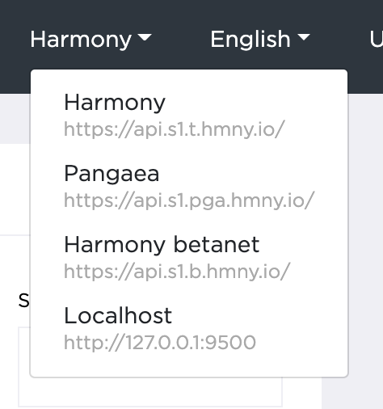

# How to Make Transactions

### How to make a transaction

Make sure you are in the Web Wallet interface. To access the Web Wallet, select the wallet you want to open and click **Web Wallet** on the MathWallet extension popover interface:

After clicking **Web Wallet**, you may be presented with a button that says **Login via MathWallet Browser Extension**. ****Click this button to continue on to the Web Wallet.

Now, to make a transaction:

1. Specify the shard you want to pull funds from using the **Shard** dropdown in the sidebar.
2. Specify which account you want to send funds to using the **To Address** field.
3. Specify which shard you want to send funds to using the **Shard** dropdown to the right.
4. Specify the amount you wish to send in the **Transfer Amount** field.
5. Specify the gas price you wish to pay using the **Fee** slider. _Gas_ is a fee exacted by the network for the computational work of mining a transaction into the blockchain.
6. Click **Transfer** to complete the transaction! You will be shown a transaction receipt before submitting.

### Switching Networks

In the toolbar at the top of the page, there is a dropdown which defaults to **Harmony** where you can specify which network you wish to operate on.

* **Harmony** connects to Harmony's mainnet.
* **Pangaea** connects to [Pangaea, an experimental game designed to test certain aspects of the Harmony network](https://docs.harmony.one/pangaea/).
* **Harmony betanet** connects to Harmony's testnet.
* **Localhost** connects to a [network hosted locally on your machine](https://github.com/harmony-one/harmony/). This endpoint is only active if you are running a local network on your machine.

