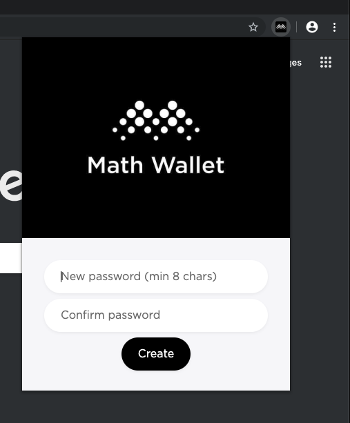
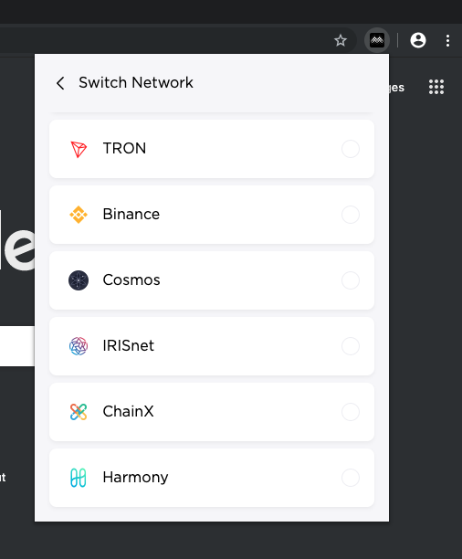
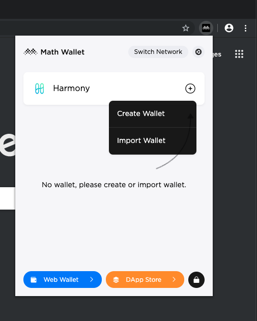

# Setup

## Installation

Access the Google Chrome web store and install the [Math Wallet extension](https://chrome.google.com/webstore/detail/math-wallet/afbcbjpbpfadlkmhmclhkeeodmamcflc?hl=en).

Open the extension in your browser and create new password as it asks.

Select Harmony wallet from the list of networks.

Finally, import your existing wallet using your mnemonic or private key. You can also create a wallet through the extension. For more detail regarding wallet creation and outside of Math Wallet, please refer to our guide on wallet use.

