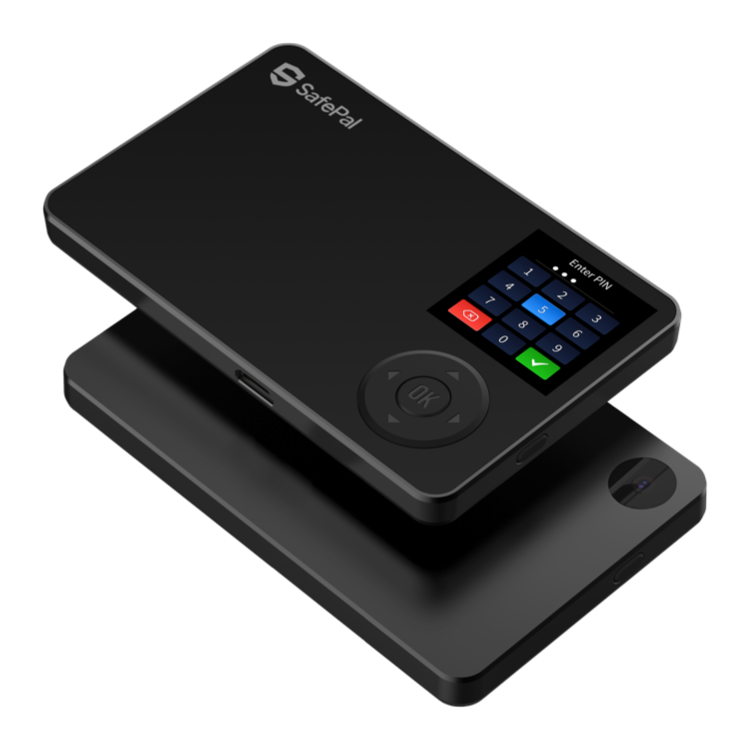
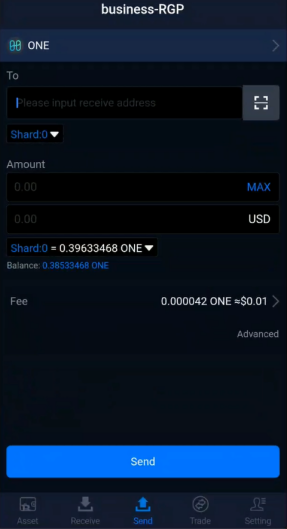
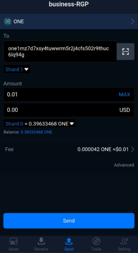
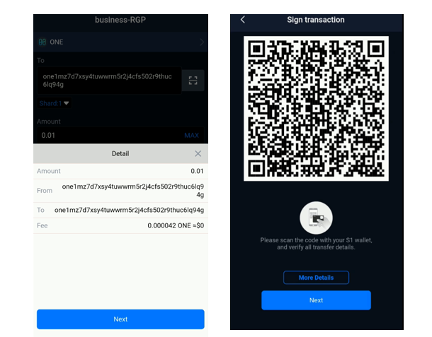
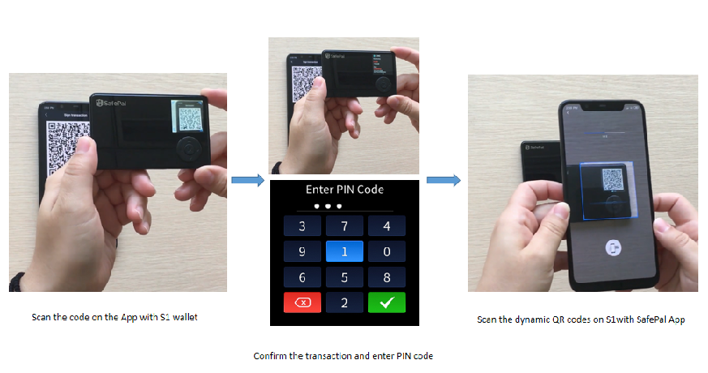

# SafePal

### **SafePal Hardware Wallet**

SafePal is a secure and user-friendly hardware wallet designed for the masses. SafePal S1, its first flagship hardware wallet, adopts multiple layers of security schemes and intuitive user interfaces, enabling users to store, transfer and trade coins in the wallet in the easiest way.

### Download SafePal Mobile Apps

SafePal mobile apps can be downloaded from PlayStore and AppStore following the instructions[ here](https://safepal.io/download).

### Quick Start

Please make sure your SafePal is the latest by following the instructions [here](https://safepal.io/upgrade).

SafePal General user's manual is [here](https://docs.safepal.io/user-manual) and the initial set up guide is [here](https://docs.safepal.io/quick-start/set-up-your-safepal-wallet-within-3-minutes).

## How to send ONE in SafePal？

Step1：Enter 'Send' segment in SafePal App and select ONE coin.

Step2：Input receive address by pasting the address or scanning the QR code. Enter all transfer details - amount, fee level and don't forget to select the shard number.

Step3:Then clink “Send”to check the transaction details.

Tips: If you don't know the exact shard number, don't worry, you can simply use Shard 0 as the default shard.

Step4:Sign the order with your SafePal S1 hardware wallet.

Step5:Confirm the payment.The transfer is broadcasted on chain! Don't forget to check transfer status later!

{% embed url="https://www.dropbox.com/s/uo80rhxy0pnu9sa/SafePal%20Teaser.mp4?dl=0" caption="" %}

## Receiving ONE in SafePal

To receiving ONE token from other wallets, just show your ONE address to any wallet that supports ONE and does the transaction from that wallet. Once the transaction is confirmed, you can see the balance updated in your SafePal mobile app.

Please note that the SafePal S1 hardware wallet won't show the balance since the SafePal S1 hardware wallet is completely offline, it cannot detect any changes to your balance or list of tokens when you receive money or add/delete tokens in the SafePal App. Only after you send some money from the newly added coin and sign the transaction with the S1 hardware wallet, will S1 hardware wallet ‘knows’ there is a new coin added and display it on the screen.

Based on this mechanism, there won’t be any balance shown on S1 wallet, because it won’t be a reliable number, especially when somebody sends you some money.

