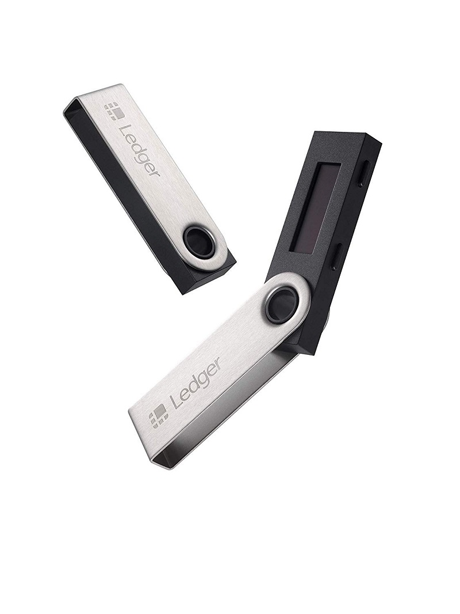

# Ledger

## Ledger Nano S

The Nano S is a hardware wallet created by Ledger. A hardware wallet stores the private keys to Harmony tokens on a separate device, making it much harder for malicious parties to steal them. In fact, the private keys never leave the Nano S itself, so they will remain secure even if the device is connected to a compromised computer. As long as you follow best practices when using your Nano S, it is virtually impossible for an attacker to steal your funds.

