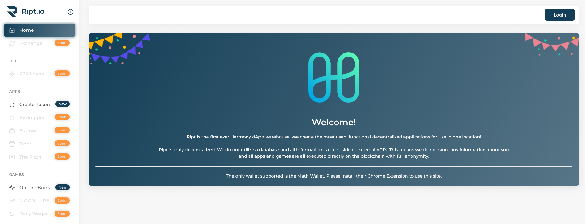

# Applications

## [**Harmony Soccer Players**](https://soccerplayers.demo.harmony.one/)\*\*\*\*

SoccerPlayers is an NFT collectible game deployed on Harmony blockchain. It is like CryptoKitties, but for collecting your favorite soccer player cards. Each soccer player has a unique token as part of a ERC721 smart contract deployed on Harmony blockchain, that are available to buy. All soccer player cards are open in the market all the time, so that anyone can buy. Every purchase increases the card value by 15%, and the seller will make a profit of 13% when their card is bought by others. A 2% commission is paid to the minting account to cover the app maintenance costs. 


This app is built for technology demonstration, and not for commercial purpose. We do NOT own or license the trademarks of any of the digital assets.


## [Harmonauts](https://harmony.one/harmonauts-nft)

Harmonauts is also an NFT collectible game ported from CryptoPunks and built on the Harmony Blockchain. The Harmonauts are 24 pixelated images of Harmony personnel. These are the guys and girls that make Harmony work! The value of Harmonaut depends on the characteristics \(which is our Harmony culture\) it has. Rarer characteristic the Harmonaut has, higher price it will be in the market. There are currently three ways to get the valuable Harmonauts. 

* Initially you can claim it for free based on the "first come first serve" rule.
* Once all the Harmonauts are claimed, you can only buy those are actively on sale from others.
* Another way is to bid on the Harmonauts you want no matter it's on sale or not, the owner will decide which bid to accept. 

Notice you can withdraw the token you have in the smart contract to your ONE wallet anytime. 

## [Good One](http://crowdfunding.s3-website-us-west-1.amazonaws.com/) 

Good One is a simple crowdfunding dApp which will have the ‘minimum’ functionalities that you’d expect from a crowdfunding platform. Basically, one should be able to start crowdfunding projects, and fund them.

* Start Project — we should be able to start a new crowdfunding project, along with setting its details like goal amount, etc
* View Projects — we should be able to retrieve our existing projects’ details and display it
* Fund Project — we should be able to fund an existing project with ONE
* Retrieve Funds — in the case where a project does not meet its goal amount, and is past its deadline, funders should be able to retrieve their contributed funds \(All-or-Nothing setup\)

## [OneMoji](https://peekpi.github.io/onemoji/dist/)\*\*\*\*

_Disclaimer: this game is ported from_ [_Nyftimoji_](https://niftymoji.com/)_, an Ethereum based game, for non-commercial purposes._

You can use 20 $one tokens to mint an emoji token \(HRC 721 token\) using smart contract. The lucky number you input and the block hash will decide which emoji you are going to get from a library of 3,470 emojis. 



## Ript.io

[Ript.io](https://ript.io/) is the first ever Harmony dApp warehouse. We create the most used, functional decentralized applications for use in one location. Ript.io was built by Michael Otis \(Twitter: @OHHHtis\), currently there are 2 dApps available with a dozen more on the way!  

