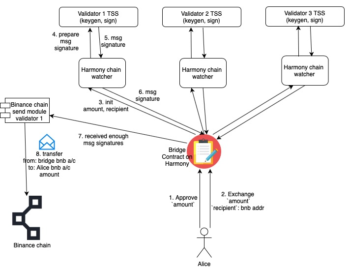
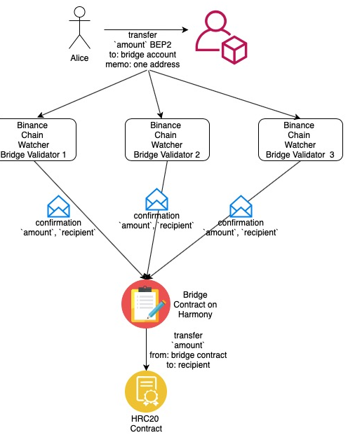

# Cross-Chain

## **SWOOP Dex**

Welcome! The pages that follow contain comprehensive documentation of the SWOOP ecosystem. SWOOP is a fork from Uniswap,  code and documentation is based on [Uniswap](https://uniswap.org/) 🦄 and [SushiSwap](https://sushiswap.org/) 🍣&#x20;

### **How it Works** <a href="#developer-links" id="developer-links"></a>

.png>)

SWOOP is an _automated liquidity protocol_ powered by a constant product formula and implemented in a system of non-upgradeable smart contracts on the Harmony blockchain. It obviates the need for trusted intermediaries, prioritizing **decentralization**, **censorship resistance**, and **security**. SWOOP is **open-source software** licensed under the [GPL](https://en.wikipedia.org/wiki/GNU\_General\_Public\_License).

Each SWOOP smart contract, or pair, manages a liquidity pool made up of reserves of two HRC-20 tokens.

Anyone can become a liquidity provider for a pool by depositing an equivalent value of each underlying token in return for pool tokens.

.png>)

Pairs act as automated market makers, standing ready to accept one token for the other as long as the “constant product” formula is preserved. This formula, most simply expressed as `x * y = k`, states that trades must not change the product (`k`) of a pair’s reserve balances (`x` and `y`). Because `k` remains unchanged from the reference frame of a trade, it is often referred to as the invariant. This formula has the desirable property that larger trades (relative to reserves) execute at exponentially worse rates than smaller ones.

In practice, SWOOP applies a 0.30% fee to trades, which is added to reserves. As a result, each trade actually increases `k`. This functions as a payout to LPs, which is realized when they burn their pool tokens to withdraw their portion of total reserves. In the future, this fee may be reduced to 0.25%, with the remaining 0.05% withheld as a protocol-wide charge.

.png>)

Because the relative price of the two pair assets can only be changed through trading, divergences between the SWOOP price and external prices create arbitrage opportunities. This mechanism ensures that SWOOP prices always trend toward the market-clearing price.

### Project scope

The Uniswap V2 to Swoop migration includes [a total of 10 implementation repositories](https://github.com/harmony-one/?q=swoop\&type=\&language=).

Out of these 10 repositories, six repositories are directly forked from Uniswap:

#### UI/SDK:

* [https://github.com/harmony-one/swoop-interface](https://github.com/harmony-one/swoop-interface) - The interface / UI
* [https://github.com/harmony-one/swoop-sdk](https://github.com/harmony-one/swoop-sdk) - SDK functionality/interaction code
* [https://github.com/harmony-one/swoop-default-token-list](https://github.com/harmony-one/swoop-default-token-list) - Default token list

#### Smart contracts:

* [https://github.com/harmony-one/swoop-core](https://github.com/harmony-one/swoop-core) - Core smart contracts (UniswapV2Factory, UniswapV2Pair, UniswapV2ERC20)
* [https://github.com/harmony-one/swoop-periphery](https://github.com/harmony-one/swoop-periphery) - Periphery smart contracts (UniswapV2Router02.sol etc.)
* [https://github.com/harmony-one/swoop-lib](https://github.com/harmony-one/swoop-lib) - Solidity libraries

Besides the six forked repositories, Swoop also contains four additional repositories:

#### UI/SDK:

* [https://github.com/harmony-one/swoop-utils](https://github.com/harmony-one/swoop-utils) - OneWallet & MathWallet wallet connectors + additional wrappers
* [https://github.com/harmony-one/swoop-cli](https://github.com/harmony-one/swoop-cli) - CLI tools to interact with the deployed factory and router contracts

#### Smart contracts:

* [https://github.com/harmony-one/swoop-misc](https://github.com/harmony-one/swoop-misc) - Multicall & Wrapped ONE smart contracts + additional token testing smart contracts

#### Deployment:

* [https://github.com/harmony-one/swoop-deployment](https://github.com/harmony-one/swoop-deployment) - Deployment scripts & instructions for deploying Swoop on Harmony

### Smart contracts

The original Uniswap V2 contracts were just slightly modified - during the process of porting Swoop we only needed to change some minor differences for customizing the LP token names and symbols as well as updating the init code hash for the _UniswapV2Pair_ contract.

The changes occurred in the following contracts:

#### Core (uniswap/uniswap-v2-core -> harmony-one/swoop-core)

Repository: [https://github.com/harmony-one/swoop-core](https://github.com/harmony-one/swoop-core)

**UniswapV2ERC20.sol**

Name and symbols have been changed from Uniswap V2 and UNI-V2 to Swoop and SWP respectively:

```diff
-    string public constant name = 'Uniswap V2';
-    string public constant symbol = 'UNI-V2';
+    string public constant name = 'Swoop';
+    string public constant symbol = 'SWP';
```

#### Periphery (uniswap/uniswap-v2-periphery -> harmony-one/swoop-periphery)

Repository: [https://github.com/harmony-one/swoop-periphery](https://github.com/harmony-one/swoop-periphery)

**UniswapV2Library.sol**

Package reference was updated:

```diff
-import '@uniswap/v2-core/contracts/interfaces/IUniswapV2Pair.sol';
+import '@swoop-exchange/core/contracts/interfaces/IUniswapV2Pair.sol';
```

Init code hash was updated:

```diff
@@ -21,7 +22,7 @@
                 hex'ff',
                 factory,
                 keccak256(abi.encodePacked(token0, token1)),
-                hex'96e8ac4277198ff8b6f785478aa9a39f403cb768dd02cbee326c3e7da348845f' // init code hash
+                hex'e3c4d7c2f0f0eb6af0a666a9b54ea1196dd3676e4e4b696af853d8951f807cc5' // init code hash
             ))));
     }
```

**UniswapV2Router02.sol**

Package references were updated:

```diff
-import '@uniswap/v2-core/contracts/interfaces/IUniswapV2Factory.sol';
-import '@uniswap/lib/contracts/libraries/TransferHelper.sol';
+import '@swoop-exchange/core/contracts/interfaces/IUniswapV2Factory.sol';
+import '@swoop-exchange/lib/contracts/libraries/TransferHelper.sol';
```

The above were the only changes that needed to be carried out on the smart contract level when porting the original Uniswap V2 contracts since Harmony is fully EVM-compatible.

For detailed diffs between the Uniswap V2 contracts and the Swoop contracts, [please see more details here](https://github.com/harmony-one/swoop-deployment/tree/main/diff).

**Misc contracts (non-Uniswap)**

Due to migrating Uniswap to a new chain we also had to port some peripheral (non Uniswap) related contracts:

* [MakerDAO's multicall.sol](https://github.com/makerdao/multicall) ([contract ported here](https://github.com/harmony-one/swoop-misc/blob/master/contracts/required/Multicall.sol))
* [Wrapped Ether (wETH)](https://github.com/makerdao/sai/blob/master/src/weth9.sol) ([contract ported here](https://github.com/harmony-one/swoop-misc/blob/master/contracts/required/WONE.sol))

The two contracts above are required to be deployed in order to fully be able to fork Uniswap to Harmony.

The entire deployment process for deploing Swoop on Harmony has been documented [here](https://github.com/harmony-one/swoop-deployment).

### dApp / Interface (UI) / SDK:s & libraries

The major work with porting Swoop happened at the UI and SDK/library level.

#### Interface ([uniswap/uniswap-interface](https://github.com/Uniswap/uniswap-interface) -> [harmony-one/swoop-interface](https://github.com/harmony-one/swoop-interface))

[Porting the interface](https://github.com/harmony-one/swoop-interface/compare/6c3560e5d7ff9bad74a2e687345608d8f4aea213...e1f299f6c1fee345173eca2e2f76d94b2a21f299) resulted in by far the most amount of work compared to all of the other repositories.

**Ethers.js -> harmony-js/core**

Uniswap V2 relies on [ethers.js](https://github.com/ethers-io/ethers.js/) which currently does not work with Harmony due to Harmony being a sharded blockchain. Harmony is actively working on a wrapper library that will hopefully be available soon.

Due to the usage of ethers.js all smart contract interactions had to be changed from an ethers.js-style interaction flow to use [harmony-js/core](https://github.com/harmony-one/sdk) instead. Harmony-js/core (JS SDK) is partially designed after web3.js, so if Uniswap V2 would've been implemented using web3.js the changes wouldn't have been as drastic.

Due to the migration from ethers.js to harmony-js/core, all of the smart contract interactions had to be changed from e.g:

```javascript
    return tokenContract
      .approve(spender, useExact ? amountToApprove.raw.toString() : MaxUint256, {
        gasLimit: calculateGasMargin(estimatedGas)
      })
      .then((response: TransactionResponse) => {
        addTransaction(response, {
          summary: 'Approve ' + amountToApprove.currency.symbol,
          approval: { tokenAddress: token.address, spender: spender }
        })
      })
      .catch((error: Error) => {
        console.debug('Failed to approve token', error)
        throw error
      })
```

To e.g:

```javascript
return tokenContract.methods
      .approve(spender, useExact ? amountToApprove.raw.toString() : MaxUint256.toString()).send(gasOptions)
      .then((response: any) => {
        addTransaction(response, {
          summary: 'Approve ' + amountToApprove.currency.symbol,
          approval: { tokenAddress: token.address, spender: spender }
        })
      })
      .catch((error: Error) => {
        setApproveTxSent( false)
        console.debug('Failed to approve token', error)
        throw error
      })
```

Due to replacing ethers.js to harmony-js/core we also ran into some issues with various parameter **** issues (numbers sent as string vs hex etc.) that has since been patched in harmony-js/core.

**Wallets - MetaMask/web3-react -> custom OneWallet & MathWallet code**

Harmony isn't currently compatible with MetaMask, neither do we currently have our own version of web3-react (but it's currently being worked on).

Because of this we had to replace the [web3-react](https://github.com/NoahZinsmeister/web3-react) code in Uniswap with custom wallet connectors for [OneWallet](https://github.com/harmony-one/swoop-utils/blob/master/src/wallets/oneWallet.ts) & [MathWallet](https://github.com/harmony-one/swoop-utils/blob/master/src/wallets/mathWallet.ts).

We're hoping to have our own version of [web3-react](https://github.com/NoahZinsmeister/web3-react) available soon.

**Miscellaneous changes**

Besides the work on replacing the ethers.js smart contract interaction code with the harmony-js/core equivalent version as well as replacing web3-react with custom wallet code, we also had to change the following in the interface code base:

* Token references (both addresses and names)
* ChainID references
* Package references
* Parameter and result formatting
* Certain interaction flows (which were tailored to the use of MetaMask and similar wallets)
* \+ a bunch of other things - [see this commit comparison for more details](https://github.com/harmony-one/swoop-interface/compare/6c3560e5d7ff9bad74a2e687345608d8f4aea213...e1f299f6c1fee345173eca2e2f76d94b2a21f299).

**SDK (**[**uniswap/uniswap-sdk**](https://github.com/Uniswap/uniswap-sdk) **->** [**harmony-one/swoop-sdk**](https://github.com/harmony-one/swoop-sdk)**)**

[Porting the Uniswap SDK to Swoop SDK](https://github.com/harmony-one/swoop-sdk/compare/553fcb1a7f1c7942b2444886a6122fc731588a04...b00c4dbcfcfb8bd0681ce85d9b7643606d14d12d) mostly revolved around replacing the deployed factory and router addresses, changing references from ETHER to HARMONY, using @harmony-js/core's ChainID for ChainID references as well as replacing WETH references and addresses with the WONE counterpart.

#### Default token list ([default-token-list](https://github.com/Uniswap/default-token-list) -> [harmony-one/swoop-default-token-list](https://github.com/harmony-one/swoop-default-token-list))

[Porting the Uniswap default token list](https://github.com/harmony-one/swoop-default-token-list/compare/16a5273fce7756784185bade525be266406b0155...5baa95addac5b6717ba3aa4c4b3dd94ab3ab7f53) was mostly about replacing Ethereum tokens to tokens deployed on Harmony.

#### Utils (not forked)

The [swoop-utils](https://github.com/harmony-one/swoop-utils) repository was created in order to externalize the wallet connectors as well as a wrapper client library for interacting with harmony-js/core.

#### CLI (not forked)

The [swoop-cli](https://github.com/harmony-one/swoop-cli) repository was created in order to perform ad-hoc testing of the factory and router contracts. This was extremely helpful when debugging certain edge cases, both on a contract and a interface level.

#### Deployment (not forked)

The original Uniswap V2 code base does not include code to deploy the smart contracts. Since Harmony also utilizes a custom deployment setup, using either Truffle with a custom provider or directly using harmony-js/core, [the swoop-deployment repository](https://github.com/harmony-one/swoop-deployment) was also created.

Besides the required deployment scripts needed to deploy the project the repository also features a step-by-step guide for how to deploy the entire protocol - from smart contracts to the UI.

### Lessons learned

During the process of porting Uniswap to Harmony we learned how fast Uniswap can be with 5-second finality and how cheap it is for users to interact with the protocol.

We learned that our tooling is robust enough to port a dApp like Uniswap, but that we need to work towards a more feature complete toolset with wrappers for ethers.js and web3-react.

Due to our work on porting Uniswap we've realized the need for accelerating this process and we're currently actively working on these tools in order to provide an awesome dApp development environment for developers looking to build on Harmony.

### Reference materials <a href="#reference-materials" id="reference-materials"></a>

Notion page: [https://www.notion.so/harmonyone/SWOOP-Cross-chain-DEX-Uniswap-3f58e623da28455aaa3fc7b6da7a446f](https://www.notion.so/harmonyone/SWOOP-Cross-chain-DEX-Uniswap-3f58e623da28455aaa3fc7b6da7a446f)

### Developer community

Join the SWOOP developer community on [Telegram](https://t.me/swoopxchaindex).

### **Disclaimer note**

This project is a tech demo in beta. You understand and expressly accept that the beta version of SWOOP is provided to you at your own risk on an “AS IS” and “UNDER DEVELOPMENT” basis. THE DEVELOPERS OF SWOOP MAKE NO WARRANTY WHATSOEVER WITH RESPECT TO THE BETA DEMO, INCLUDING ANY (A) WARRANTY OF MERCHANTABILITY; (B) WARRANTY OF FITNESS FOR A PARTICULAR PURPOSE; (C) WARRANTY OF TITLE; OR (D) WARRANTY AGAINST INFRINGEMENT OF INTELLECTUAL PROPERTY RIGHTS OF A THIRD PARTY; WHETHER ARISING BY LAW, COURSE OF DEALING, COURSE OF PERFORMANCE, USAGE OF TRADE, OR OTHERWISE.

Nationals and residents of the following countries are restricted from participation: Afghanistan, Cuba, Democratic Republic of the Congo, Guinea-Bissau, Iran, Iraq, Lebanon, Libya, Myanmar, North Korea, Somalia, Sudan, Syria, Yemen, Zimbabwe, and the Crimea region of Ukraine.

The project is operated by Pangaea Community around the globe and Hemenglian Technology outside the United States.

## Demeter (Synthetix)

Demeter is a decentralized synthetic asset issuance protocol allowing users to long & short exposure to any asset class (DeFi index, BTC/ETH/Link, forex, equities, commodities) without bridges, with binary options as derivatives.

**See:** [**code**](https://github.com/harmony-one/harmony-harvest.contract)

## Binance Chain Bridge

Harmony-Binance is a bridge with smart routing and Binance as the trading partner with 100+ BNB assets on this cross-chain decentralized exchange.

### **How it Works**

Any external validator can participate on by fulfilling bridge transactions. Sending tokens from Harmony Chain to Binance Chain is done by locking tokens on Harmony Chain via a smart contract, at which point the same number of tokens are minted on Binance Chain. Differently from other bridges that use a collateral-based system, there is no pre-minting of tokens on this bridge, instead they are minted (on the-fly) once the tokens are locked on Harmony side. Users can later redeem tokens by burning them and unlocking the original tokens on Harmony Chain.

Differently from other bridge implementations, we don't use block relayers, instead the bridge validators act like event relayers (relaying transfer events that happen on each side). On this bridge, two new concepts are being used:

1. **Multi-signature**: Binance to Harmony transactions are approved by multiple validators.
2. **Threshold Signature Scheme (TSS)**: a set of validators participate in a multi-party computation (MPC) ceremony to generate a common secret that could be used to securely fulfil Harmony to Binance transactions.

#### **Harmony ⇒ Binance**

Here we are using Threshold Signature Scheme (TSS).

* User approves an exchange transaction that transfers 'x' HRC20 tokens to the bridge contract.
* Same set of bridge validators listen to this event and initiate a TSS process to generate and send their signatures to the bridge manager. At the end of the TSS process, any validator can send a BNB transaction to transfer 'x' BNB tokens from bridge BNB account to user BNB account. This is secured by secret reveal at the end of TSS process.



#### Binance ⇒ Harmony

* User will transfer 'x' BNB tokens to bridge BNB account.
* The above transfer is captured by the bridge validators who are constantly listening. The validators then prepare a confirm message and send it to Bridge contract on harmony.
* The multisig logic is in the bridge contract that requires a threshold number of signatures from validators to trust the transfer that happened on BNB side and unlock funds on harmony to user account. This threshold could be like 2 out of 3 validators.



**See:** [**code**](https://github.com/gupadhyaya/binance-chain-bridge/)**,** [**community**](https://t.me/joinchat/P0DVklMjTLdxzQDw-vv70A)****

## **Iris Bridge**&#x20;

Iris Bridge is a fully permissionless, trustless, decentralized bridge on Harmony for ALL ERC20 tokens. It employs an Ethereum light client on Harmony using Solidity.

**See:** [**code**](https://github.com/JackyWYX/harmony\_rainbow)**,** [**light client**](https://github.com/rlan35/ethClient/tree/master)****

## **BTC Bridge**

Building a bridge between Bitcoin-like blockchains with Harmony blockchain to unlock the assets such as BTC, BCH, LTC to Harmony.

### Method

* Build BTC relay and SPV client from Summa on the Harmony network, so that dApp builder can build on top it.
* Work with [Keep network](https://keep.network/#team) to add support of the Harmony chain in Keep nodes. This collaboration can bring in tBTC/hBTC support on the Harmony network.
* Explore collaboration with [Aleph Zero](https://alephzero.org/) to bring threshold ECDSA onto Harmony node so that the Harmony network can be used to generate trustless accounts to bridge multiple blockchains.
* Build a portal to wrap all bitcoin-like blockchain such as LTC/BCH/BSV into Harmony blockchain. Those blockchains can use Harmony as a portal to the entire Ethereum DeFi ecosystem via the Dex.
* Stretch technical goal is to expose VDF as on-chain primitive for randomness, which is a key component for security (used by Keep)

### Links

* [https://github.com/keep-network](https://github.com/keep-network)
* [https://github.com/summa-tx](https://github.com/summa-tx)
* [https://github.com/bcoin-org](https://github.com/bcoin-org)
* [https://github.com/LeoHChen/playground/tree/master/go/btcrelay](https://github.com/LeoHChen/playground/tree/master/go/btcrelay)
* TBTC whitepaper: [https://docs.keep.network/tbtc/index.pdf](https://docs.keep.network/tbtc/index.pdf)
* BTC SPV on Ethereum: [https://medium.com/summa-technology/cross-chain-auction-technical-f16710bfe69f](https://medium.com/summa-technology/cross-chain-auction-technical-f16710bfe69f)
* [https://dapp.test.tbtc.network/](https://dapp.test.tbtc.network/)
* [https://medium.com/@nickgrego/step-by-step-guide-for-installing-both-ecdsa-beacon-nodes-on-vps-with-100-voucher-db930ab2a667](https://medium.com/@nickgrego/step-by-step-guide-for-installing-both-ecdsa-beacon-nodes-on-vps-with-100-voucher-db930ab2a667)
