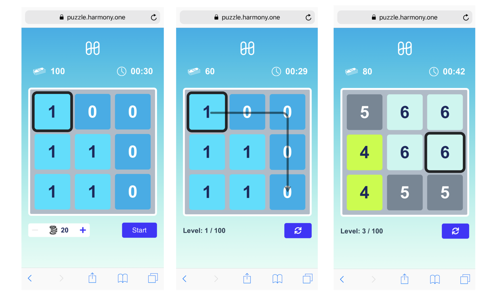

# Harmony Puzzle

The Harmony Puzzle game challenges players to solve 100 levels of gameplay ([see video introduction](https://www.youtube.com/watch?v=zU\_LhrDcQyM)). Players' moves are registered as transactions on the Harmony blockchain serving as an immutable record of their score.&#x20;

The puzzle was originally featured during Harmony’s IEO launch on Binance in 2019 where it reached over 81,000 users. Users of the Harmony Puzzle will experience first-hand Harmony’s 2-second finality time and near zero transaction fees.

The Harmony Puzzle's [Android app](https://github.com/harmony-one/android-puzzle) is open sourced on our Github. &#x20;

