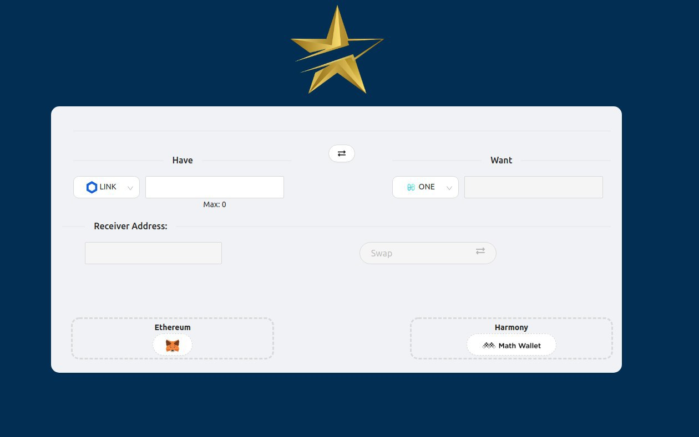
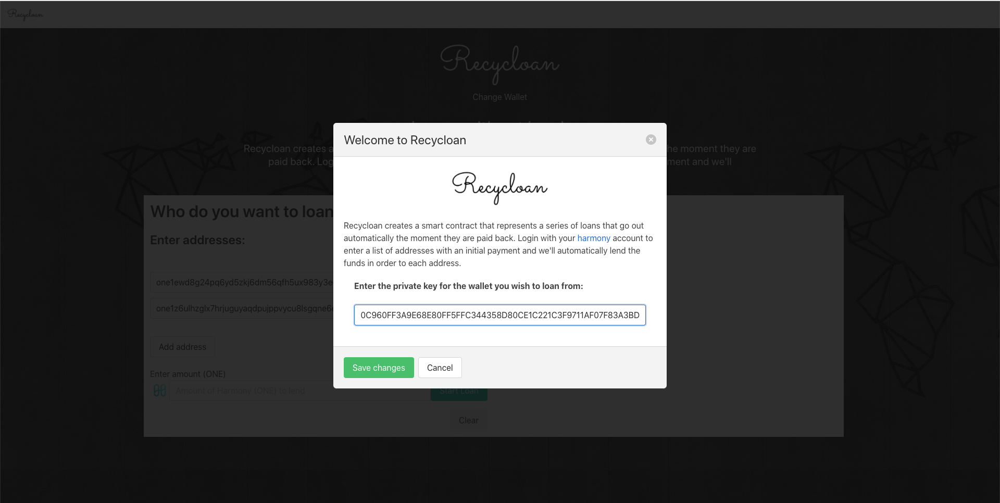
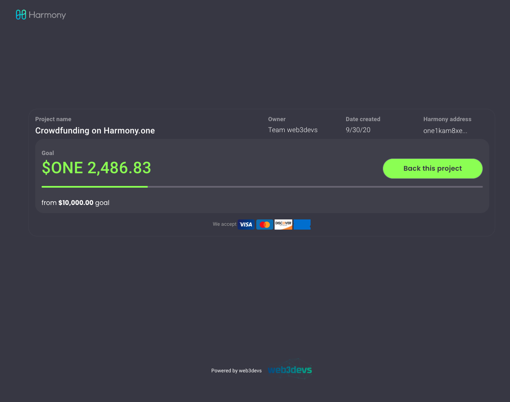
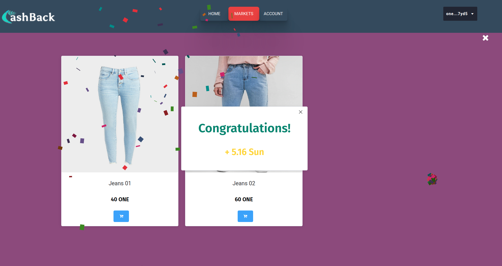
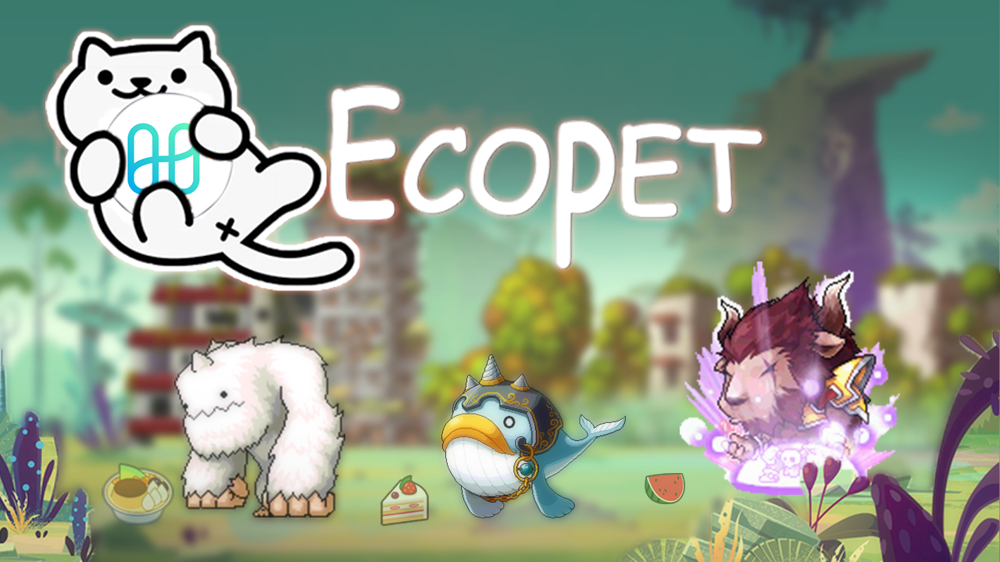
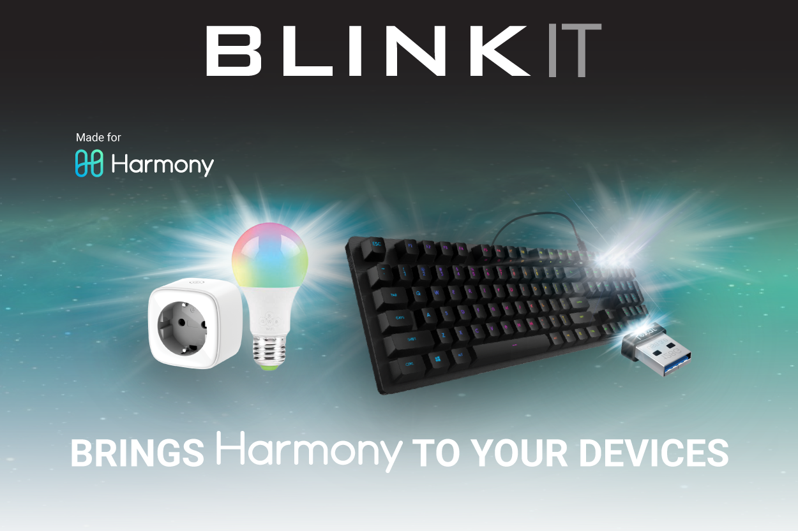

# DevPost

## [GoldenStarSwap](https://devpost.com/software/harmony-cosmos-cross)

An Ethereum-Harmony cross-chain swap dapp that uses Chainlink Price Feeds to swap ETH or ERC-20 tokens into the native Harmony token ONE. Goldenstar is built on three main modules including EthBridge, HmyBridge, and Relayer. In which the pricing of exchange tokens used through Oracle Chainlink is on Ethereum and Harmony.

## [0Games Evolution](https://devpost.com/software/0games-evolution)

"0Games is a peer-to-peer 0% fee CD Keys crypto-marketplace."

## [Recycloan](https://devpost.com/software/recycloan)

"Microlending for disadvantaged entrepreneurs without access to credit."

## [Fund My Harmony Project](https://devpost.com/software/web3devs-unisend-money-transfer-project)

"We would like to make it easier for hackers to finish these amazing projects without explaining how to get HarmonyOne. Allowing our friends and family to use their traditional payment method of a credit card to help with the funding of the project. Essentially we created a fiat gateway using traditional credit card payments."

## [CashBack](https://devpost.com/software/cryptopet)

"Defi flourishes on the Ethereum platform, but it comes with limitations that eth has not been able to overcome: transaction validation time and transaction fees are too high. The peak times of transaction costs on Uniswap went up to $ 50 just to transfer $ 10. Harmony has improved on those two and could be the perfect place for building Defi applications. Therefore we want to build a new Defi application on Harmony platform with a completely new concept inheriting the idea of lending and borrowing."

## [Olifant](https://devpost.com/software/shofar)

"Inspired by crowdfunding apps such as Kickstarter and Indiegogo, we have built a crowdfunding app, Olifant, with Blockchain Harmony technology, which allows investors to directly donate cryptocurrency to crowdsoured projects. Olifant is built for mobile devices and currently supports ONE as its main currency."

## [Ecopet](https://devpost.com/software/ecopet-1iorbs)

"Inspired by kids saving money, the tokens will also be saved and kept by a virtual pet. At first, the dapp only stops saving money on pets, later on these savings can be used to invest in financial investment funds."

## [Pay It Forward Chain](https://devpost.com/software/pay-it-forward-962ag3)

"I want to build an application which gives power to individuals to request resources provided by charities like Food Bank or non-profit organizations. Meanwhile, those charities could manage their resources, including donations and volunteers, using the application. As a volunteer, donor, or low-income worker, I wish I can trade my kindness for something whenever and wherever I need them, e.g, an online course, a piece of craftwork, instead of feeling guilty. Furthermore, I wish my kindness could be traced and acknowledged by society."

## [King's Coin](https://devpost.com/software/king-s-coin)

"**Voucher IDR (VIDR)** is a voucher for digital product in Indonesia. It is HRC20 token based on stablecoin RUPE in harmony blockchain."

## [Blinkit](https://devpost.com/software/blinkit-ephtol)

"Blinkit goals are to notify you with light and sound when blockchain action are detected. The supported devices that can be blinked are widely available and preferable inexpensive. The project is opensource and there is a big chance you already have a supported device at home that you can upcycle and give a crypto purpose with the use of Blinkit!"

