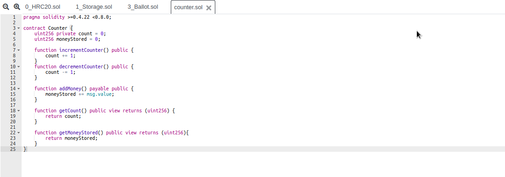
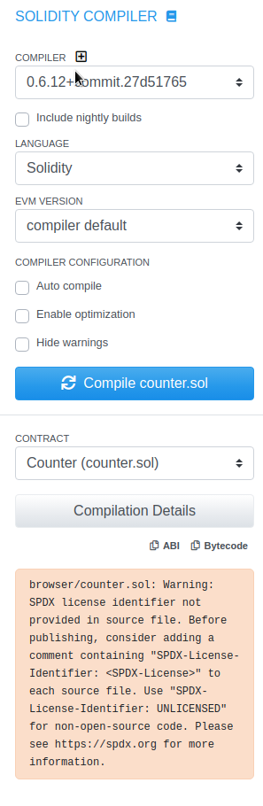

# Deployment using Remix

### Remix IDE Harmony

Open Harmony Remix IDE in your browser: [http://ide.harmony.one/](http://ide.harmony.one/). 

### Writing your Smart Contract

On opening the IDE, in the left panel, click the "+" icon to create a new solidity file:


Now click on the new file in the navigation panel, if not opened already. Now start writing your code in the window opened on the right hand side. For this demo we are going to use a simple counter smart contract:



Following is the code used in the demo image above:

```javascript
pragma solidity >=0.4.22 <0.8.0;

contract Counter {
    uint256 private count = 0;
    uint256 moneyStored = 0;

    function incrementCounter() public {
        count += 1;
    }
    function decrementCounter() public {
        count -= 1;
    }

    function addMoney() payable public {
        moneyStored += msg.value;
    }

    function getCount() public view returns (uint256) {
        return count;
    }

    function getMoneyStored() public view returns (uint256){
        return moneyStored;
    }
}
```

### Compiling

In the left navigation bar select "Solidity Compiler". In the new window choose the solidity version and modify other settings if required. Finally click on the Compile button to compile your solidity code:



### Deployment

After successful compilation, go the the navigation panel once again, and click on thr "Harmony" button. Now in the new panel, select the network to deploy on, and choose and connect to your desired wallet. For this demo we are using Math Wallet. Now click on "Deploy" to deploy your smart contract to Harmony Network:


### Congratulations

You have now successfully deployed your smart contract on harmony network!

