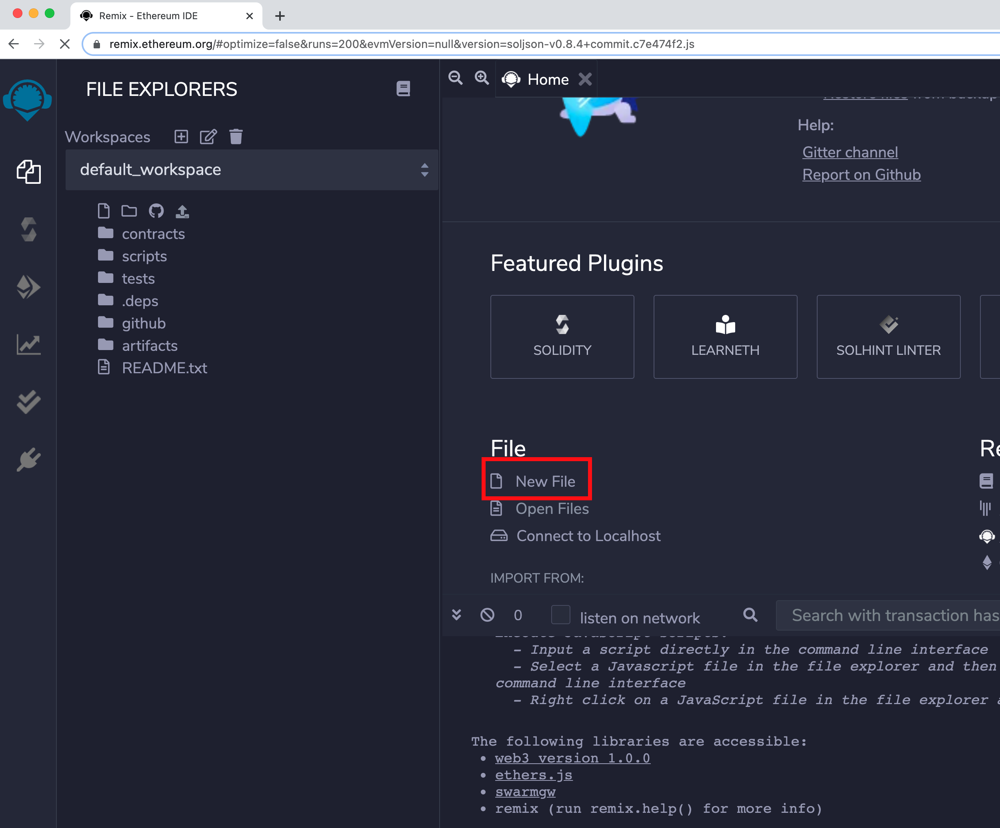

# Deploying HRC20

#### Create your own HRC20 token

Let us first create a simple HRC20 token with name "Gold" and symbol "GLD" with default 18 decimals.

1\. Launch [Remix](https://remix.ethereum.org) and create a new file with name GLDToken.sol and copy paste the code below.



```
// contracts/GLDToken.sol
// SPDX-License-Identifier: MIT
pragma solidity ^0.8.0;

import "@openzeppelin/contracts/token/ERC20/ERC20.sol";

contract GLDToken is ERC20 {
    constructor(uint256 initialSupply) ERC20("Gold", "GLD") {
        _mint(msg.sender, initialSupply);
    }
}
```

2\. Compile the GLDToken.sol

.png>)

3\. Deploy the GLDToken.sol

.png>)

4\. Interacting with the deployed GLDToken.

.png>)

5\. Changing decimals from default 18 to e.g., 16 can be done by adding the following function to GLDToken.sol file and repeating steps 2-4.

```
function decimals() public view virtual override returns (uint8) {
    return 16;
}
```

6\. Deploying a Preset HRC20 contract: A preset HRC20 contract allow for token minting, stop all token transfers (pause), and allow holders to burn their tokens. More info [here](https://docs.openzeppelin.com/contracts/4.x/erc20#Presets). Copy and paste the code below to your GLDToken.sol and repeat the steps 2-4.

```
// contracts/GLDToken.sol
// SPDX-License-Identifier: MIT
pragma solidity ^0.8.0;

import "@openzeppelin/contracts/token/ERC20/presets/ERC20PresetMinterPauser.sol";

contract GLDToken is ERC20PresetMinterPauser {
    constructor(uint256 initialSupply) ERC20PresetMinterPauser("Gold", "GLD") {
        _mint(msg.sender, initialSupply);
    }
}
```

