# Indexing HRC20 with Envio

The goal of this tutorial is to easily create an indexer that tracks and analyzes all LINK token transfers on Harmony by extracting the `Transfer (index_topic_1 address from, index_topic_2 address to, uint256 value)` logs emitted by the LINK contract. This enables real-time insights into metrics such as the largest LINK token transfers.

## Prerequisites

Before we start indexing, you'll need to make sure you have the [prerequisites](https://docs.envio.dev/docs/getting-started) installed.

## Initializing an Indexer

Now that you’re all set up and have installed the prerequisite packages required, let’s jump into the practical steps of initializing the indexer and generating a boilerplate index to index the largest LINK token transfers on Harmony.

1. Open your terminal in an empty repository and run the command `envio init`.

<figure><figcaption></figcaption></figure>

2. Name your indexer anything you’d like (e.g. `harmony-hrc20-transfer`).

<figure><figcaption></figcaption></figure>

3. Choose a preferred language, select `Contract Import`, and import from `Local ABI`.

> Note: Indexers on Envio can be written in JavaScript, TypeScript, or ReScript. For this demonstration, we’ve chosen to use TypeScript as the preferred language.

> Note: For the Contract Import feature, the `Block Explorer` option currently only supports networks with Etherscan. If the network doesn't have Etherscan, you can proceed using the `Local ABI` option. Choosing `Local ABI` option will allow you to point to a JSON file containing the smart contract ABI. The Contract Import process will then populate the required files from the ABI.

<figure>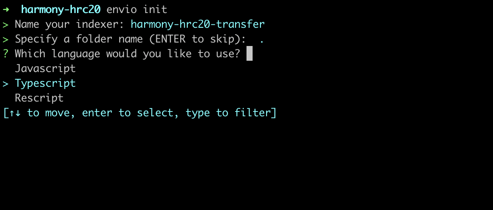<figcaption></figcaption></figure>

<figure>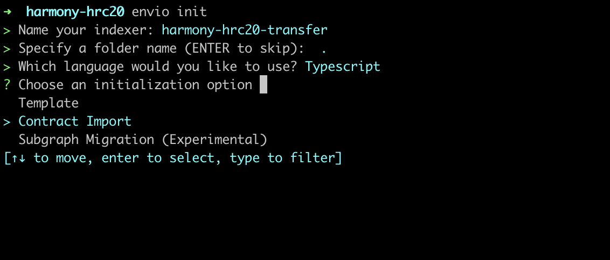<figcaption></figcaption></figure>

<figure>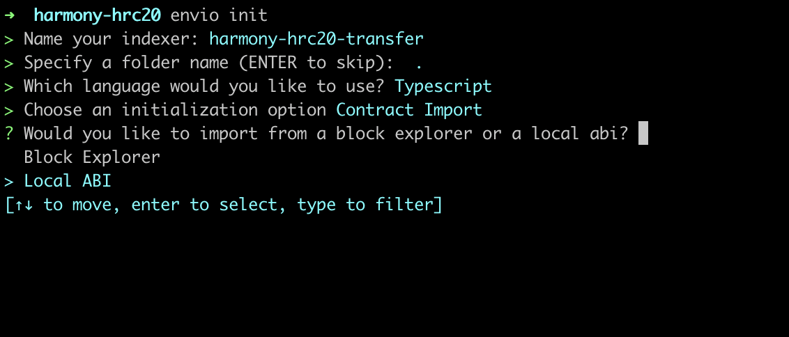<figcaption></figcaption></figure>

4. Head over to the [Harmony Explorer](https://explorer.harmony.one/), and save the ABI code from the LINK smart contract address as a file in the current working directory. For this demonstration, we've chosen to name the ABI file "abi.json". Specify the directory of JSON file containing ABI, for example `abi.json`.

LINK Token Contract address: [0x218532a12a389a4a92fc0c5fb22901d1c19198aa](https://explorer.harmony.one/address/0x218532a12a389a4a92fc0c5fb22901d1c19198aa)

<figure>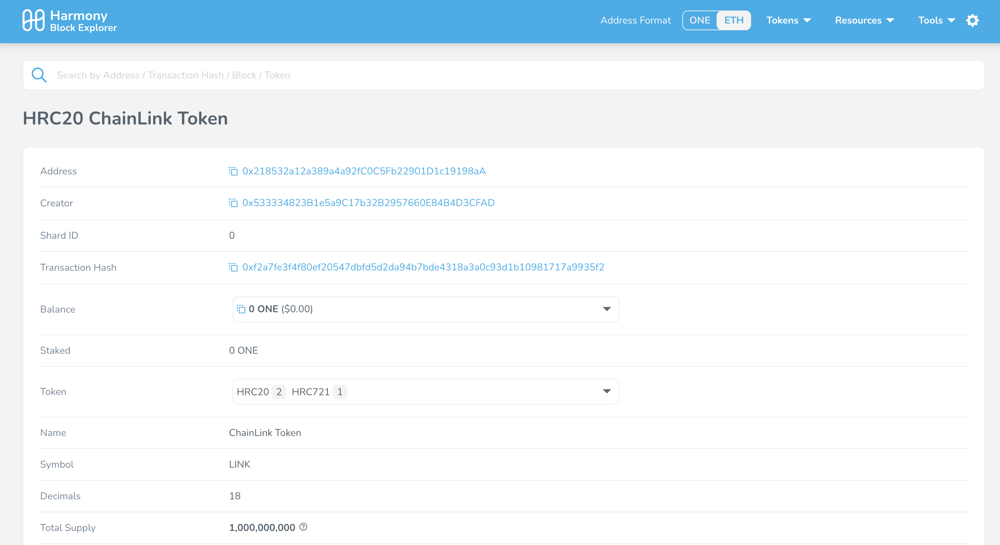<figcaption></figcaption></figure>

<figure>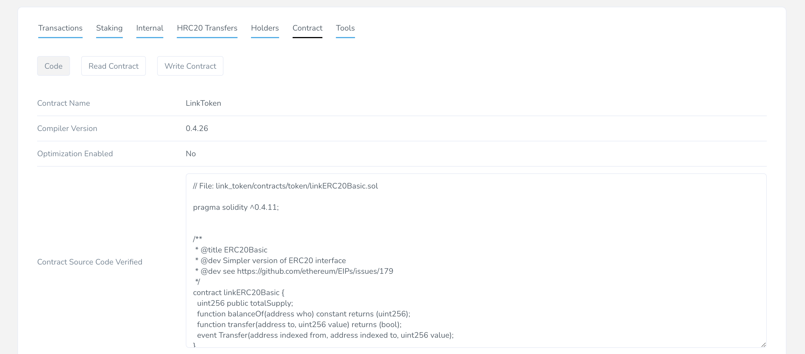<figcaption></figcaption></figure>

<figure>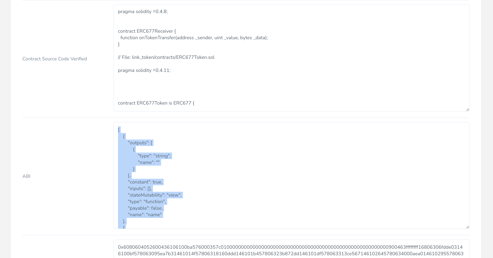<figcaption></figcaption></figure>

<figure>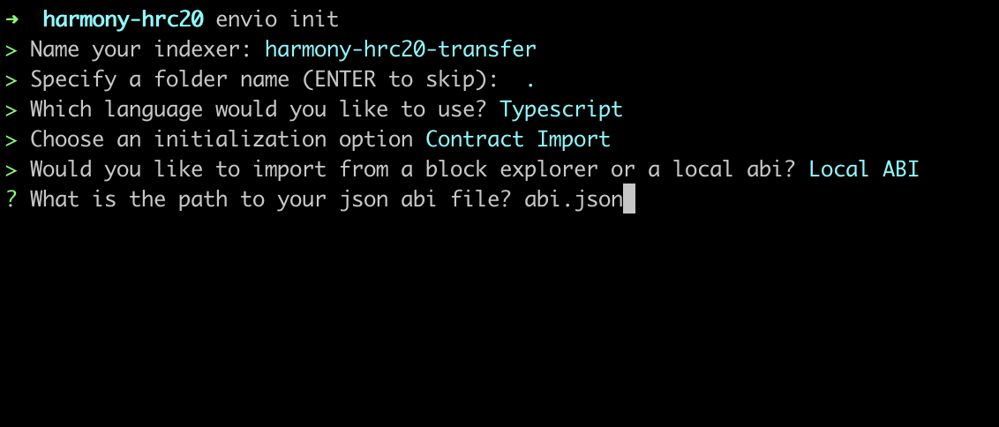<figcaption></figcaption></figure>

5. Select the events you would like to index. In this case, we’ll be indexing the `transfer` event.

> Note: Multiple events can be selected and indexed at the same time.

<figure>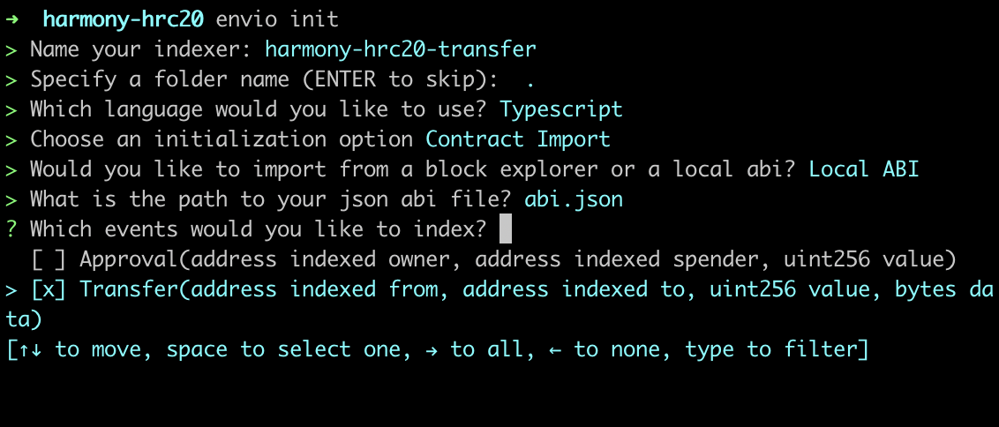<figcaption></figcaption></figure>

6. Specify the chain the contract is deployed on, the name of the contract, and the address.

> Note: If you are using a proxy contract with an implementation, the address should be for the proxy.

<figure>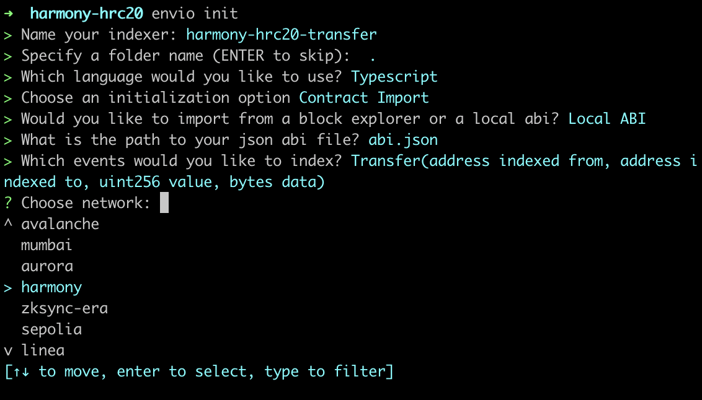<figcaption></figcaption></figure>

<figure>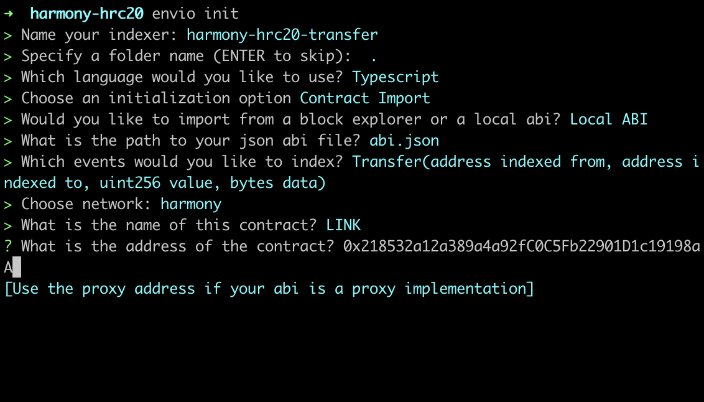<figcaption></figcaption></figure>

7. Finally, review the configuration and select `I’m finished` to start generating the indexer.

<figure>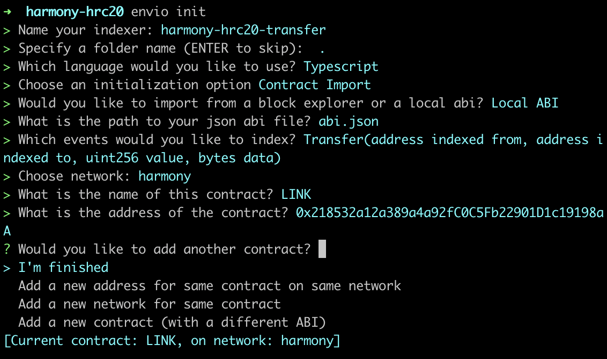<figcaption></figcaption></figure>

## Starting the Indexer

Now, let's run our indexer locally by running `envio dev` command.

<figure><figcaption></figcaption></figure>

## Overview of Generated Code

Once that’s all done we can take a peek at the files generated by Envio in our source-code editor, in this example, we’re using [VS Code](https://code.visualstudio.com/) (Visual Code Studio).

1. **config.yaml**

This file defines the network, start block, contract address, and events we want to index on Harmony.

<figure>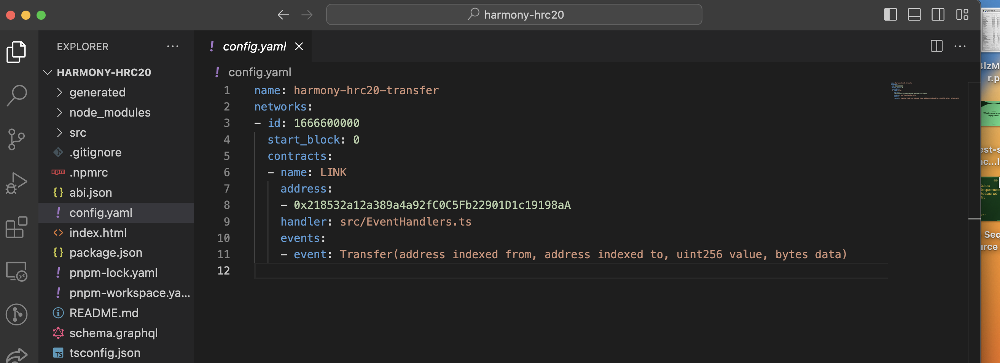<figcaption></figcaption></figure>

2. **Schema.graphql**

This file saves and defines the data structures for selected events, such as the `transfer` event.

<figure>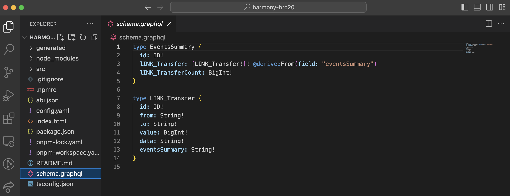<figcaption></figcaption></figure>

3. **event-handler**

This file defines what happens when an event is emitted and saves what code is going to run, allowing customization in data handling.

<figure>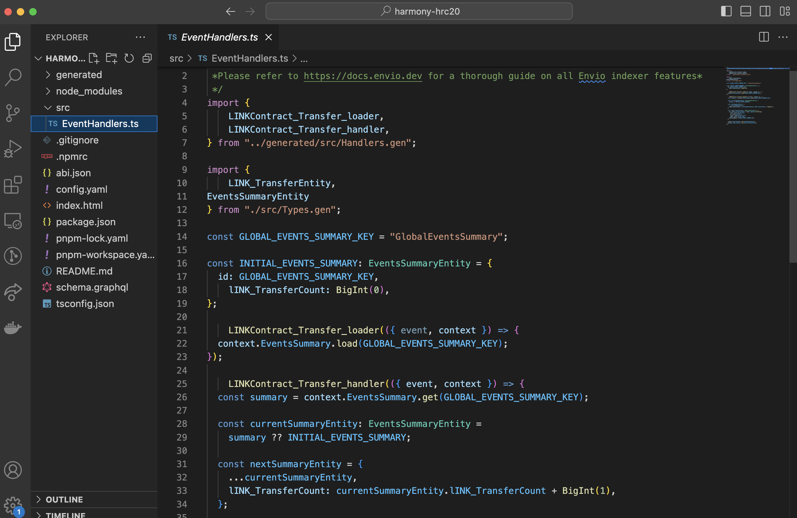<figcaption></figcaption></figure>

## Exploring the Indexed Data

Well done, now let’s explore the indexed data. Your browser would have opened a local Hasura console at [http://localhost:8080/console](http://localhost:8080/console)

1. Head over to the Hasura console, type in the admin-secret password `testing`, and click “API” in the above column to access the GraphQL endpoint to query real-time data.

<figure>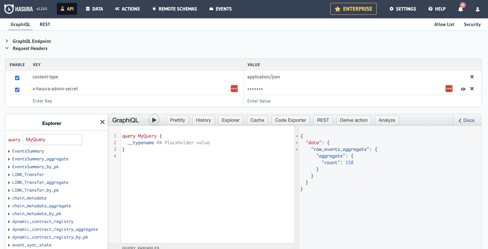<figcaption></figcaption></figure>

2. Navigate to “Data” in the above column to monitor the indexing progress on Harmony through the events sync state table to see which block number you are on.

<figure><figcaption></figcaption></figure>

3. Explore the "LINK\_Transfer" table to explore details such as amount, senders, recipients and values.&#x20;

<figure><figcaption></figcaption></figure>

4. Finally let’s analyze some events. Simply head back to “API” in the above column. From there you can run a query-specific event, in this example "LINK\_Transfer" to explore details such as amounts, senders, recipients and values.

_Once you have selected your desired events run the query by clicking the play button ( ▶️) to gain access to the real-time indexed data._

<figure>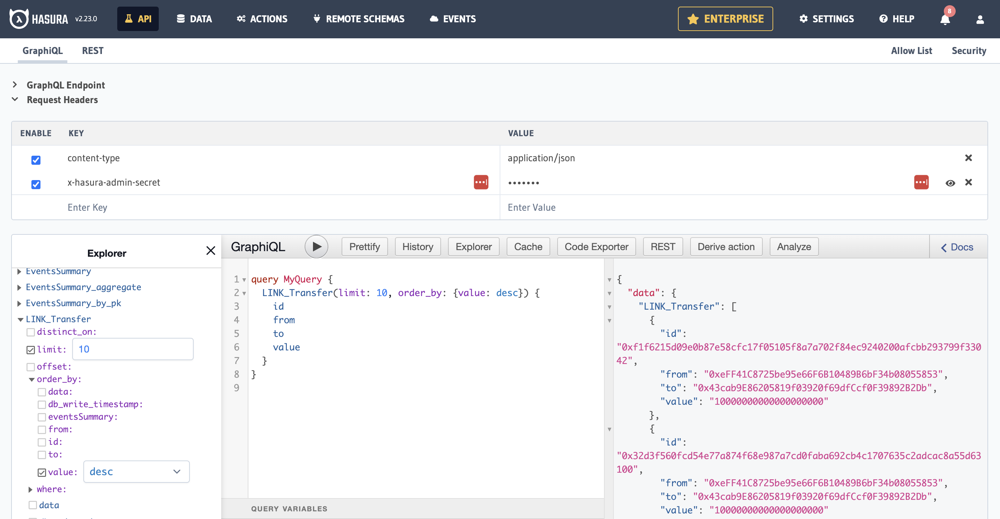<figcaption></figcaption></figure>

**For example:**

Let’s look at getting 10 `Link_Transfer` events, and order them by the amount we would like to appear first (in this case: desc = largest amount), who it’s from, who it’s to, and the value being transferred.

You can now run queries to explore specific events, such as the largest LINK transfers.

If you want to index more than just `transfer` events, such as holders and balances, you can select `Erc20` template option after running `envio init` command.
