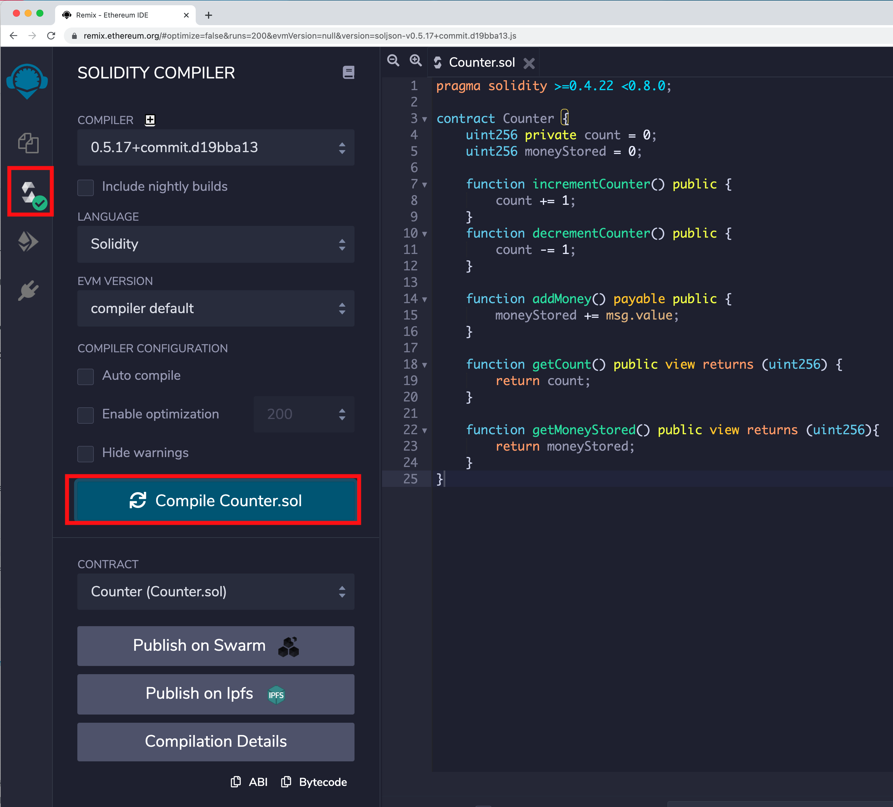
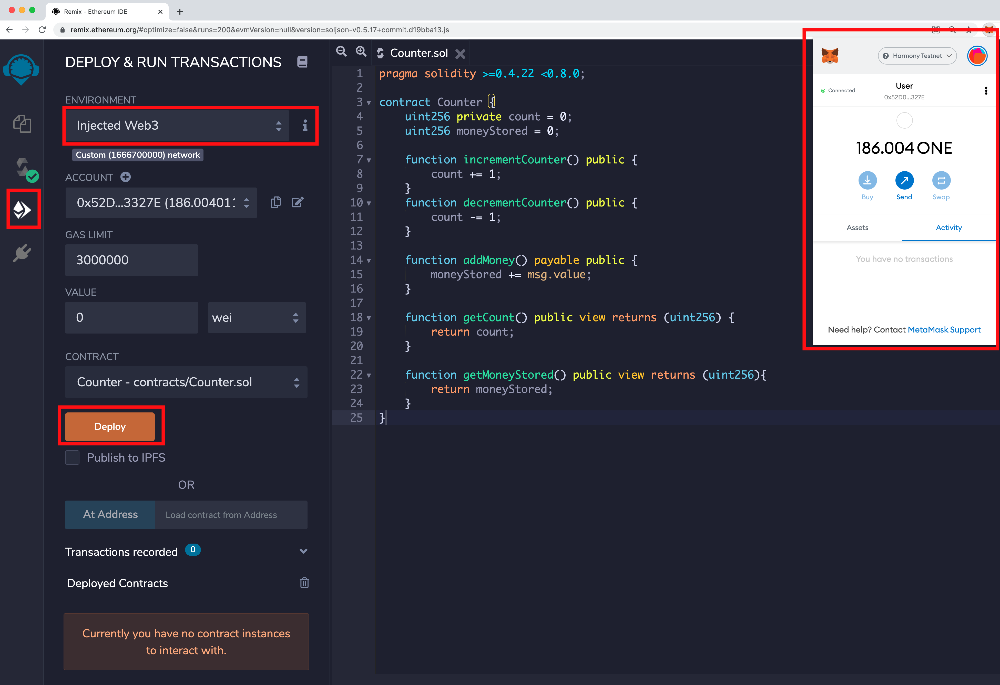
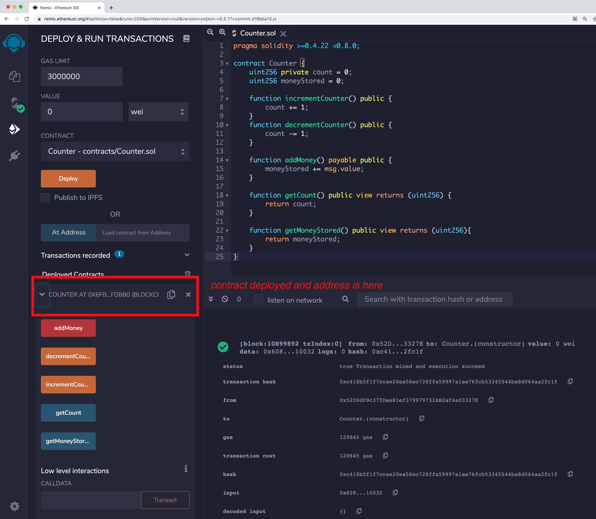

# Ethereum Remix

Go to [https://remix.ethereum.org/](https://remix.ethereum.org/)

### Writing your smart contract


Copy and paste the code below to Counter.sol file

```
pragma solidity >=0.4.22 <0.8.0;

contract Counter {
    uint256 private count = 0;
    uint256 moneyStored = 0;

    function incrementCounter() public {
        count += 1;
    }
    function decrementCounter() public {
        count -= 1;
    }

    function addMoney() payable public {
        moneyStored += msg.value;
    }

    function getCount() public view returns (uint256) {
        return count;
    }

    function getMoneyStored() public view returns (uint256){
        return moneyStored;
    }
}
```

### Compiling



### Deploying

If you want to deploy the contract to a live network like Harmony Testnet or Mainnet, configure your metamask by adding the required Harmony networks using this [guide](https://docs.harmony.one/home/network/wallets/browser-extensions-wallets/metamask-wallet).






###
