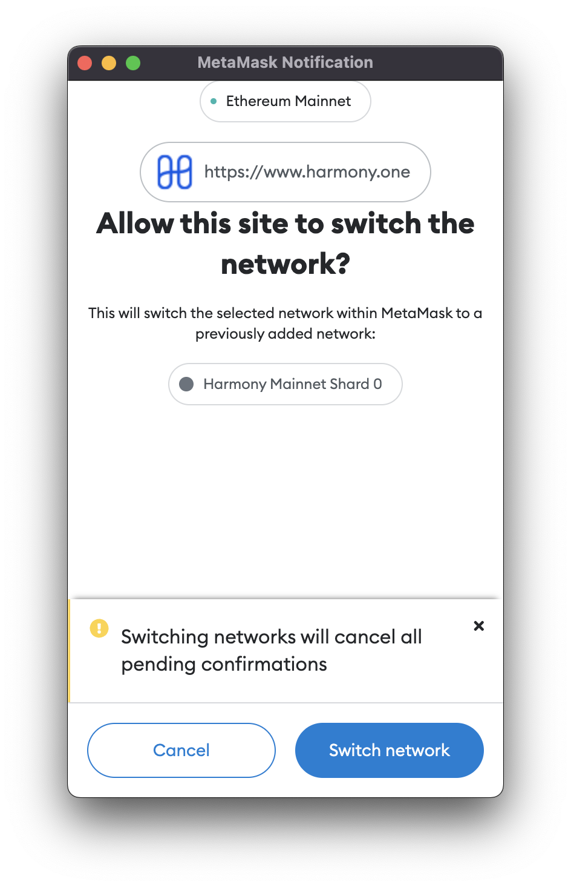

# Add or Switch to Harmony chain on Metamask

Harmony is a multi-sharded chain, currently with shard 0, 1, 2 and 3 running on Mainnet.  To execute the code snippet below successfull, you can test on a device that has Metamask extension / add-on installed and visible to your app.

```javascript
// Harmony's Shard ID {0..3}
const shardId = 0;

try {
  const walletAddEthereumChainRequest = await ethereum.request({
    method: 'wallet_addEthereumChain',
    params: [
      {
        chainId: '0x' + Number(1666600000 + shardId).toString(16),
        chainName: 'Harmony Mainnet Shard ' + shardId,
        nativeCurrency: { name: 'ONE', symbol: 'ONE', decimals: 18 },
        rpcUrls: ['https://' + (shardId === 0 ? 'api.harmony.one' : 'api.s' + shardId + '.t.hmny.io')],
        blockExplorerUrls: ['https://explorer.harmony.one/'],
      },
    ],
  });
} catch (error) {
  console.error(error);
}
```


Please note that `window.web3` has been [deprecated](https://docs.metamask.io/guide/provider-migration.html#summary-of-breaking-changes).  Use `window.ethereum` instead.  To migrate, use [this guide from Metamask](https://docs.metamask.io/guide/provider-migration.html#table-of-contents).


When this code snippet is executed, users will see message to approve adding or switching to correct Harmony chain.



You can see more information about Metamask documentation related to the Ethereum Provider API at [https://docs.metamask.io/guide/ethereum-provider.html](https://docs.metamask.io/guide/ethereum-provider.html)

To see a full list of Chain IDs, please visit [https://chainlist.org/](https://chainlist.org/) and search for `Harmony`
