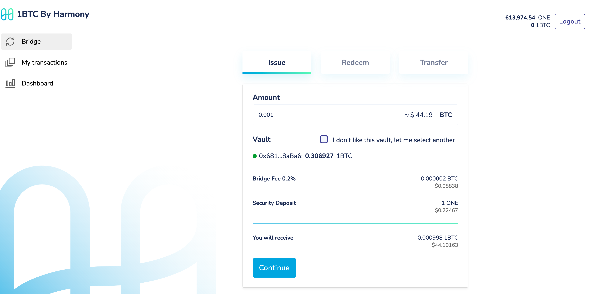
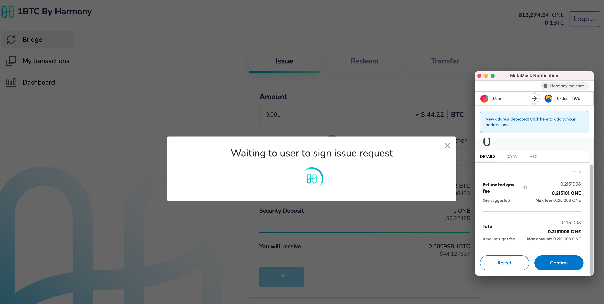
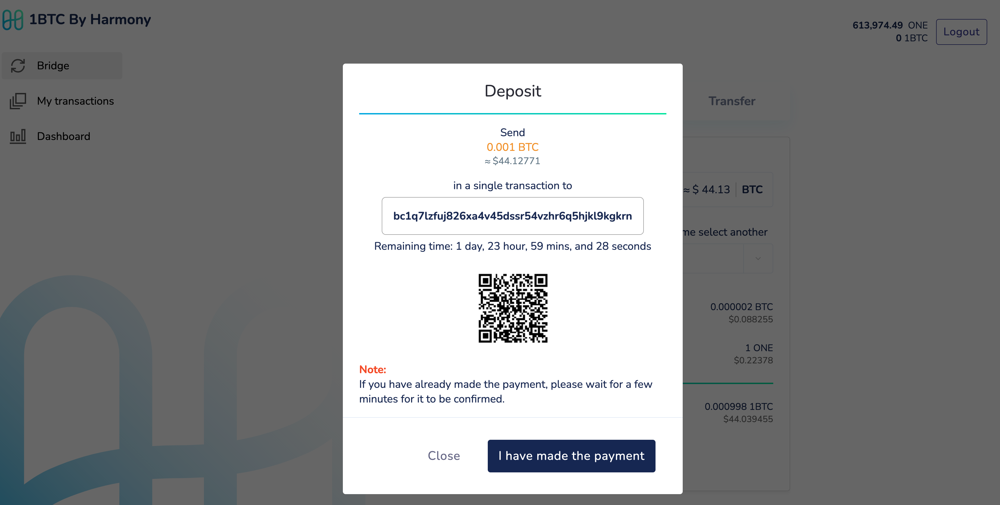
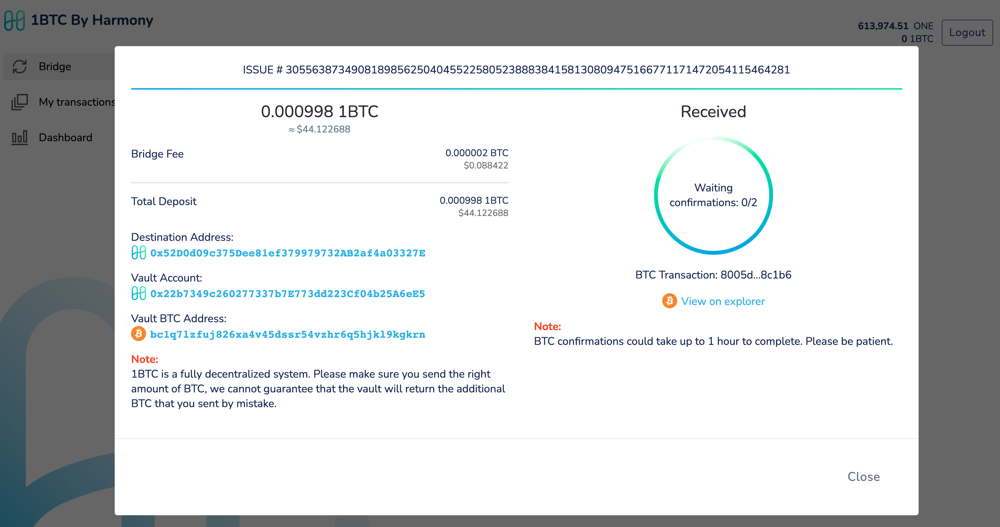
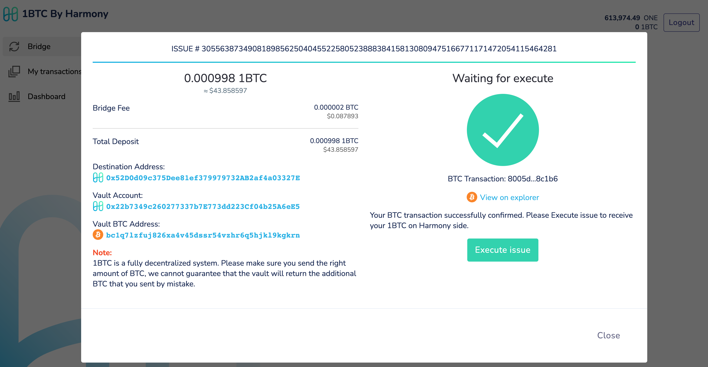
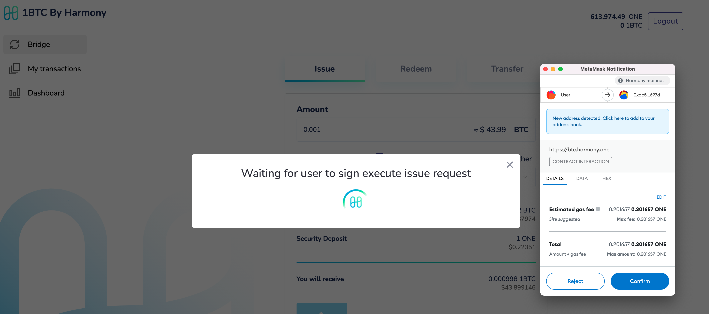

# Issue

1\) Navigate to https://btc.harmony.one and connect your metamask wallet

.png>)

2\) Create Issue request for bridging your BTC to Harmony and receive 1BTC

3\) Sign the issue request transaction

4\) Transfer the BTC to the provided account and confirm

5\) Wait for BTC to be received in the vault account and enough confirmations

6\) Upon sufficient confirmation, the execute issue action is enabled for user to mint and receive the 1BTC (the wrapped bitcoin on harmony)

7\) Sign and execute the execute request transaction

8\) Received 1BTC

