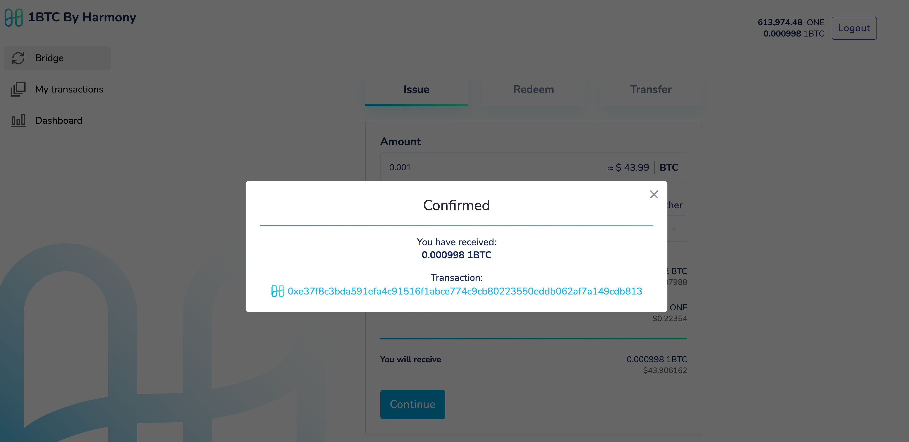

# Issue

**#1 | Navigate to btc.harmony.one and connect your Metamask wallet.**

.png>)

**#2 | Create an "Issue" request for bridging your BTC to Harmony and begin the bridging process.**

Specify the amount of BTC you wish to bridge into the Harmony ecosystem in the "Amount" field. An external vault will be selected for you, but you have the option to select one manually if desired.

Click Continue.

.png>)

**#3 | Sign the Issue request transaction in your Metamask.**

Click the Confirm button in Metamask to sign the transaction on the Harmony network. The fees + security deposit should be less than 1/2 a single ONE.

.png>)

**#4 | Transfer the BTC to the provided account.**

At this point, the vault is ready to receive and store your BTC before issuing your new 1BTC. Copy the BTC address provided by the bridge then send your BTC to the address to continue the process.

.png>)

**#5 | Wait for the BTC to be received by the vault. This can take time on the BTC blockchain.**

At this stage, we must wait for two confirmations on the BTC blockchain before your transfer to the vault is complete. This can take upwards of 1-hour but, on average, may take between 20 to 30 minutes.

.png>)

**#6 | Execute the Issue request to begin the minting of your 1BTC.**

At this stage your BTC was successfully transferred to the vault, and you are provided with a transaction ID on the BTC blockchain. Click the Execute Issue button to begin minting your new 1BTC on the Harmony network.&#x20;

The 1BTC will arrive on the Metamask account you connected in the first step above.

.png>)

**#7 | Sign and execute the Execute Issue transaction to receive your 1BTC.**

Click the Confirm button in Metamask to approve the Execute Issue transaction. This will complete the minting process of your 1BTC and transfer the new wrapped token to your Harmony account.

.png>)

**#8 | You now have 1BTC on Harmony.**

The newly minted 1BTC is now in your possession which can be used in the Harmony ecosystem. Our launch partner Tranquil Finance (https://tranquil.finance) will be offering incentives for 1BTC holders.

