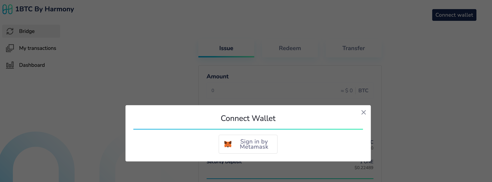
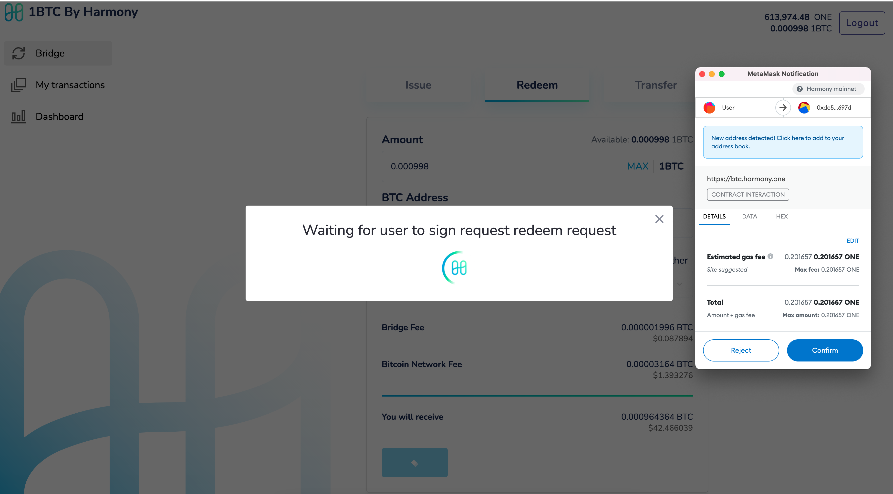
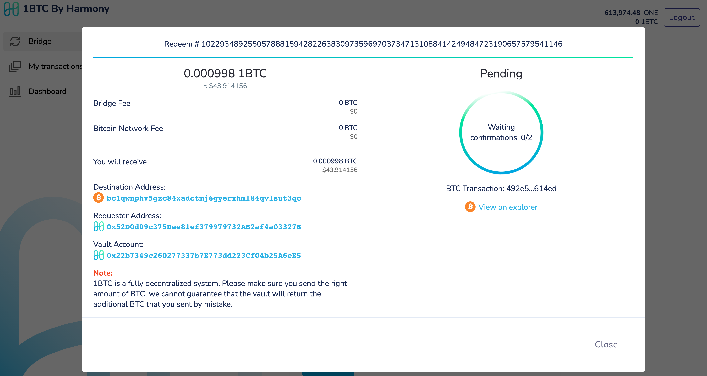

# Redeem

1\) Navigate to https://btc.harmony.one and connect your metamask wallet

2\) Create redeem request

3\) Sign the redeem request transaction

4\) Vault automatically picks up your redeem request and begins transferring your BTC back to your account

5\) Wait for sufficient number of confirmations to be received for the transferred BTC

6\) Upon sufficient confirmation, the redeem is finalized and user receives BTC to their account.

