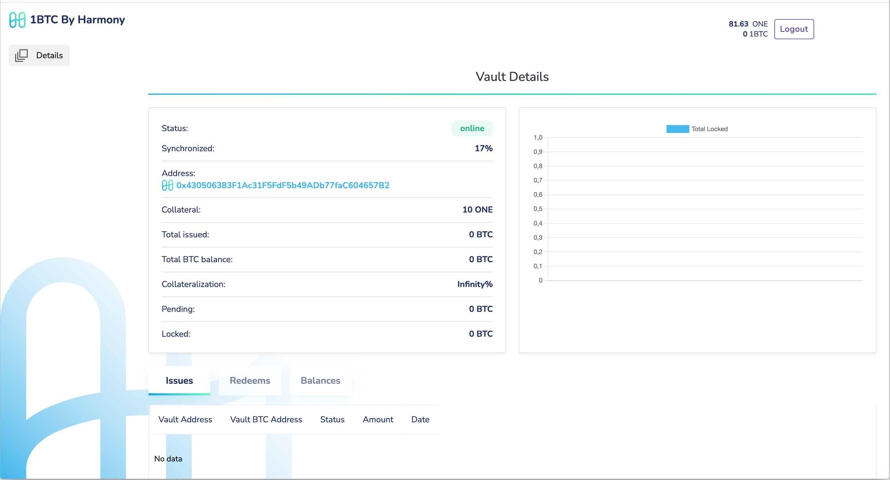
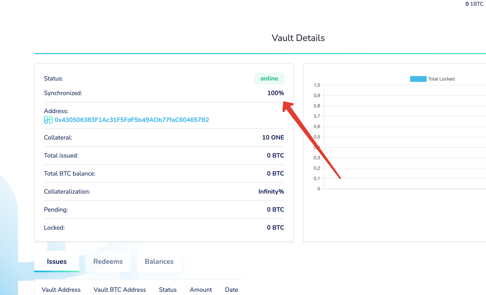

# Setup

### Goals

* Launching vault client&#x20;
* Registering vault to bitcoin bridge


Requirements

* Linux or MacOS, Windows not tested
* 2GB RAM, 4GB disk space
* Stable internet connection
* Un-interrupted service for at least 8 hr/day


### Steps

#### Setting up vault client using docker-compose

* Install [docker](https://docs.docker.com/engine/install/) & [docker-compose](https://docs.docker.com/compose/install/)&#x20;
* Download the docker-compose file and start the vault client

```
mkdir vault && cd vault
curl -L -o 'docker-compose.yml' https://raw.githubusercontent.com/harmony-one/onebtc.relayer-client/main/docker-compose.yml
```

#### Adding your Harmony & Bitcoin accounts to vault server

* There are two ways:&#x20;
  1. using the environment file (less secure)
  2. using aws kms (more secured)



1\) Create a file with name `./keys/.env.private` under the vault directory&#x20;

```
mkdir keys
vi ./keys/.env.private
```

2\) Add following env variables to it

```
HMY_VAULT_PRIVATE_KEY=0x6a36da....
BTC_VAULT_PRIVATE_KEY=16878a5c....
```


Note that, bitcoin private key must be in the hex format




Encrypt your Harmony and Bitcoin account private keys using AWS KMS by following [these](https://docs.aws.amazon.com/cli/latest/reference/kms/encrypt.html) steps and create the two encrypted files with names `./keys/hmy-secret` and `./keys/btc-secret`


Note that, you will need to modify the docker-compose.yml file to add your AWS credentials, under the `vault`section

\`\`\`\
``AWS\_ACCESS\_KEY\_ID: "\<your-aws-access-key-id>"&#x20;

AWS\_SECRET\_ACCESS\_KEY: "\<your-aws-secret-key>"

AWS\_CONFIG\_REGION: "\<your-aws-region>"\
` ``` `




#### Starting vault client

You can simply run the docker-compose command to launch your vault

```
docker-compose up -d
```

Following docker commands are helpful to view the vault client docker process and make sure that it is running and also checking the logs.

```
docker-compose ps
docker-compose logs -f
```

#### Registering your vault in btc bridge

There are two ways:

1\) Running a `curl` command on vault server

```
curl http://localhost:3000/api/vault-client/register -H 'Content-Type: application/json' -X POST --data '{"collateral":"11"}'
```


Note that, you will need at least 11 ONE (10 ONE for registering your vault and 1 ONE for some gas). Higher value is okay. You can also register with smaller values and later increase your collateral from the admin page.


2\) Navigate to vault admin page (upon running the vault client in the above step): http://localhost:3000/.&#x20;


If you are using a remote server and accessing vault admin page from outside, navigate to appropriate URL with your remote server name. e.g., http://your-server-address:3000/. Note that, if you using aws or other server instances, you may need to allow inbound access to your machine that is trying to load the btc bridge admin page.


Upon navigating, you should see the page that prompts to register the vaults and your wallet addresses.

.png>)

Click `Register your vault` to successfully complete this step.&#x20;


Note that, you should have at least 11 ONE tokens in your Harmony wallet that is being registered to successfully completing the registration step.


Upon successfully registering you will be navigated to vault details page as shown below with all the relevant information regarding the registered vaults.



It is recommended to wait until the vault synchronization (as shown below) reaches 100%. This usually takes about 10-20 minutes after registering your vault. This is is final step and now your vault is ready to facilitate BTC transfers.




