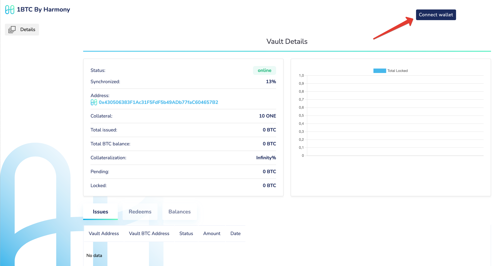
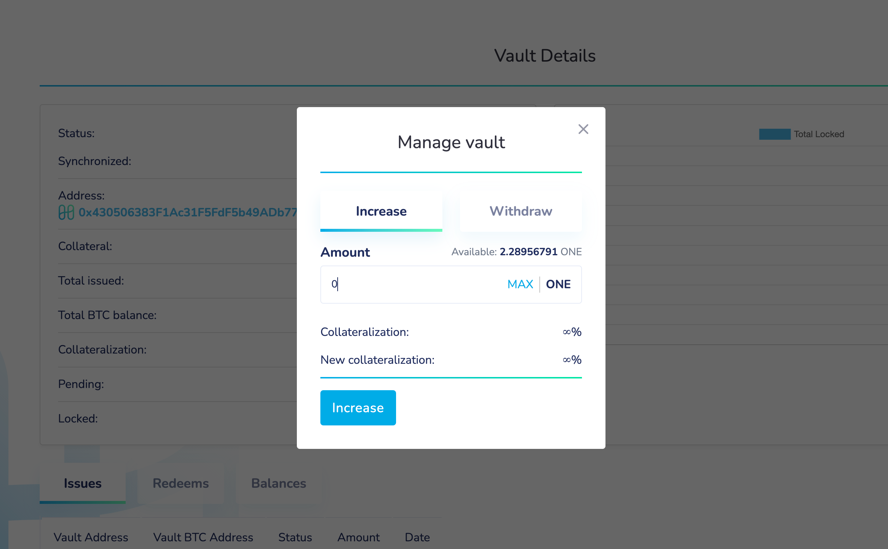

# Manage

Vault management is used primarily for:

* Increasing the collateral
* Withdrawing the collateral
* Monitoring the collateral ratio and other status

### Steps

* Check the status of your vault in [https://btc.harmony.one/dashboard/vaults](https://btc.harmony.one/dashboard/vaults)
* Navigate to http://localhost:3000&#x20;

* Connect your vault's Harmony wallet using either metamask or onewallet&#x20;

 

* Click on manage

 
