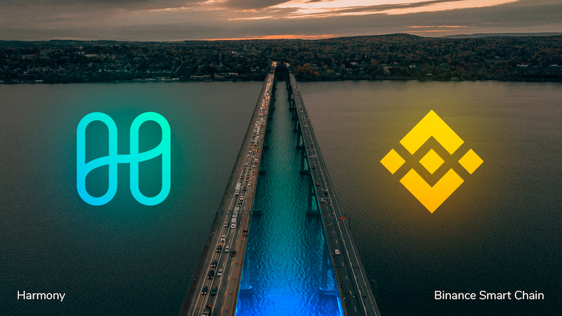
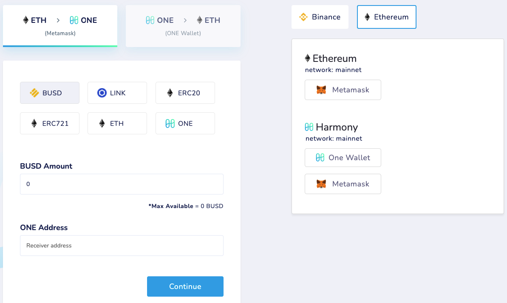
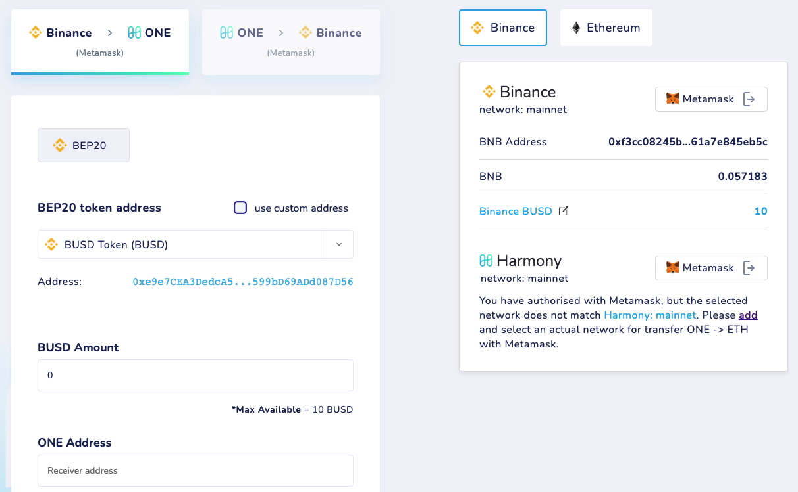
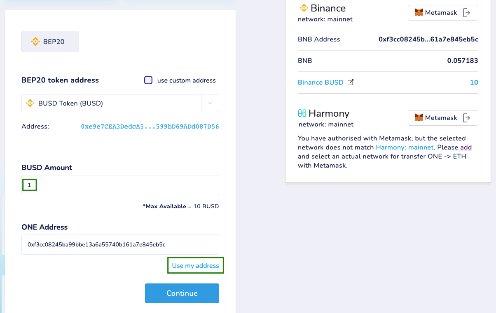
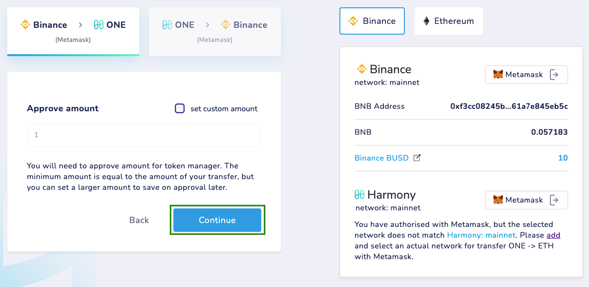
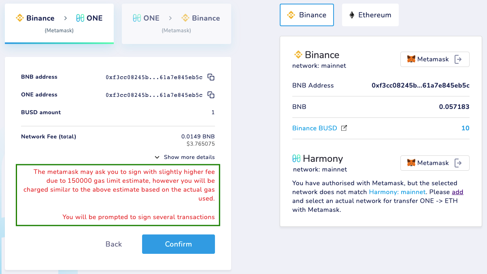
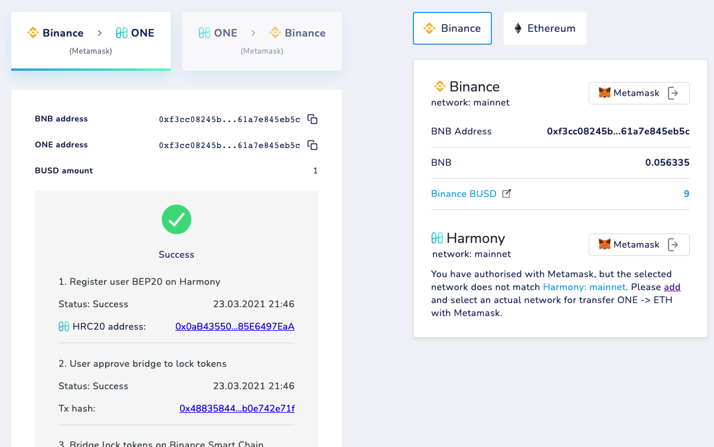
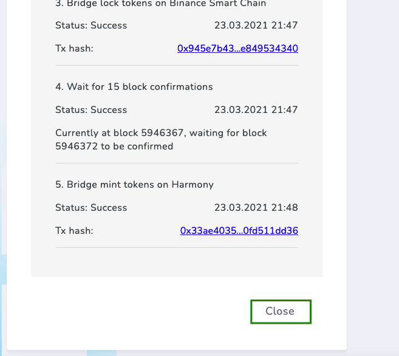
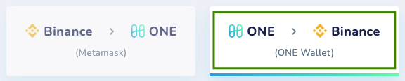

# Bridging BSC <> ONE


Do NOT send bridged tokens directly to other blockchains or exchanges. This will not work and it might result in **permanent loss** of your tokens. Bridged tokens can only be used on Harmony network. The only way to send them out is by bridging them back.


### Swapping BSC > ONE Tokens

1\. Head over to [bridge.harmony.one](https://bridge.harmony.one)

2\. Connect your Metamask account to [Binance Smart Chain](https://docs.binance.org/smart-chain/wallet/metamask.html) and connect your OneWallet or [Metamask](../../wallets/browser-extensions-wallets/metamask-wallet/) to the Harmony Mainnet.

3\. After confirming the token amount, select your Harmony ONE address on which you would like to receive your tokens.

4\. Select a BEP20 token from the left (or fill in the contract address). As an example, BUSD is used in this guide. When all fields are correctly filled in click on **Continue** to perform the bridge action.

5\. On the next screen just click **Continue**.

6\. Read the message with fees very carefully on the next page. You can click on **Show more details** for more information about the fees for this action. If you agree, click on **Confirm**.

7\. The bridge action will begin and you will be asked multiple times to sign transactions using Metamask. Just click on **Confirm** for every action

8\. If all went well, we have a successful bridge action.

9\. You can now close the last screen at the bottom of the page by clicking on the **Close** button. You can also choose to do this in the opposite direction, from Harmony to BSC.

10\. In order to see the tokens you might need to [add the tokens](adding-tokens.md) to your wallet.

### Swapping ONE > BSC Tokens

For swapping BEP-20 tokens for BEP-20 tokens the process is very similar. Make sure you select ONE -> Binance on top as we want to convert from Harmony to Binance Smart Chain (BSC) this time:


The remaining process is pretty much the same as the one mentioned on the section before. You will need to confirm a few transactions as they pop up on your selected wallet.


### Support

If you have any issue using the bridge, please click on _Info_ at the top of the page, where you will be given instructions on how to report them.

Alternatively you can join our Telegram Support channel at [https://harmony.one/bridge-support](https://harmony.one/bridge-support)
