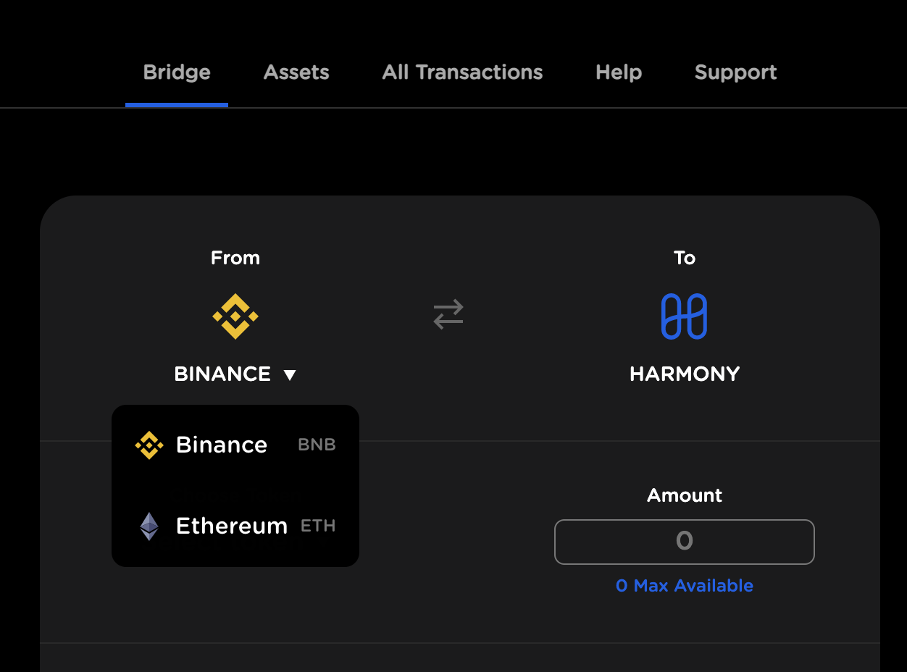
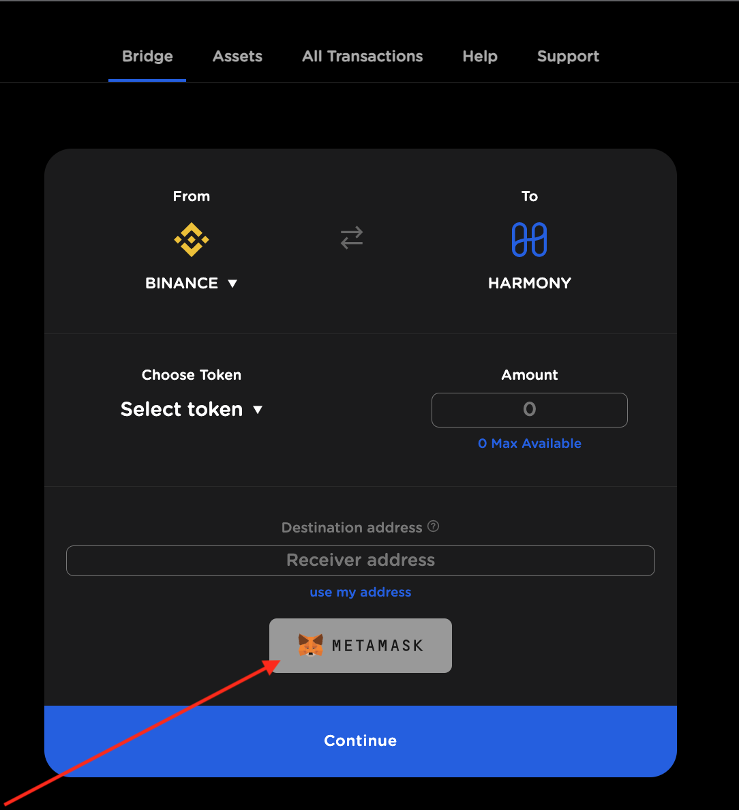
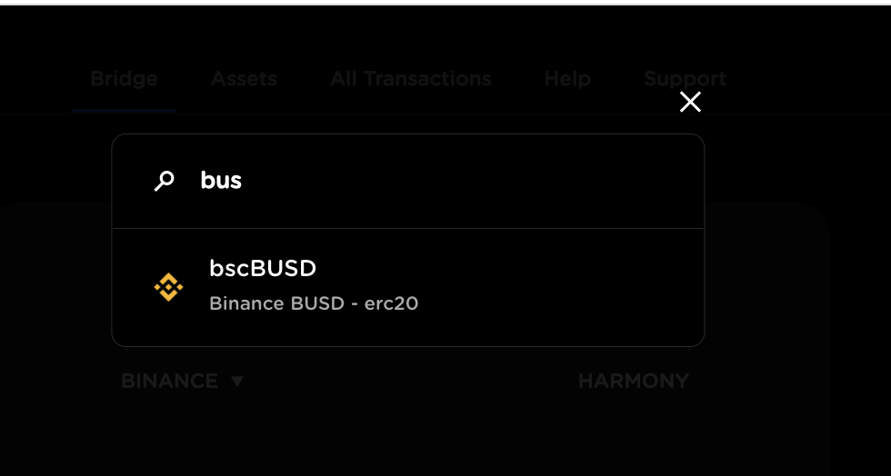
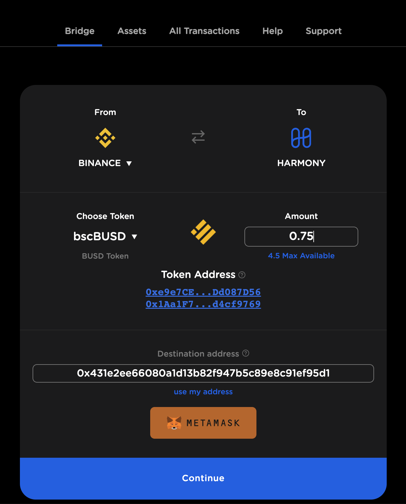
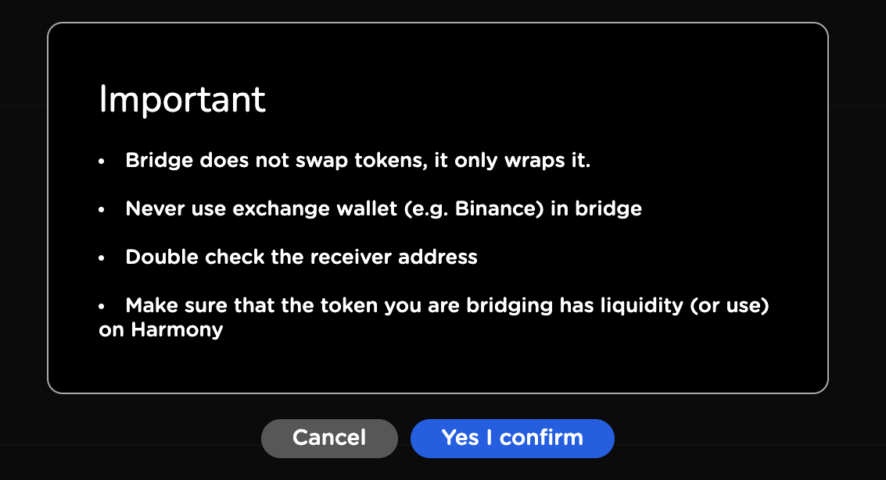
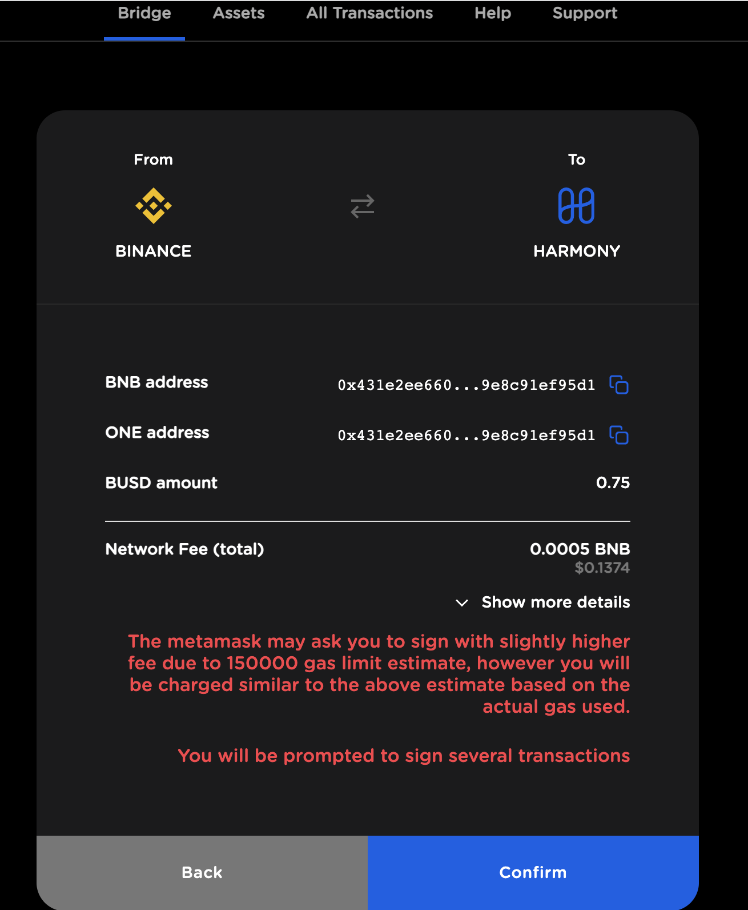
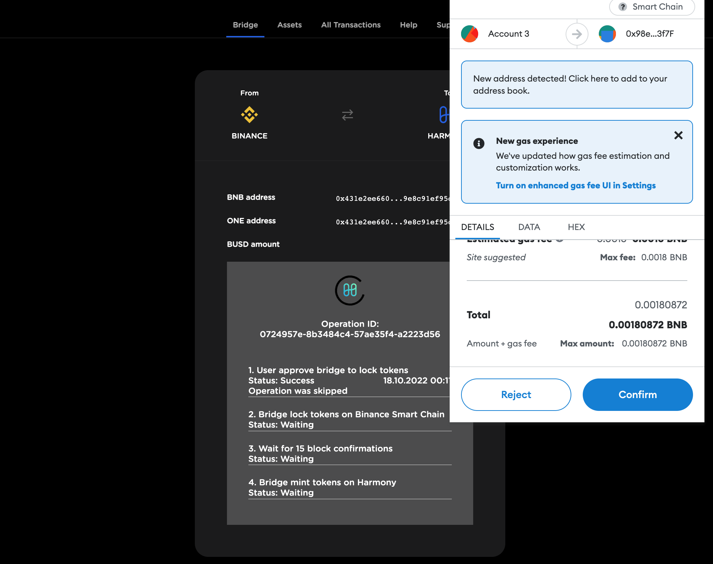
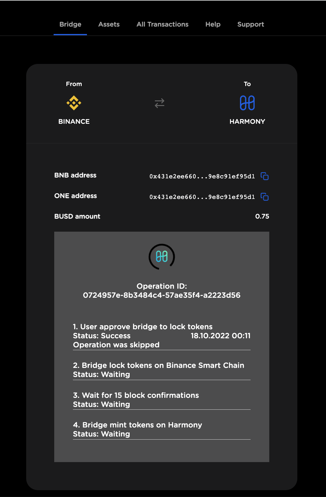
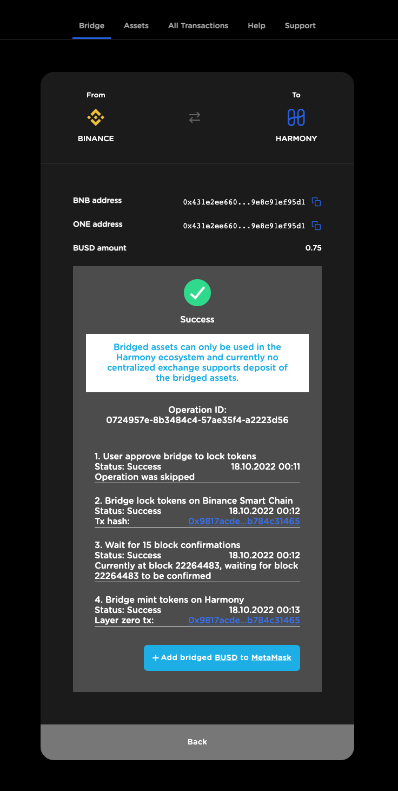
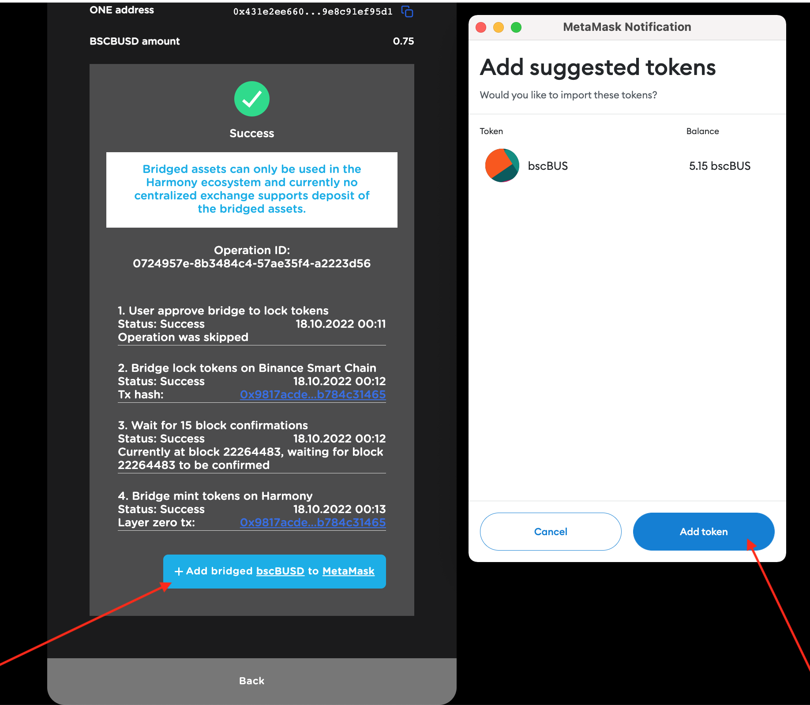

# Bridge tutorial

1\. Head over to [layerzero.bridge.harmony.one](https://layerzero.bridge.harmony.one)

2\. Choose transfer direction

3\. Connect your Metamask account via Metamask button

On wallet connection destination address is chosen automatically. You can specify another address on which you would like to receive your tokens.


You need to be able to open your wallet in the network you sent your tokens to. Check that there are no network restrictions that prevents you from it. Also check if there is no limitations on a token type you can receive.\
**Never send tokens to an exchange account!**


4\. Select a token from the list. You can use the search field.

When selected, token addresses for both networks will appear on the page. Note that token you receive never have the same address in destination network. You can check what token you get by following its address link. Please check if it's a desired token, and it has a liquidity in the target network.

5\. Enter the amount.

When all fields are correctly filled in click on **Continue** to perform the bridge action.

6\. You'll see the notice. Please read it carefully.

7\. Read the message with fees very carefully on the next page. If you agree, click on **Confirm**.

8\. The bridge action will begin, and you will be asked multiple times to sign transactions using Metamask. Just click on **Confirm** for every action

There are several steps in the bridge operation. Normally, it takes up to 20 min to finish the operation step.

When the transaction is over, its hash appear on the corresponding step. You can follow the link for transaction details.

9\. If all went well, we have a successful bridge action.

10\. In order to see the tokens you might need to add the tokens to your wallet. There is a special button for it in the interface. You need to confirm adding in Metamask notification window.

Alternately, you can use [this guide](../../ecosystem/partners/exchanges/adding-custom-harmony-tokens.md) for adding tokens.


Do NOT send bridged tokens directly to other blockchains or exchanges. This will not work and it might result in **permanent loss** of your tokens. Bridged tokens can only be used on Harmony network. The only way to send them out is by bridging them back.

