# Gnosis Safe

## Gnosis Safe on Harmony

The Gnosis Safe is a smart contract wallet with multi-signature functionality at its core. \
Gnosis Safe Application on Harmony: [https://multisig.harmony.one](https://multisig.harmony.one)

## Connect Wallet

You can connect to Gnosis Safe using [Metamask](../wallets/browser-extensions-wallets/metamask-wallet/).

1\) Go to the Safe application on Harmony at [https://multisig.harmony.one](https://multisig.harmony.one) and click on **Connect Wallet**.

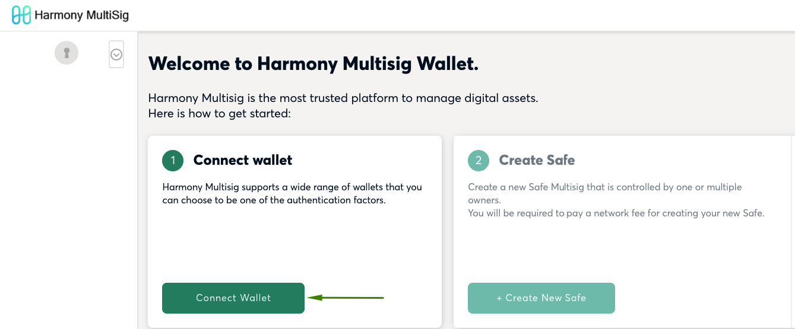

2\) Chose your wallet.

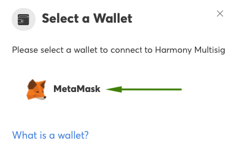

### Connecting with MetaMask

Select the MetaMask option in the connect wallet menu. Check that the correct MetaMask account is active and connected to the Harmony Network.

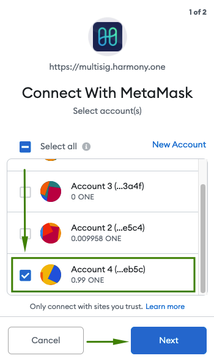

## Create Safe

1\) Press **Create new Safe**.

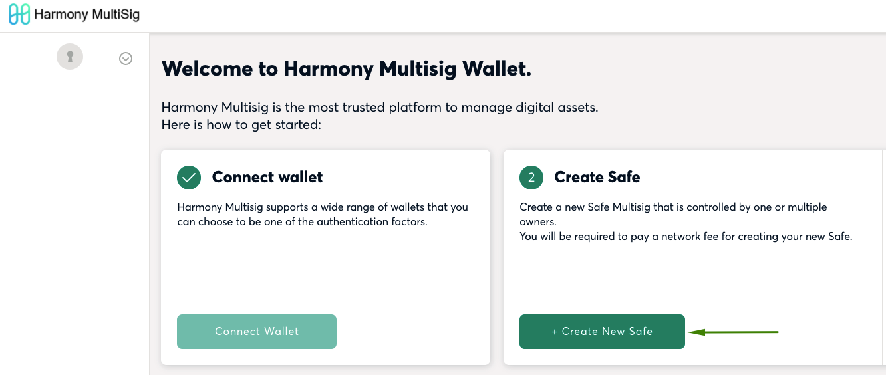

2\) Name the safe. This will be stored locally. Press **Start** to continue.

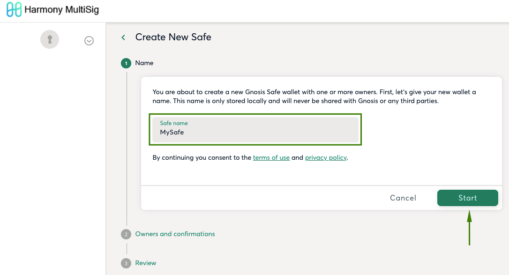

3\) Add additional owners if you want. For each additional owner:

1. Click Add another owner
2. Give Owner a Name
3. Enter Owner an Address
4. Select how many owners will be required to confirm a transaction
5. Press **Review**

.png>)

4\) Submit your safe by clicking on **Submit**. You will need a very small amount of ONE tokens to confirm the transaction.

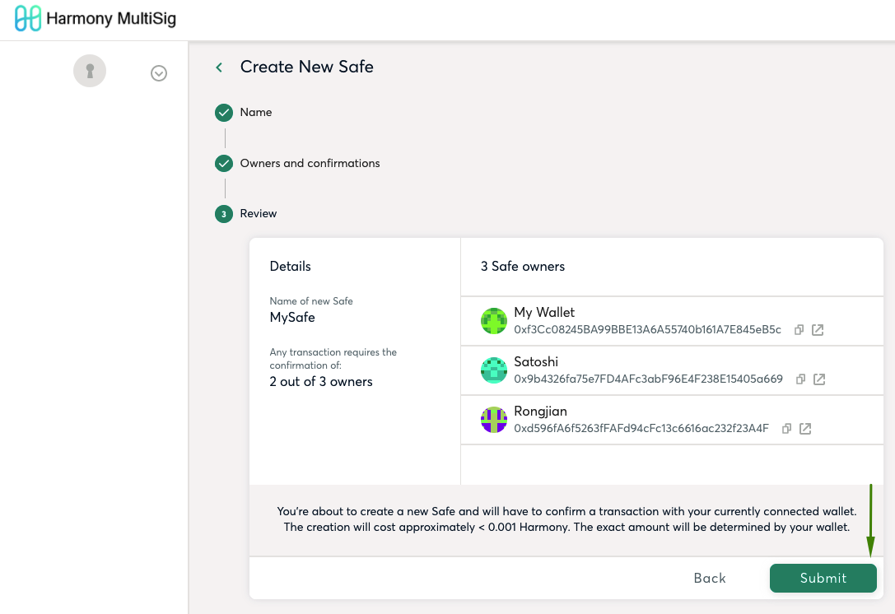

5\) Confirm the transaction on Metamask.

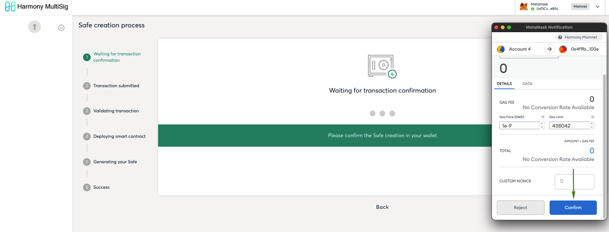

6\) If all steps were sucessfull your Safe should have been deployed. Just click on **Continue**.

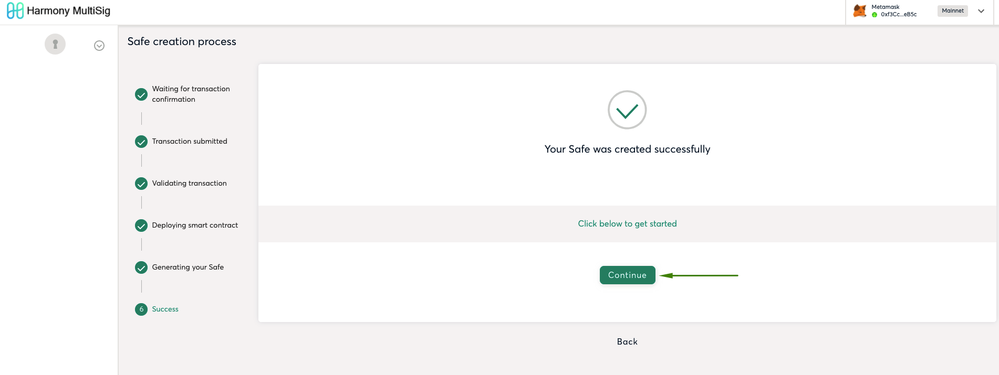

## Load Existing Safe

You can load the Safe on other devices, so everyone can sign transactions using the same safe, but using different accounts.

1\) On main page there is an option called **Load Existing Safe**. Click on this button as shown by the image below.

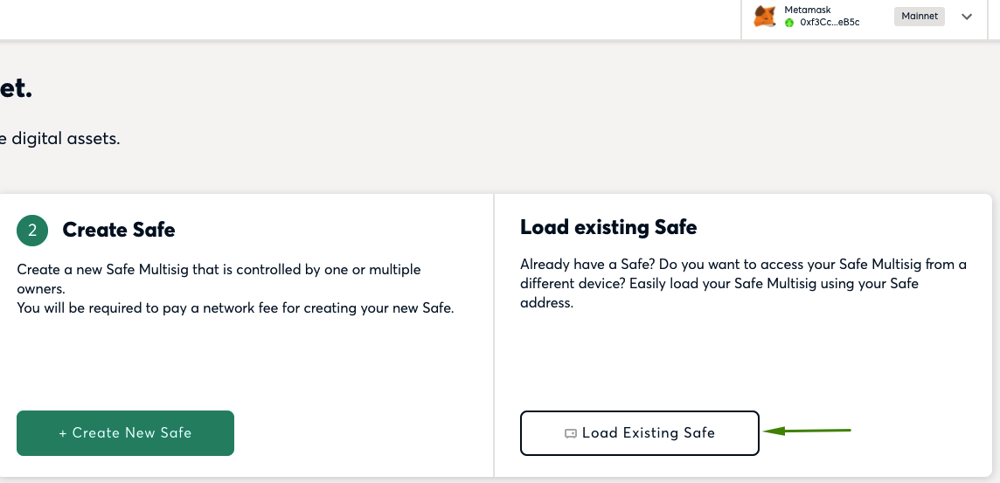

2\) Pick a name for your Safe and paste the Safe Address. The Safe Address can be found on the main page. If you are in doubt please check section **Receive Tokens**.

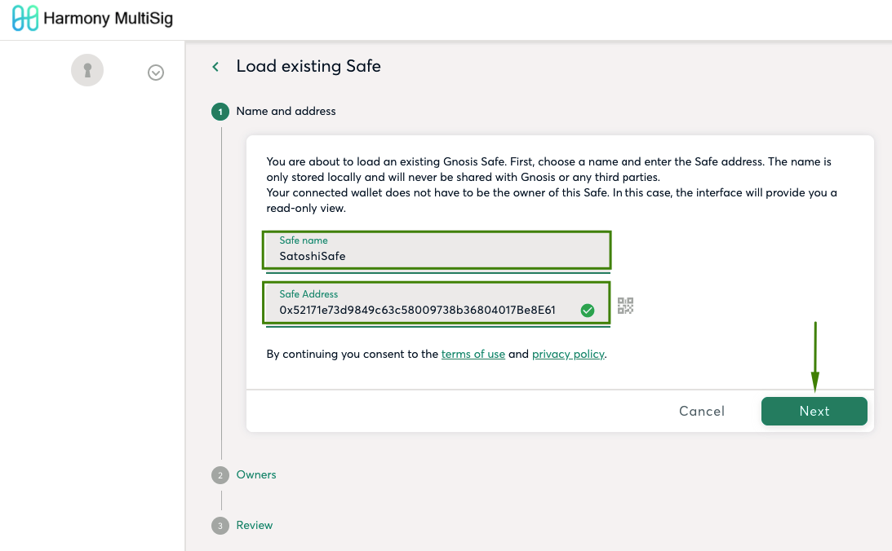

3\) Review owners by clicking on **Review**.

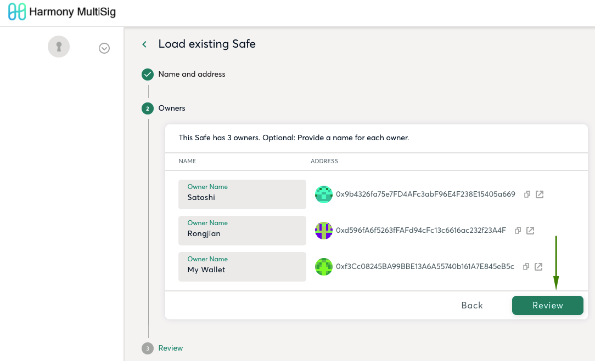

4\) Load Safe by clicking on **Load**.

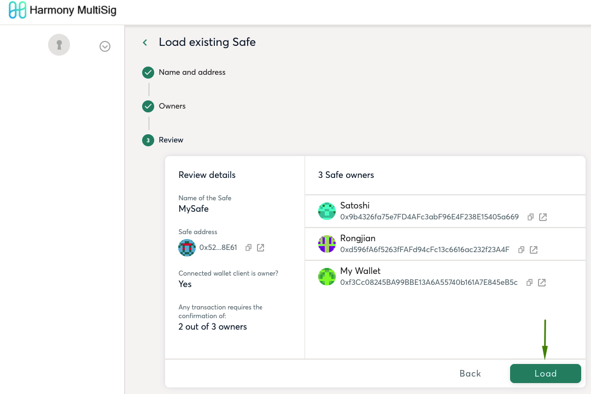

If sucessfull, you should see your Safe loaded on main page.

## Send Tokens

1\) On the main page click on **New Transaction**.

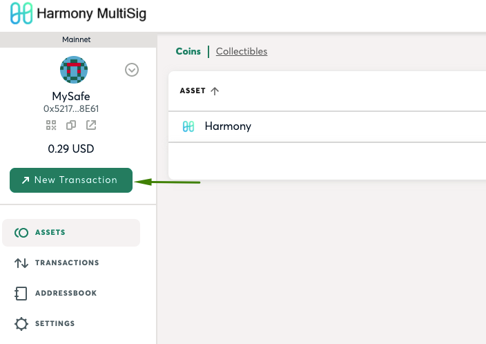

2\) On next window click on **Send funds**. You can also send collectibles, but for this example we will be sending normal tokens.

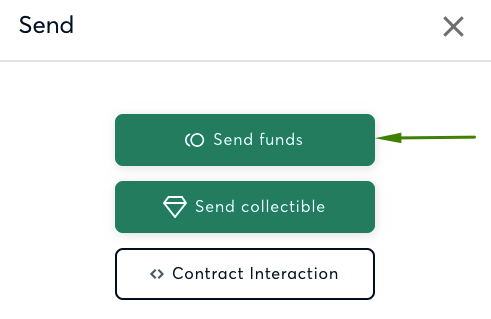

3\) On next window fill the recipient address you want to send your tokens to and the amount. After that click on **Review**.

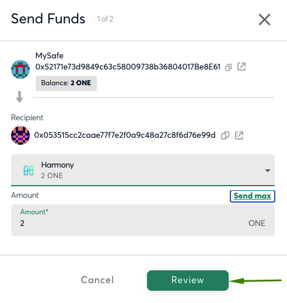

4\) O next window click on **Submit**.

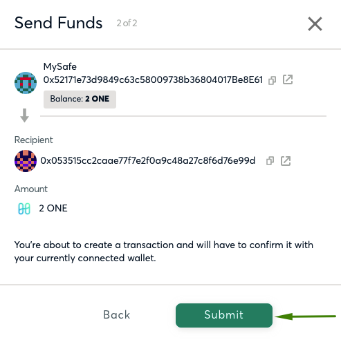

5\) A Metamask window will pop up for you to confirm the transaction. You should see your transaction confirmed on the next window. On our example we are using 2 of 3 signatures for the tokens to be sent out of the Safe.

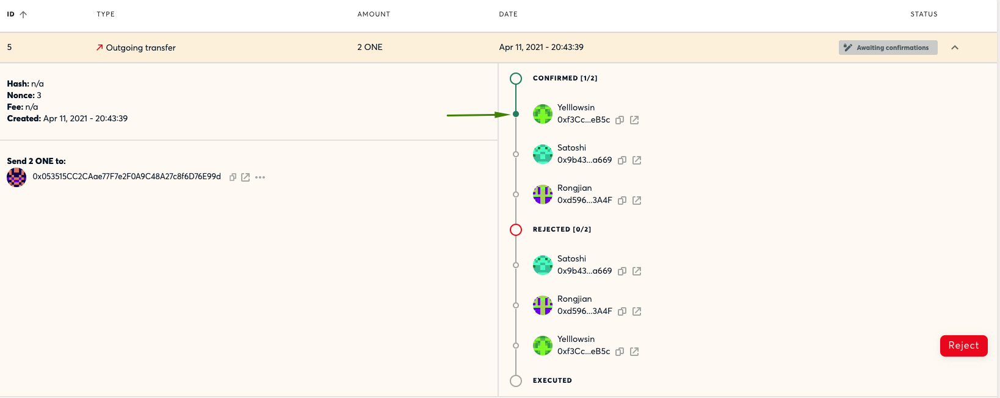

6\) We need at least one more account to confirm the transaction on the safe. Just click on **Confirm** logged in with the required account.

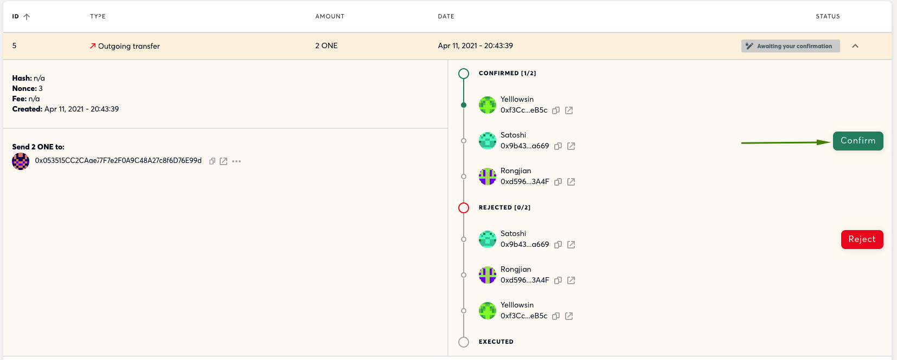

7\) Approve the transaction by clicking on **Approve Transaction**.

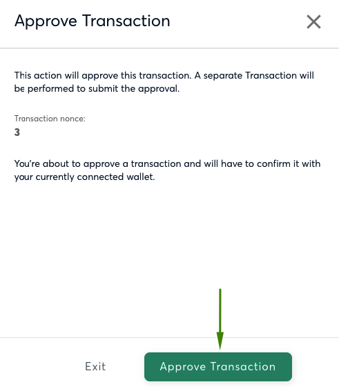

8\) If all the parts have confirmed the transaction you should see **Success** on top.

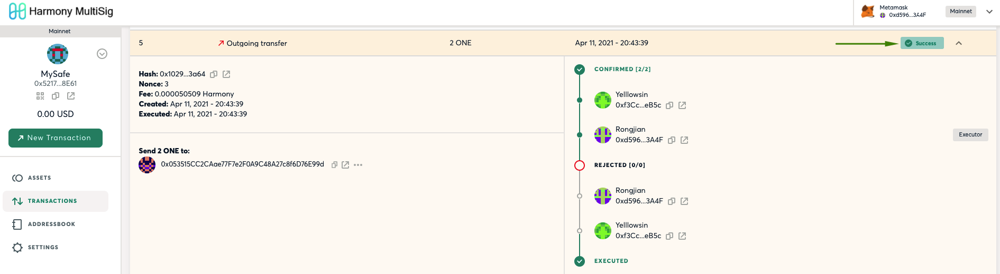

## Receive Tokens

Once you have a Safe deployed, you can use the Safe address to receive tokens. Just click on **Copy to clipboard**.

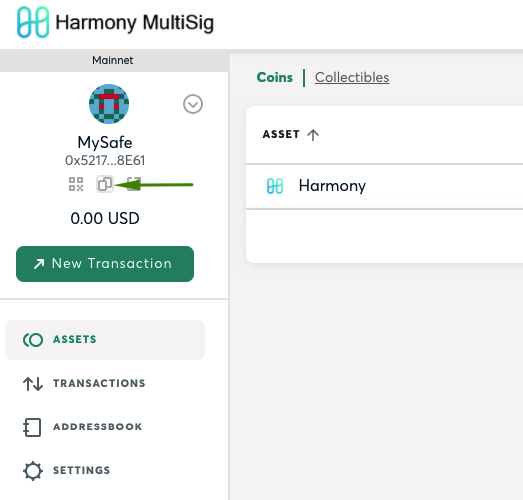
