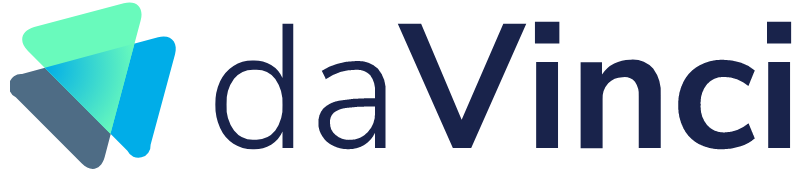

# NFTs

Harmony is a fully Ethereum compatible blockchain ready to support all major NFT standards, including [HRC721](https://github.com/harmony-one/HRC/tree/master/examples/hrc721) and [HRC1155](https://github.com/harmony-one/hrc1155).

Several NFT platforms and campaigns have been launched on Harmony. The Harmony community has launched recently a NFT marketplace, daVinci Marketplace, in April 2021. See our other NFT highlights below:

## daVinci Marketplace

daVinci is a NFT marketplace that supports the creation, buying and selling of NFTs minted on Harmony. You may access the marketplace here:  [https://davinci.gallery/](https://davinci.gallery)&#x20;

[Documentation and FAQs ](https://davincigalleryone.gitbook.io/davinci-gallery/)

DaVinci social media: [Telegram](https://t.me/daVinci\_NFT\_Marketplace), [Twitter](https://twitter.com/davinci\_gallery), [Discord](https://discord.gg/UpgmJUPcfv)

## ****[**Atari**](https://atari.harmony.one) **(Quidd)**

Atari, Quidd and Harmony have teamed up to offer this exclusive limited edition Atari Centipede NFTs.

The Centipede series, created by the legendary Dona Bailey, carry a special spirit and set the industry standard for decades.



## Animoca [Beast Quest](https://bquh.io)

Beast Quest, Animoca Brands and Harmony Protocol have teamed up for this exclusive offer! Buy limited edition chests containing gems, VIP points & NFT collectible cards. Collect a set to win Harmony ONE tokens!



## [LMA](https://lma-art-gallery.com) Art Gallery

LMA is a marketplace for the trading of unique non-fungible tokens (NFTs) art cards on Harmony Network.

Everyone can purchase the unique art cards, and become the owner of that specific art card. For each purchase the price will increase automatically 100% and can be immediately purchase from other person.

See: [documentation](https://lma-art-gallery.gitbook.io/lma-art-gallery/), [telegram](https://t.me/lma\_art\_gallery), [video](https://youtu.be/E01HlVadKus)

.png>)

## Sandbox

Harmony and The Sandbox Partner to Enable Growth of Blockchain Gaming.

We’re excited to announce a strategic partnership with one of blockchain gaming industry’s leading projects, [The Sandbox](https://www.sandbox.game/en/). At Harmony, we believe in empowering gamers through true digital ownership of their game assets and creating new economic incentives through play-to-earn business model. We want to support and facilitate The Sandbox’s team mission to offering a gaming virtual world where players can play, create, own, trade, govern and monetize their gaming experience through the use of blockchain technology, NFTs and their native utility token $SAND powering their platform.

.png>)
