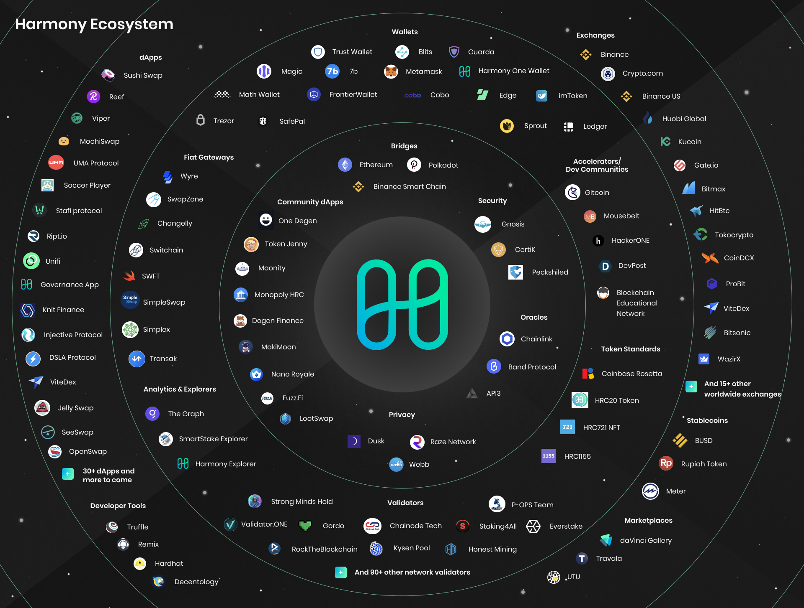

# Ecosystem

The Harmony team is focused on delivering a strong foundation for our network and ecosystem. We are grateful for the engagement and support of our validators, stakers, developers, grantees and collaborators for a fruitful year.

Our current ecosystem map as of May 2021:

See below our 2020 Year in Review & Ecosystem Growth:



