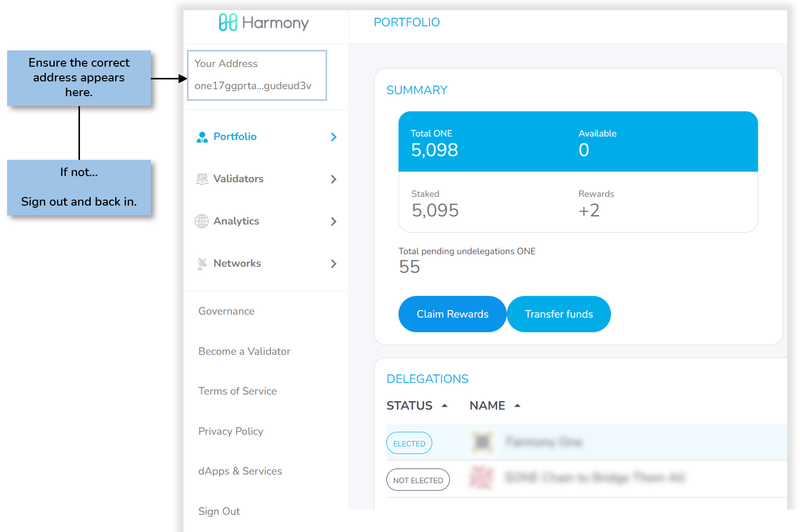
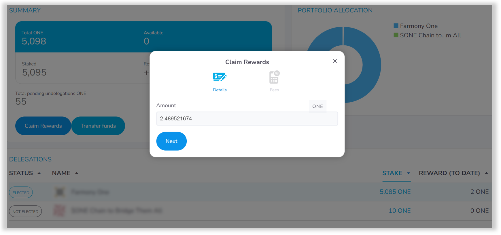
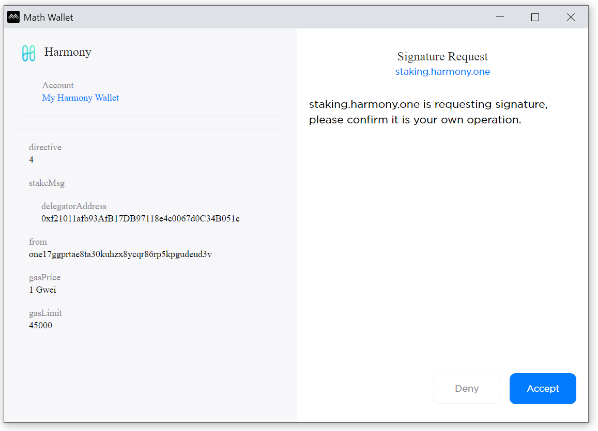
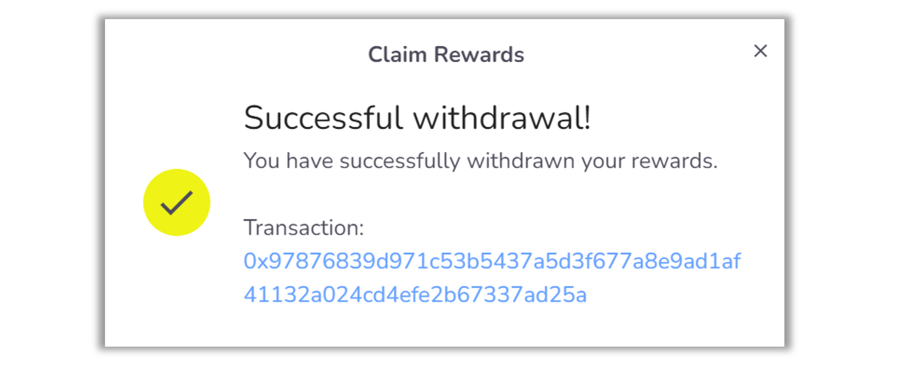

# Collecting Rewards

With your ONE staked to one or more validators, your delegation begins earning rewards with each block. You may collect these rewards at any time and may be re-delegated to compound your interest assuming you have 100 or more ONE.

Visit the staking dashboard at staking.harmony.one and click the **Portfolio** link on the left.&#x20;

Log into the dashboard if you're not already signed in.

With your address confirmed, proceed by clicking the **Claim Rewards** button to collect the ONE earned through staking.&#x20;

Note the staking dashboard currently only displays whole integers, which means <1 ONE rewards will display as zero and cannot be collected.

Proceed by clicking the **Next** button at the window below.

Then click the **Confirm and Sign** button to send the transaction for signing in Math Wallet.&#x20;

This will cause Math Wallet to pop up and request you to accept the signature request.

Click the **Accept** button to sign the transaction and collect your rewards.

Your rewards are collected once you see a **Successful Withdrawal** message.

Your ONE rewards, generated by staking your coins, are now added to your wallet.

