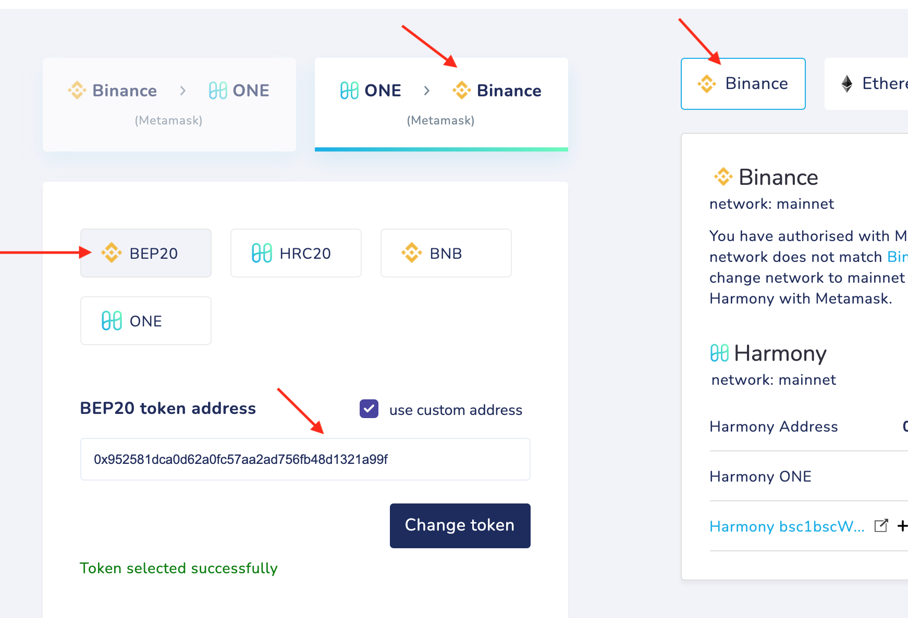
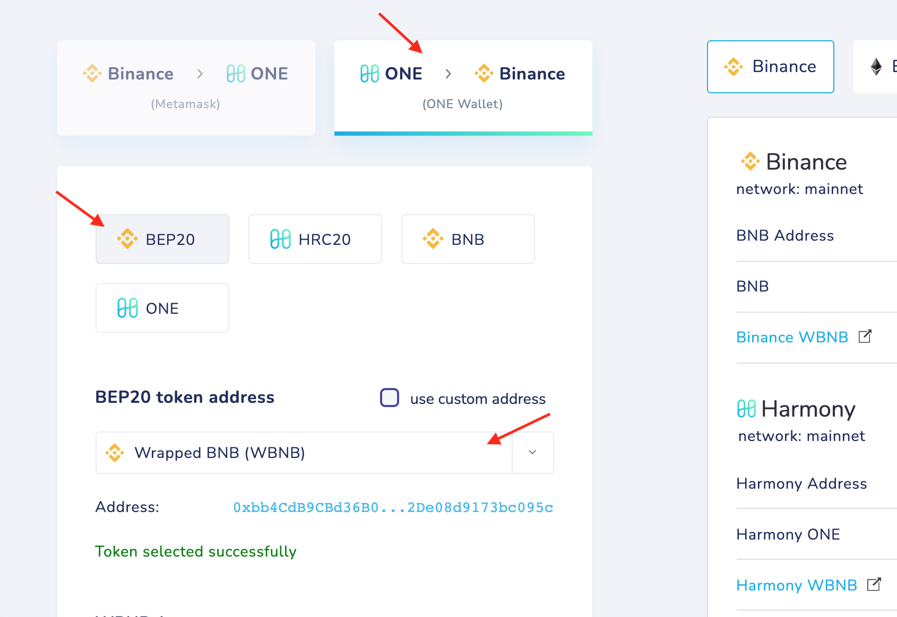

# bsc1bscWBNB

**bsc1bscWBNB → 1bscWBNB → bscWBNB → WBNB**

**bsc1bscWBNB → 1bscWBNB** 

Bridge your tokens from Harmony to **Binance**

Choose **BEP20** with custom token address **0x952581dca0d62a0fc57aa2ad756fb48d1321a99f**

**1bscWBNB → bscWBNB**

Bridge your 1bscWBNB tokens to **Harmony**

Choose **HRC20** with custom token address **0x673d2ec54e0a6580fc7e098295b70e3ce0350d03**

**bscWBNB → WBNB**

Bridge your bscWBNB tokens to **Binance** to get WBNB there

Chose **BEP20,** token address **0xbb4cdb9cbd36b01bd1cbaebf2de08d9173bc095c**

