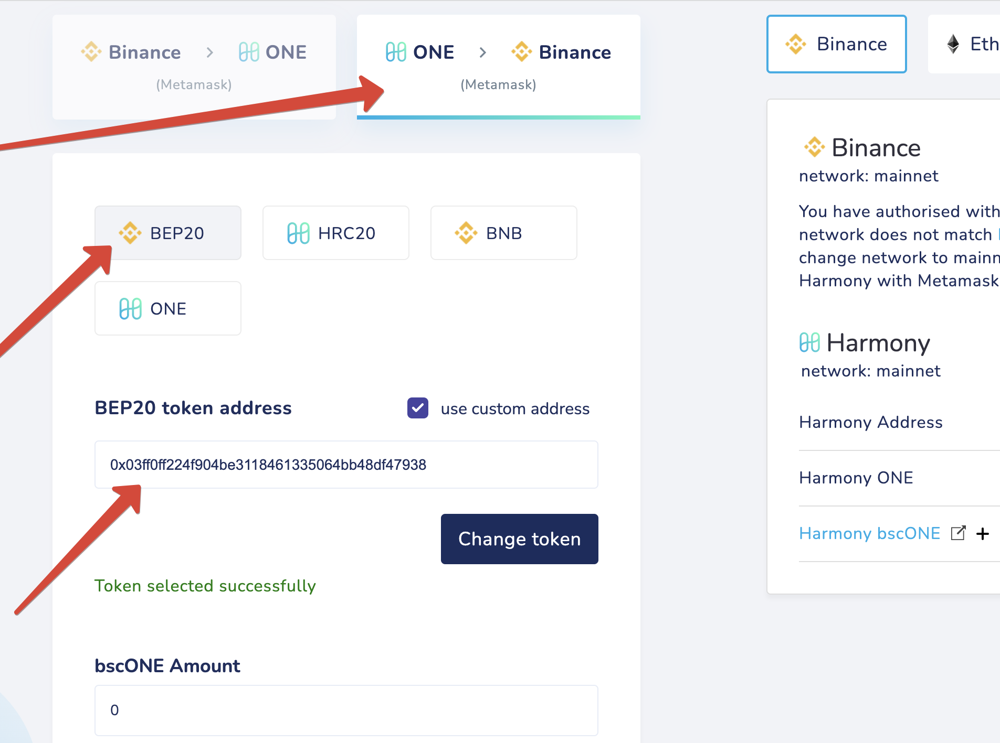

# bscOne

You get this token on Harmony when you choose BEP20 instead of the ONE button.

Steps to unwrap:

**bscONE -> ONE (BSC) -> ONE (HMY)**

**bscONE → ONE (BSC)**

Bridge your bscONE ****tokens from Harmony back to **Binance**

Settings: 
**BEP20**
Custom token address: **0x03ff0ff224f904be3118461335064bb48df47938**

 

**ONE (BSC) -> ONE (HMY)**

Bridge your tokens to Harmony. 
Choose **ONE** to receive them as Native ONE tokens instead of bscONE (no custom address needed):

