# I don’t know how to bridge my token

## **Harmony** **ONE**

Always use ONE button for any transfer direction.

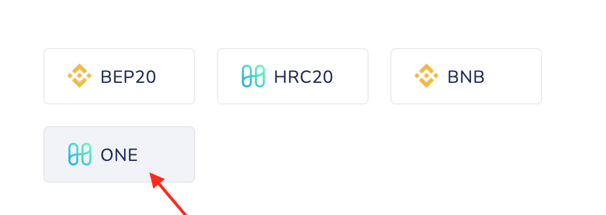

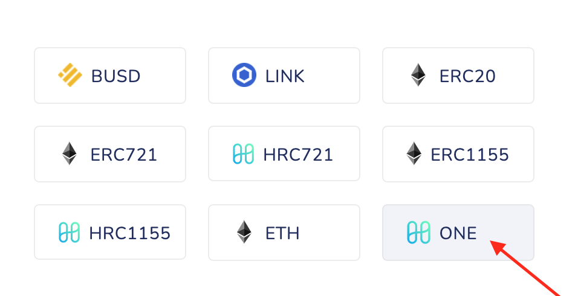

Binance [ONE](https://bscscan.com//token/0x03fF0ff224f904be3118461335064bB48Df47938) ↔ Native [Harmony ONE](https://explorer.harmony.one/address/0x00eeeeeeeeeeeeeeeeeeeeeeeeeeeeeeeeeeeeee?activeTab=3) on Harmony

[1ONE](https://etherscan.io/token/0xD5cd84D6f044AbE314Ee7E414d37cae8773ef9D3) on Ethereum ↔ Native [Harmony ONE](https://explorer.harmony.one/address/0x00eeeeeeeeeeeeeeeeeeeeeeeeeeeeeeeeeeeeee?activeTab=3) on Harmony

## **Binance BNB**

There is also the special button:

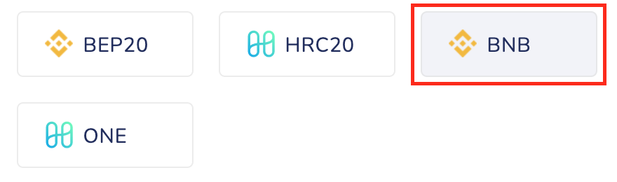

Use it to bridge [BNB](https://bscscan.com//token/0x00eeeeeeeeeeeeeeeeeeeeeeeeeeeeeeeeeeeeee) from Binance to Harmony and also to bridge [bscBNB](https://explorer.harmony.one/#/address/0xb1f6E61E1e113625593a22fa6aa94F8052bc39E0?activeTab=3) back to Binance. 

## Ethereum **ETH**

There is a special button:

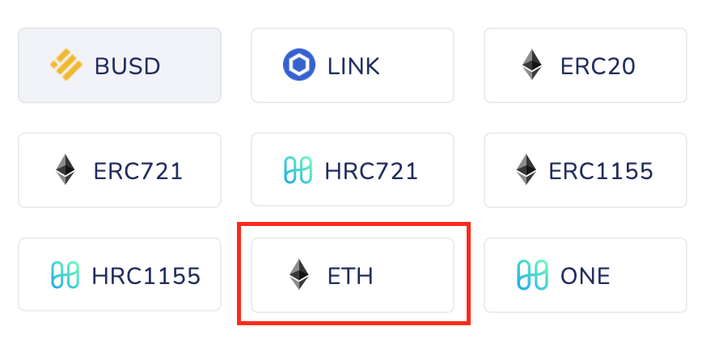

Use that buttons to bridge [ETH](https://etherscan.io/token/0x00eeeeeeeeeeeeeeeeeeeeeeeeeeeeeeeeeeeeee) and bridge back [1ETH](https://explorer.harmony.one/#/address/0x6983D1E6DEf3690C4d616b13597A09e6193EA013?activeTab=3) from Harmony to Ethereum. 

## Ethereum **BUSD**

There are special buttons for these tokens.

Use this button to bridge [BUSD](https://etherscan.io/token/0x4fabb145d64652a948d72533023f6e7a623c7c53) from Ethereum and bridge [BUSD](https://explorer.harmony.one/address/0xE176EBE47d621b984a73036B9DA5d834411ef734?activeTab=3) tokens back from Harmony. 

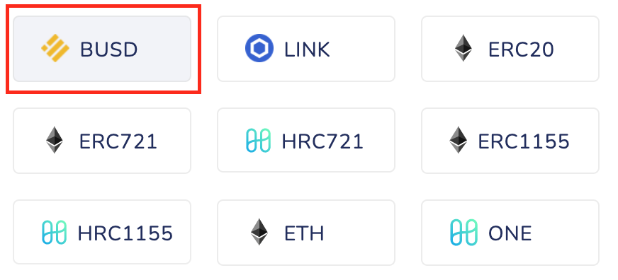

## Ethereum **LINK**

Use this button to bridge [LINK](https://etherscan.io/token/0x514910771af9ca656af840dff83e8264ecf986ca) from Ethereum and bridge back Harmony [LINK](https://explorer.harmony.one/address/0x218532a12a389a4a92fc0c5fb22901d1c19198aa) tokens. 

## Other tokens

### **To Harmony**

1. Select a token type. 

The token type you select is based on where the token was originally issued. For example, if you are bridging USDT from Ethereum or sending it back, use ERC20. Use BEP20 option for any BEP20 token that you are bridging from Binance or sending it back. 

Use HRC20 option only for tokens that were originally minted on Harmony (e.g. VIPER). Never use HRC20 for bridging tokens issued on Ethereum or Binance. If your token is now on Binance or Ethereum and it has “1” prefix (e.g. 1VIPER), it most likely is HRC20 token bridged from Harmony or other token incorrectly bridged as HRC20. In such cases, it can be bridged back as HRC20. 

You can check token type on the token page:

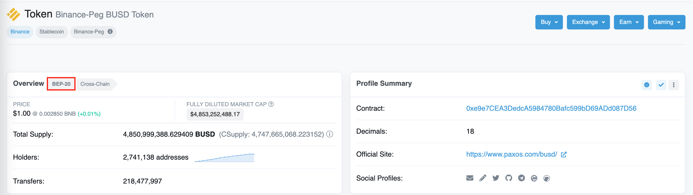

Or you can find your token here: [https://bridge.harmony.one/tokens](https://bridge.harmony.one/tokens)

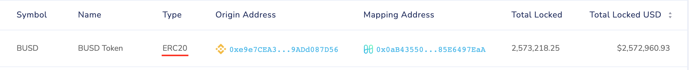

1. Find your token in the list. Compare an address you see on the page to your token address to avoid confusion. You can also paste your token address in the field to find it:
    
    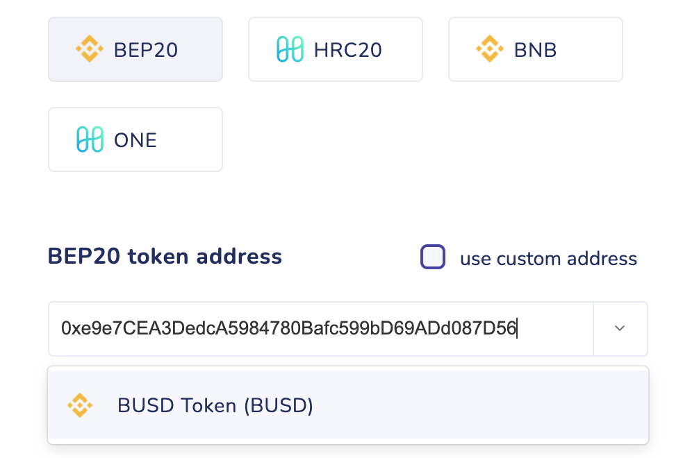
    

Don’t use a custom token address, unless your token is unique or you have a good understanding of what you are doing. All popular tokens are already listed.

If you haven’t found your token, check the token type and address.

After you selected a token, you’ll see the green message “Token selected successfully”.

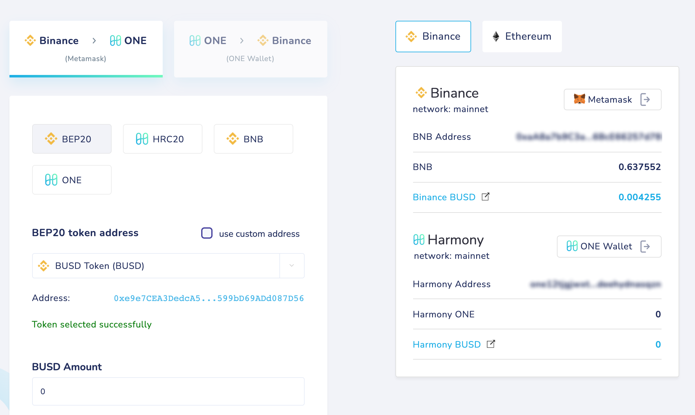

On the right part, you will see the correct amount of the selected token in the wallet and a link to its page. 

If your Harmony wallet is connected, you’ll see an amount of the mapped token on Harmony and a link to it.

### **From Harmony**

If you bridge back a token issued on a partner network (Binance or Ethereum), you need to find the mapped token in that network. If you received your token by bridging, it’s the same token you had before that operation. It’s also the same token you’ll get after you bridge your token back.
If the token origin is not Harmony, on the operation page you’ll need to choose that Binance or Ethereum token, not the bridged token you now have in the wallet. For example, if you have [bscBUSD](https://explorer.harmony.one/address/0x0aB43550A6915F9f67d0c454C2E90385E6497EaA?activeTab=3) token, you need data of a mapped BUSD token on Binance. You can search by bscBUSD address here [https://bridge.harmony.one/tokens](https://bridge.harmony.one/tokens):

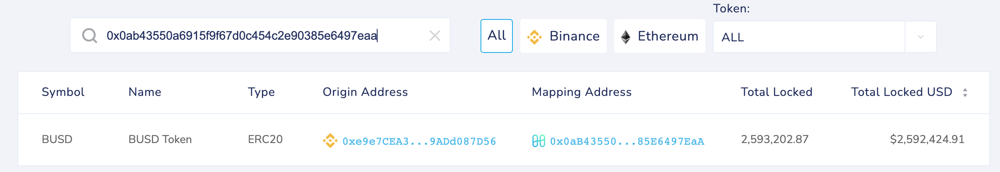

As you can see, the origin address belongs to BUSD token on Binance.

1. Select a token type

The token type you select is based on where the token was originally issued. 

First, find out which network is your token belongs to. Remember that tokens from different partner chains (Ethereum and Binance) are not interchangeable. 
If your token on Harmony has “bsc” prefix, it’s BEP20 token from Binance. Bridge it back to Binance as **BEP20** (unless it’s not bscBNB, there is BNB button for it).
If your token on Harmony has “1” prefix, it’s a token from Ethereum. Bridge it back as **ERC20**.

Token originally minted on Harmony is **HRC20** (e.g. VIPER). Never use HRC20 for bridging back Ethereum or Binance tokens. 

1. Find the token in the list.

If you bridge back a token issued on a partner network (Binance or Ethereum), you need to find the mapped token in that network. Choose it from the list. You can search by its origin address.

Don’t use a custom token address, unless your token is unique or you have a good understanding of what you are doing. All popular tokens are already listed.

If you haven’t found your token, check the token type and address.

After you selected a token, you’ll see the green message “Token selected successfully”.

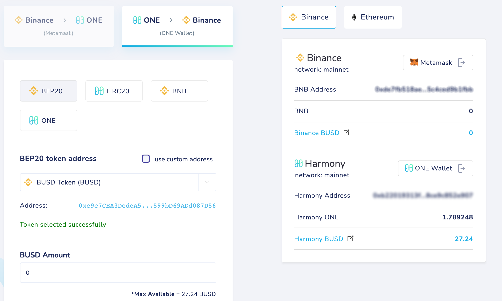

On the right part, you will see the correct amount of the token in your wallet in Harmony and a link to its page. 

If your second wallet is connected, you’ll see an amount of the mapped token on Binance or Ethereum and a link to it. If you are bridging a token originally issued on that network, it should be the same token you’ve chosen on the page.