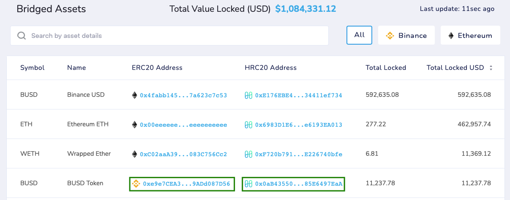

# Adding Tokens

In order to see the corresponding asset on your wallet you may need to add it manually to it. For this, you need the corresponding contract which you can find [here](https://bridge.harmony.one/tokens).

Check [here](../../network/wallets/browser-extensions-wallets/metamask-wallet.md#hrc-20-hrc721-transactions) for instructions on how to add a custom token on Metamask.

On the example below, in green are the corresponding contracts for Binance BUSD on Harmony Chain and Binance Smart Chain (BSC).


Keep in mind the bridge has contracts for BUSD on both Ethereum and Binance Smart Chain (BSC). For you to see the funds, use the correct contract address.


