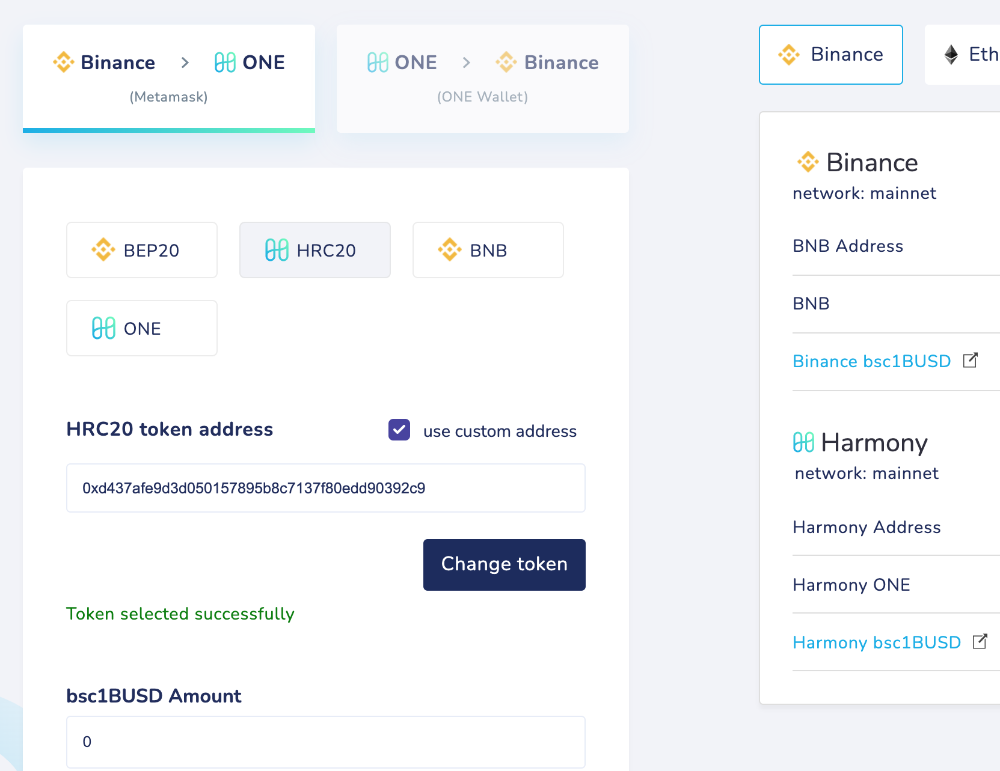
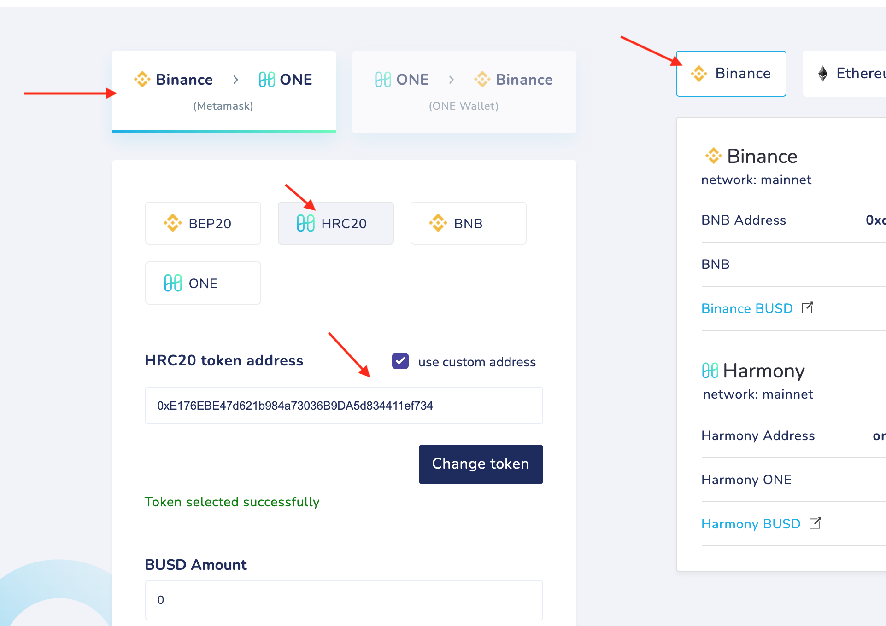
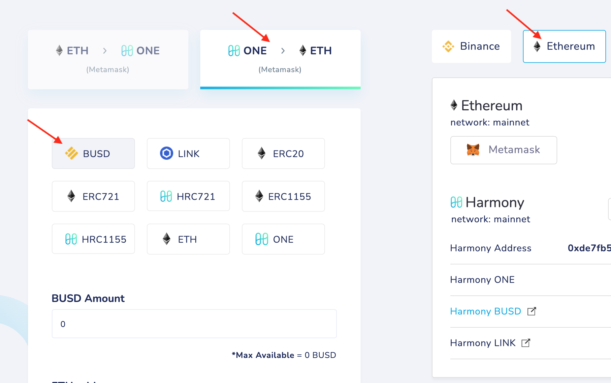

# 1bsc1BUSD

**1bsc1BUSD → bsc1BUSD → 1BUSD → BUSD**

**1bsc1BUSD → bsc1BUSD**

Bridge your tokens from Binance to Harmony

Settings:
type: **HRC20,** custom token address: **0xd437afe9d3d050157895b8c7137f80edd90392c9**

**bsc1BUSD → 1BUSD** 

Bridge your tokens from Harmony to Binance using these settings:

type: **BEP20,** custom token address: **0x5b48e05cb36d509b573990e97124cf1e90f2f36f**

**1BUSD → BUSD**

Next, bridge your 1BUSD tokens from Binance to Harmony

Settings:
type: **HRC20,** custom token address: **0xe176ebe47d621b984a73036b9da5d834411ef734**

After this operation, you'll have BUSD tokens in Harmony network. You can swap them or bridge to the Ethereum network if you want. 

Please use the following settings if you want to bridge your tokens to Ethereum:
from Harmony to **Ethereum**
type: **BUSD**

