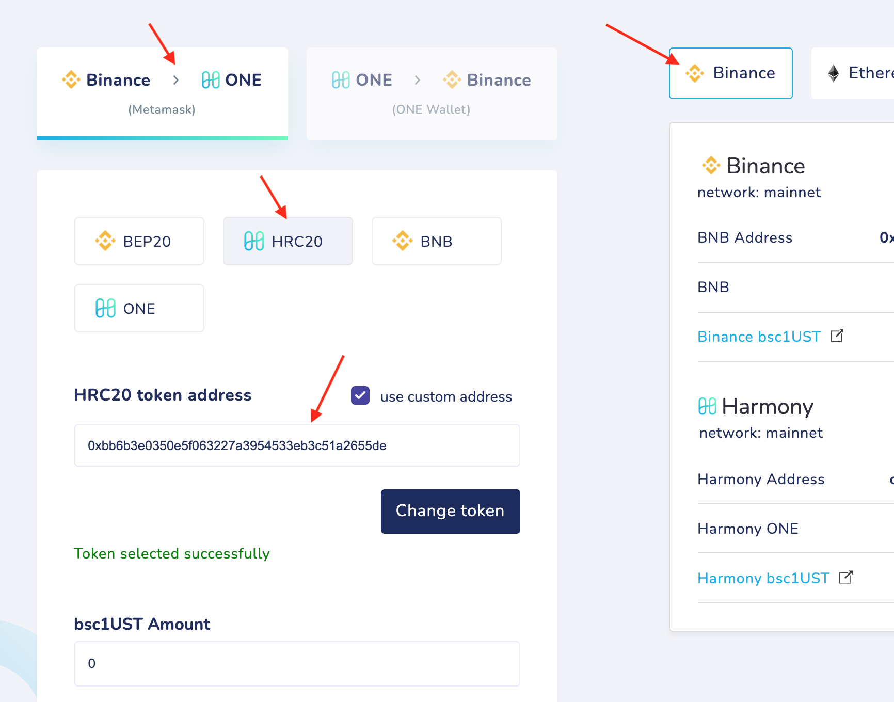
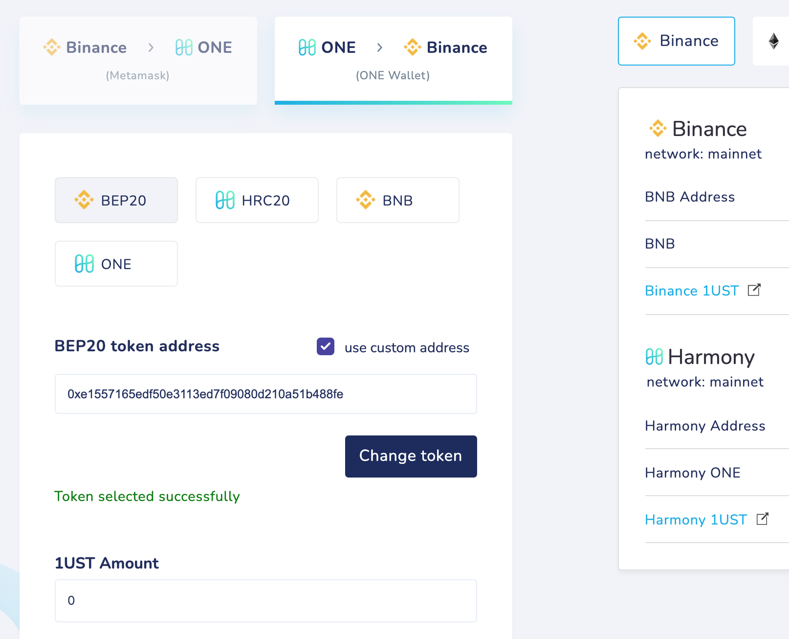

# 1bsc1UST

**1bsc1UST → bsc1UST → 1UST → UST**

**1bsc1UST → bsc1UST**

Binance→Harmony

HRC20

custom token address 0xbb6b3e0350e5f063227a3954533eb3c51a2655de

**bsc1UST → 1UST**

Harmony→Binance

BEP20

custom token address: **0xe1557165edf50e3113ed7f09080d210a51b488fe**

**1UST → UST**

Binance→Harmony

HRC20 

Choose Wrapped UST Token (1UST), token address: **0x224e64ec1bdce3870a6a6c777edd450454068fec**