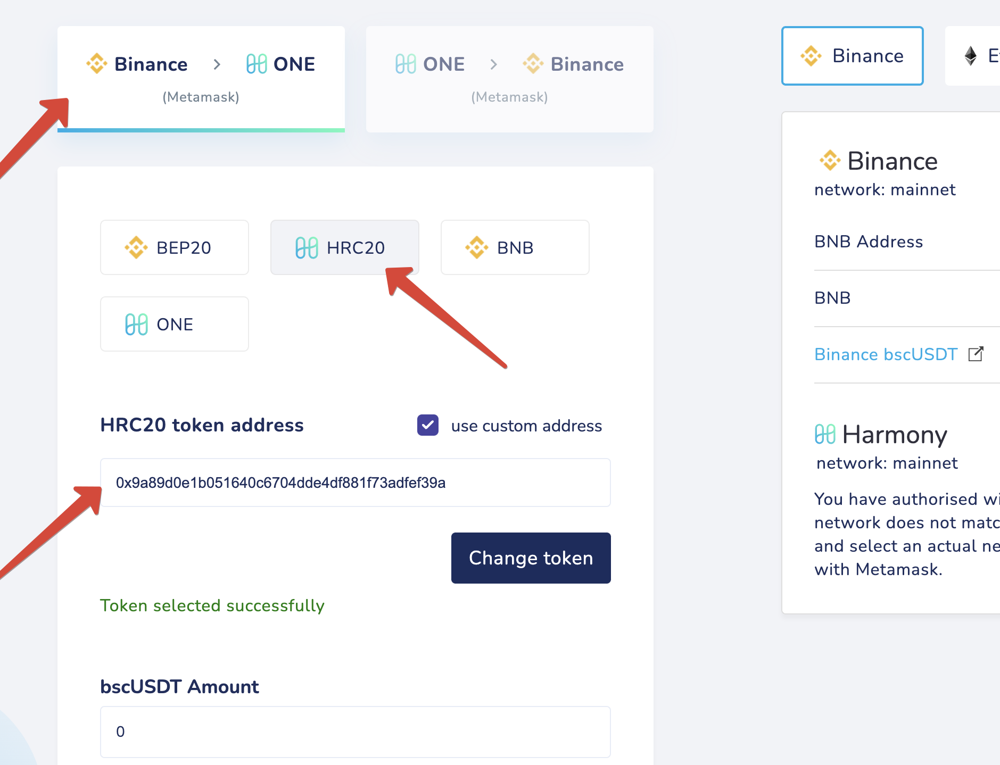

# 1bscUSDT

Steps to unwrap: 

**1bscUSDT → bscUSDT → USDT**

**1bscUSDT → bscUSDT** 

Bridge 1bscUSDT token from **Binance** **to** **Harmony**

Settings: **HRC20**, custom token address: **0x9a89d0e1b051640c6704dde4df881f73adfef39a**

Now you have **bscUSDT** tokens which you can swap or bridge. 

If you want to swap your tokens, you can use [https://viperswap.one/#/swap](https://viperswap.one/#/swap) or ask about available DEX in the Harmony community groups.

For bridging them from Harmony **to Binance**, use the following settings:
**BEP20**, choose **Tether USD (USDT)** from the list. 
Token address: **0x55d398326f99059fF775485246999027B3197955**

