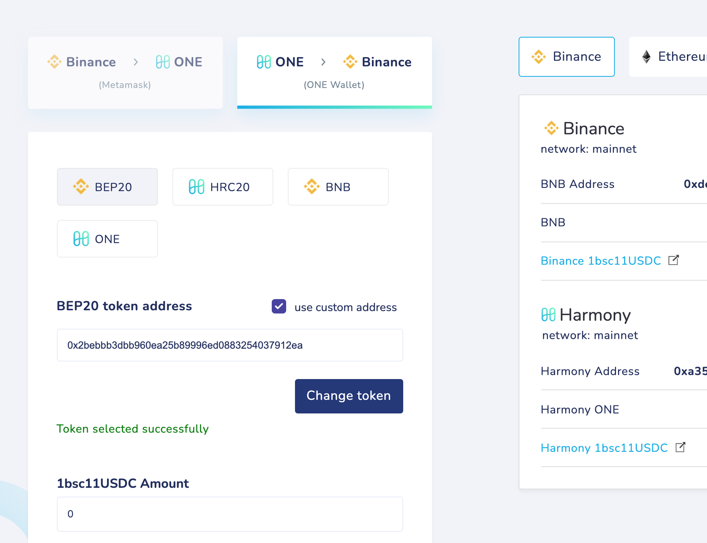
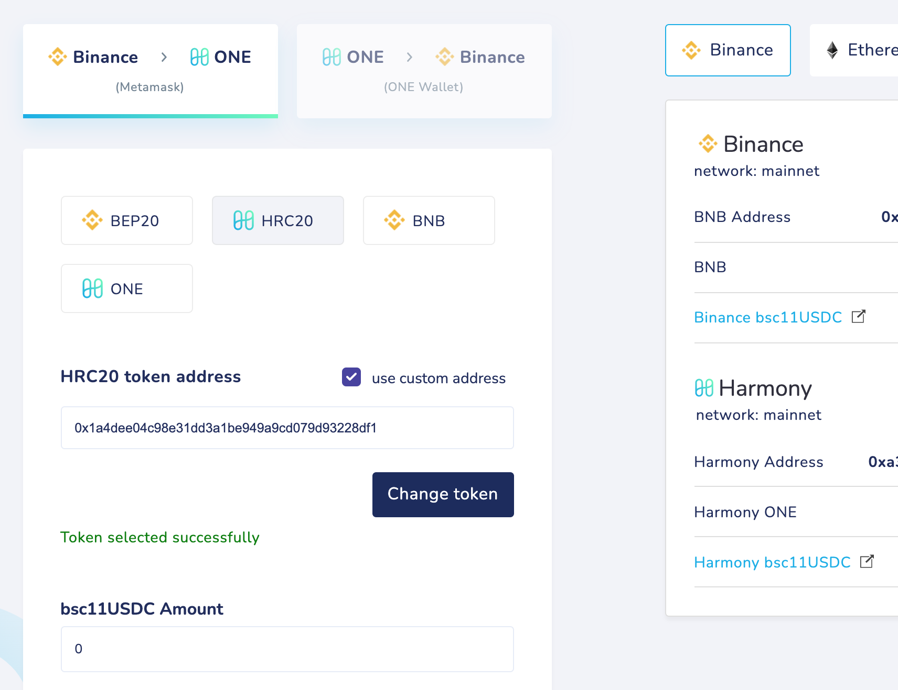
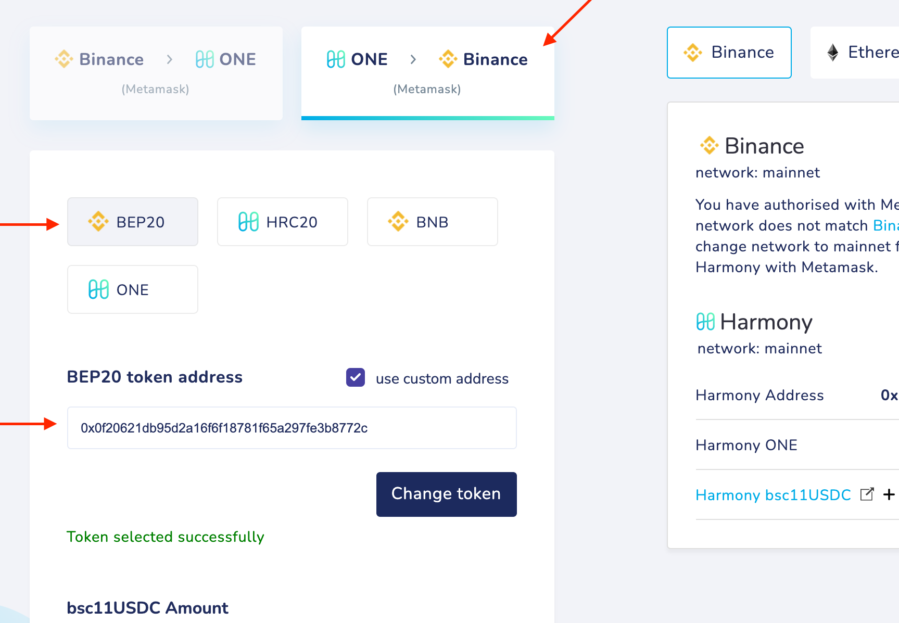
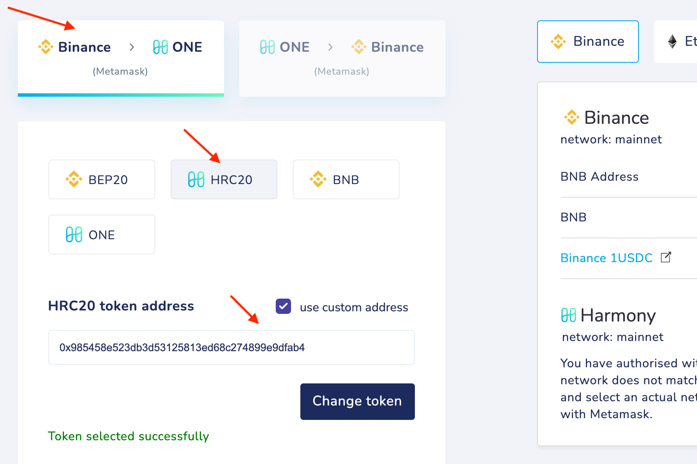
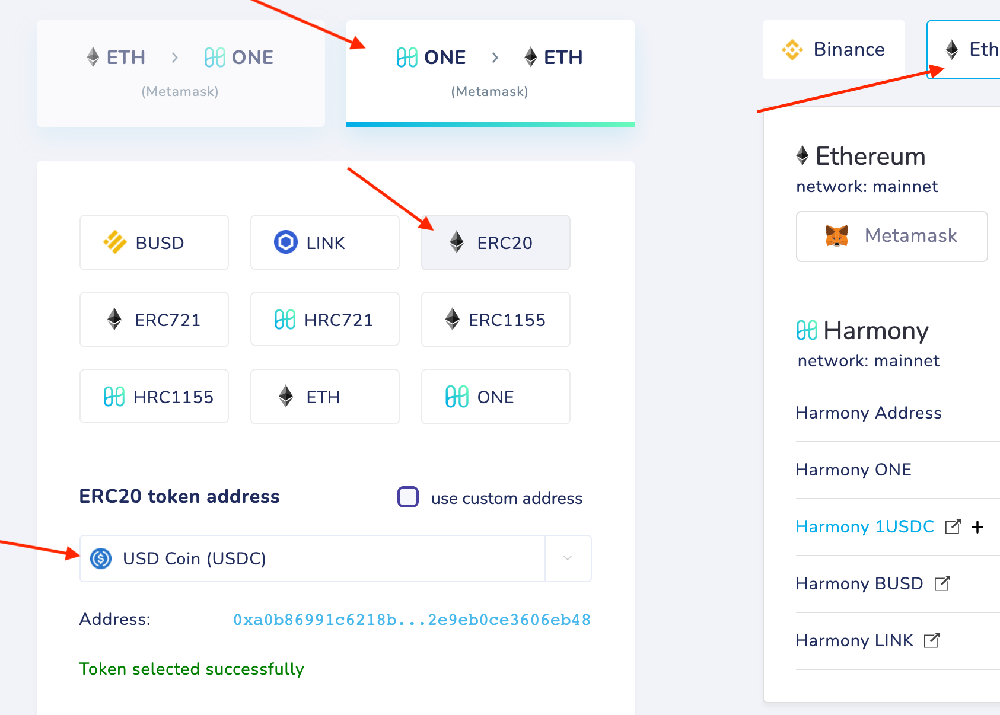

# bsc1bsc11USDC

Steps to unwrap:

**bsc1bsc11USDC → 1bsc11USDC → bsc11USDC → 11USDC → 1USDC → USDC**

**bsc1bsc11USDC → 1bsc11USDC**

Bridge your tokens from Harmony to **Binance**

Settings:
type **BEP20**
custom address: **0x2bebbb3dbb960ea25b89996ed0883254037912ea**

**1bsc11USDC → bsc11USDC**

Binance ****→ **Harmony**

Settings:
type: **HRC20**
custom address: **0x1a4dee04c98e31dd3a1be949a9cd079d93228df1**

**bsc11USDC → 11USDC** 

Harmony → **Binance**

Settings:
type **BEP20**
custom address: **0x0f20621db95d2a16f6f18781f65a297fe3b8772c**

**11USDC → 1USDC** 

Binance ****→ **Harmony**

Settings:
type: **HRC20**
custom address: **0x985458e523db3d53125813ed68c274899e9dfab4**

Now you have **1USDC** tokens which you can swap or bridge.

If you want to swap your tokens, you can use [https://viperswap.one/#/swap](https://viperswap.one/#/swap) or ask about available DEX in the Harmony community groups.

If you want to bridge your tokens to get USDC on Ethereum, please do the following operation:

Settings:
from Harmony to **ETH**
type: **ERC20,**
token: **USD Coin (USDC),** address: **0xA0b86991c6218b36c1d19D4a2e9Eb0cE3606eB48**