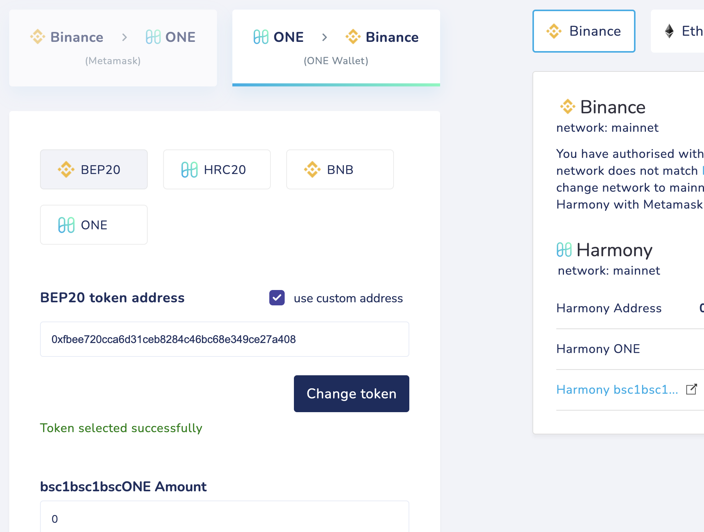
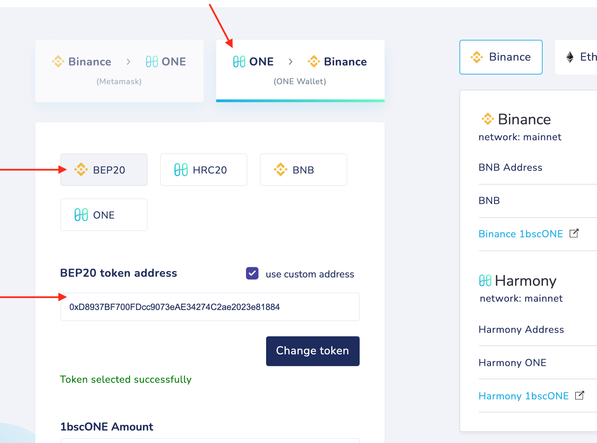
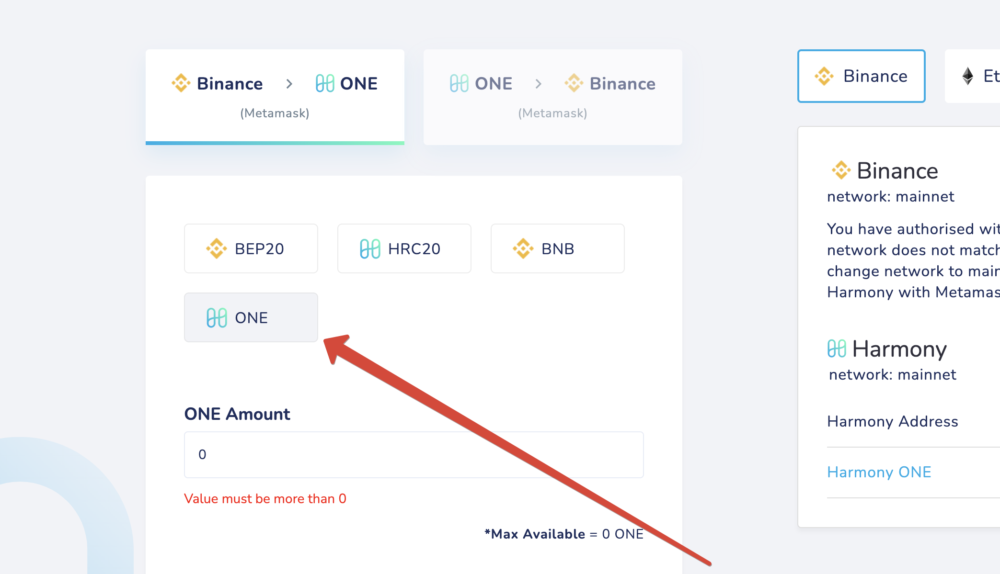

# bsc1bsc1bscONE

Steps to unwrap:

**bsc1bsc1bscONE -> 1bsc1bscONE -> bsc1bscONE -> 1bscONE -> bscONE -> ONE (BSC) -> ONE (HMY)**

**bsc1bsc1bscONE -> 1bsc1bscONE** 

Bridge your tokens to **Binance**. 

Choose **BEP20** with custom token address: **0xfbee720cca6d31ceb8284c46bc68e349ce27a408**

**1bsc1bscONE -> bsc1bscONE**

Next, bridge 1bsc1bscONE to **Harmony**

Choose **HRC20** with custom address **0x3E26A513aEE9e3cbE4E246850ac9365AA88d06c0** 

**bsc1bscONE -> 1bscONE** 

Bridge your bsc1bscONE tokens to **Binance** 

Choose  **BEP20** with custom address  **0xD8937BF700FDcc9073eAE34274C2ae2023e81884** 

**1bscONE -> bscONE** 

Bridge your 1bscONE to **Harmony**

Choose **HRC20** with custom address  **0xAD785c955625E4e82cdAE2F997cd6038A8ecd90E** 

**bscONE -> ONE (BSC)** 

Bridge your bscONE from Harmony to **Binance** to receive Binance ONE

Settings: 
**BEP20**
Custom token address: **0x03ff0ff224f904be3118461335064bb48df47938**

**ONE (BSC) -> ONE (HMY)**

Bridge your tokens to Harmony. 
Choose **ONE** to receive them as Native ONE tokens instead of bscONE (no custom address needed):

