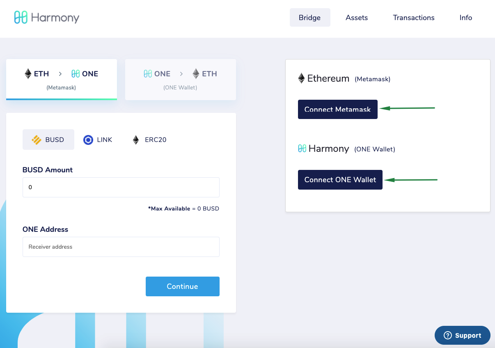
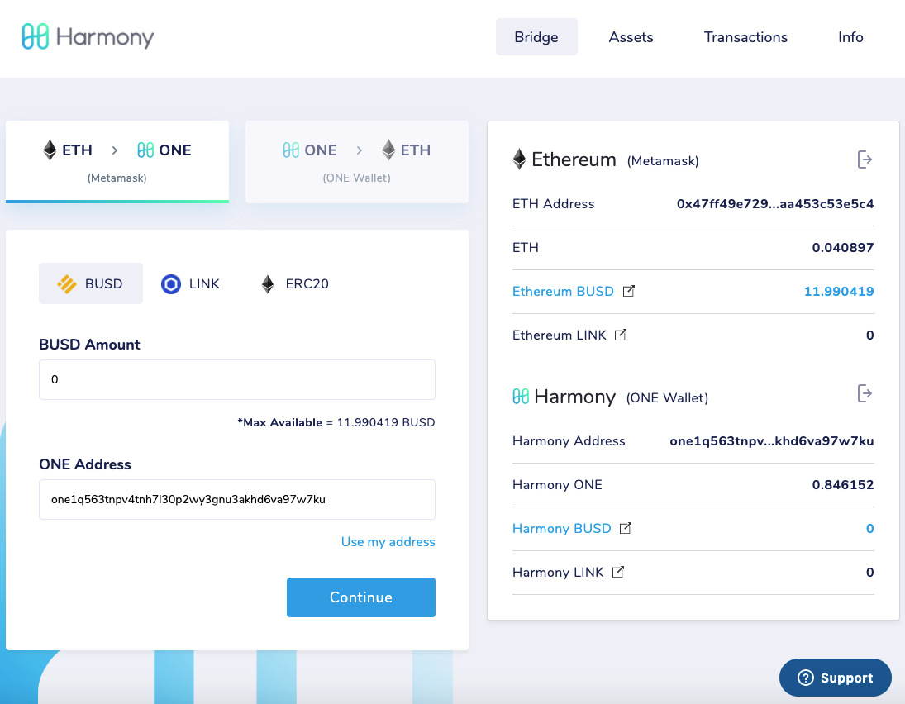
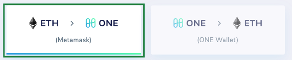
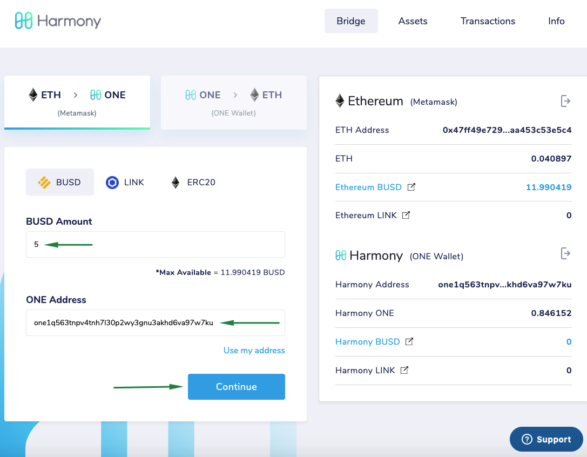
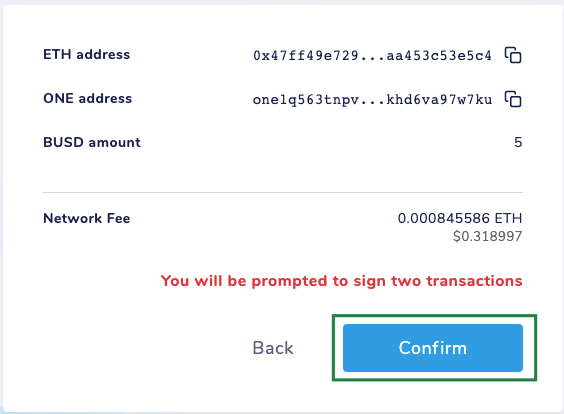
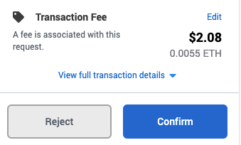
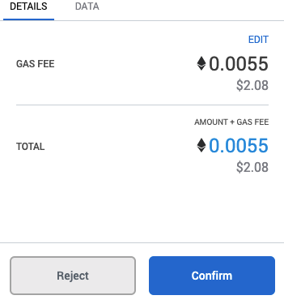
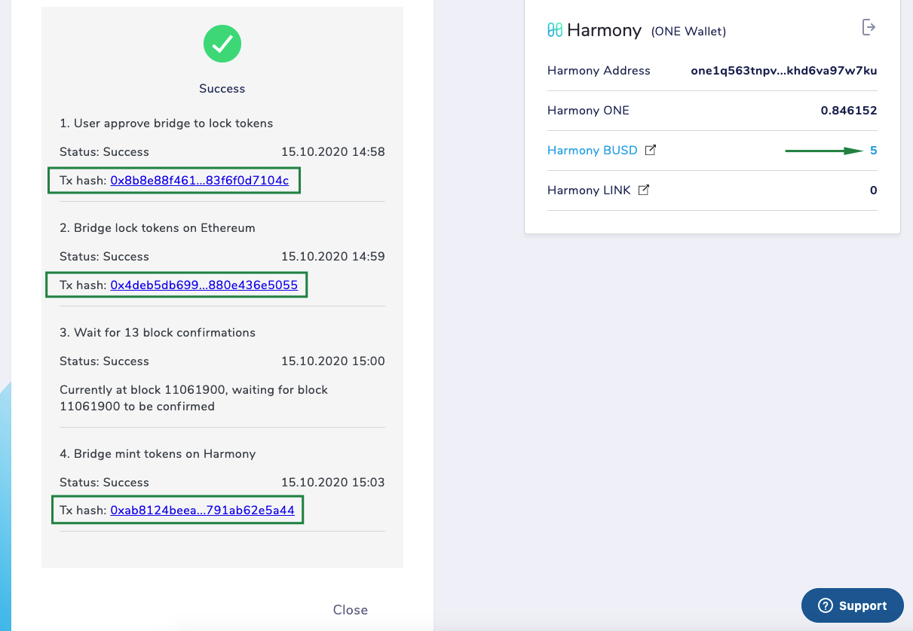
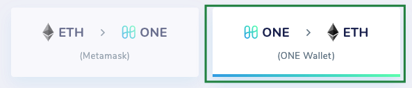

# Bridging ETH <> ONE


Do NOT send bridged tokens directly to other blockchains or exchanges. This will not work and it might result in **permanent loss** of your tokens. Bridged tokens can only be used on Harmony network. The only way to send them out is by bridging them back.


### Connecting Wallets

Access the Horizon Bridge web page: [https://bridge.harmony.one/](https://bridge.harmony.one)

Click on button **Connect Metamask**. A pop-up page will appear for you to confirm which wallet you want to connect from. Selected the desired wallet, click on _Next_ and then _Connect_. Click now on **Connect ONE Wallet**. A pop-up page will appear for you to confirm which wallet you want to connect from. Select the desired wallet and click on _Accept_.

If your wallets were successfully connected, you will see a screen like the one below with your ETH and ONE addresses along with their respective wallet balances:

### Swapping ETH > ONE Tokens

On the example below, we will be swapping Ethereum ERC-20 for Harmony HRC-20 tokens and using** BUSD. **Make sure to select ETH > ONE (Metamask) on top as we want to convert from Ethereum to Harmony.

1. Fill the amount you want to swap
2. Check the ONE Address you want to send your tokens to (if it was not filled automatically, click on _Use my address_)
3. Click on _Continue_

After clicking on _Continue_ you will be shown a new window where you have to _Confirm_:

Now, in Metamask Wallet you will be prompted to confirm two transactions, similar to the ones one the images below:

Confirm both transactions by clicking on button _Confirm_.

If successful, you will be shown an image like the one below where you will see all transactions hashes along with the new amount minted on Harmony blockchain.


This process can take a few minutes as the bridge needs to wait a certain number of blocks for the transactions to be confirmed.



In order to see the tokens on your wallet you might need to [add them](adding-tokens.md).


### Swapping ONE > ETH Tokens

For swapping HRC-20 tokens for ERC-20 tokens the process is very similar. Make sure you select ONE -> ETH (ONE Wallet) on top as we want to convert from Harmony to Ethereum this time:


The remaining process is pretty much the same as the one mentioned on the section before, but this time you will need to confirm the two transactions using the ONE Wallet instead of the Metamask wallet.


### Support

If you have any issue using the bridge, please click on _Info_ at the top of the page, where you will be given instructions on how to report them.

Alternatively you can join our Telegram Support channel at [https://harmony.one/bridge-support](https://harmony.one/bridge-support)
