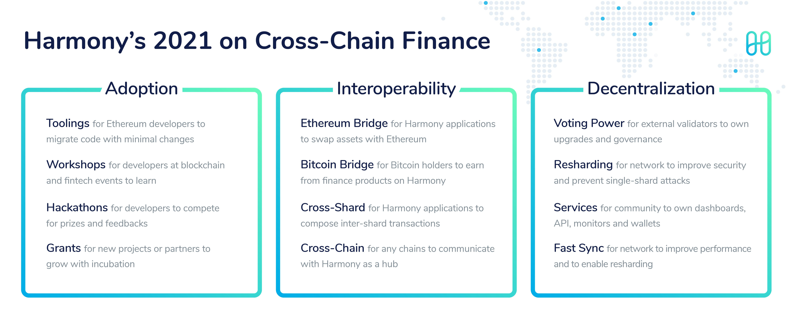

# Roadmap

In 2021 Harmony strives to be a top blockchain for cross-chain finance. Our main themes are:

1. **Adoption** — We are bringing utility to users through developers and partners. Hackathons with Gitcoin and workshops at Ethereum events will boost our reach.
2. **Interoperability** — We are bridging with Bitcoin and Ethereum for broader assets. Our cross-shard and cross-chain transactions will enable new finance applications.
3. **Decentralization** — We are growing our validator community and network features. External voting power and resharding will guarantee our long-term governance.

Here is our 2021 milestone progress. Learn more about our 2020 [ecosystem growth](https://medium.com/harmony-one/harmony-2020-year-in-review-ecosystem-growth-f414a86dbda9) journey.

Read more:



