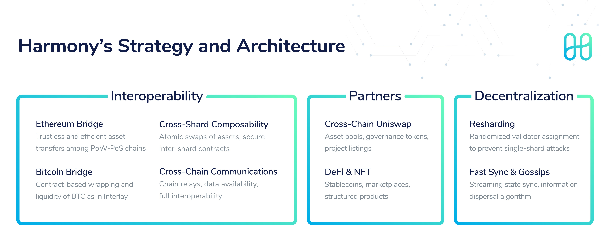

# Strategy & Architecture

Harmony in 2021 will focus on adoption through developers and partners. We will continue to strengthen our network features, to lead industry in our cross-chain architecture, and to engage broad ecosystem to build with us. There will be explosive growth and new applications this year in blockchains — Harmony is ready to be leading a part of this global fintech revolution.

Towards our mission, Harmony’s current strategy is “Cross-Chain Finance” as decentralized finance and interoperable protocols are the product-market fit in 2021. We are building trustless bridges to Bitcoin and Ethereum for broader access of users and assets with Harmony as a hub. An example of utility is a cross-chain exchange without custodial risks. Our current settlement layer and soon liquidity infrastructure will enable further financial innovations, leading to cross-exchange integrations and cross-border finance.

Read more:



