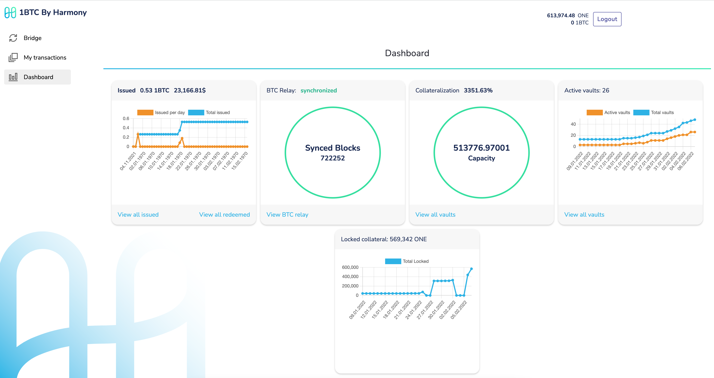
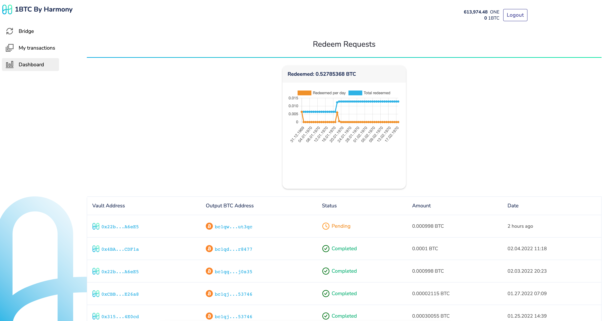
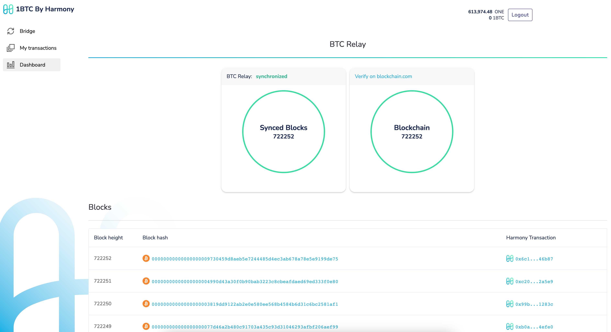
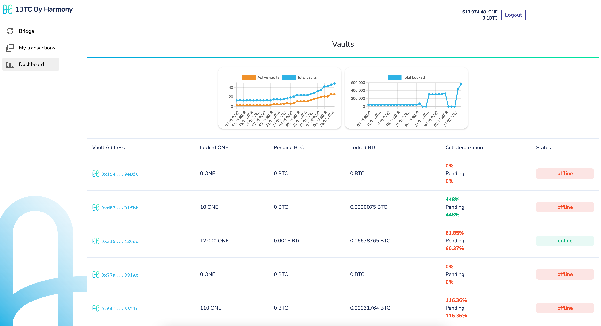
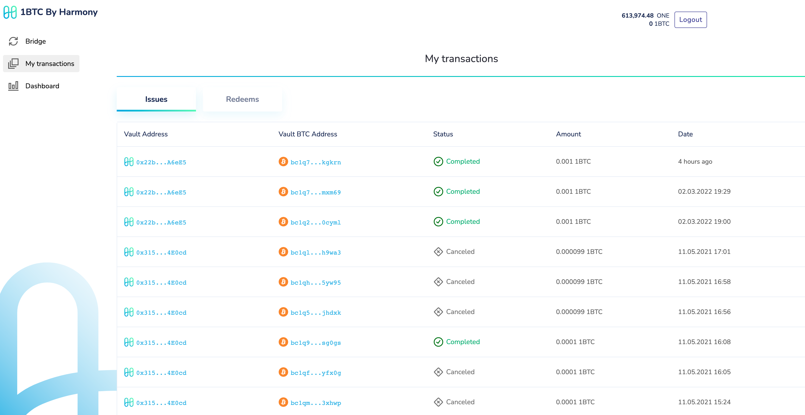

# Bridge Dashboard

**The Bridge Dashboard**

**Click the "View all issued" link to view all issue requests done by bridge users.**

This represents all BTC to 1BTC bridge transactions.

**Click the "View all redeemed" link to view all redeem requests done bridge users.**

This represents all 1BTC to BTC bridge transactions.

**Click the "View BTC Relay" link to check the blockchain sync status of the relay.**

**Click the "View all Vaults" link to view a list of all the external vaults and their details.**

**Click the "My Transactions" link on the left to view all your pending, canceled, and completed issue and redeem transactions.**

