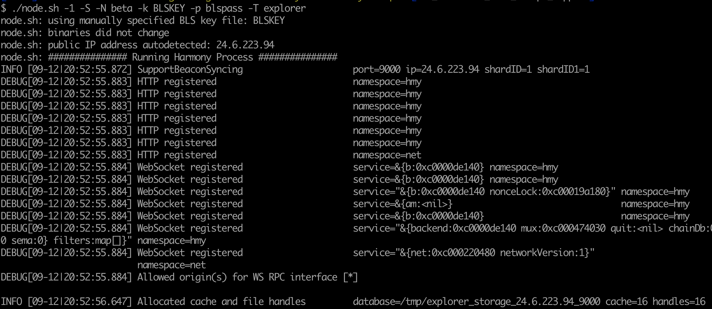

# Non-validating Nodes

Non-validating node is a full node of the blockchain with full history. It connects to the blockchain network using p2p. The non-validating node can be used by exchange or wallet website to broadcast transactions, to query balances, to fetch transaction data using RPC interfaces.

Harmony uses a node type called explorer node to satisfy the above requirements. Since Harmony is a sharded blockchain, it is currently required to setup one node per shard.

Non-validating node is a full-node with full history of the blockchain stored.

## Software Build

Please follow the readme file on the harmony repo to build the latest software release from master branch. Master branch newer than this [commit](https://github.com/harmony-one/harmony/commit/64976342c65a5b76a000ac1890e6655cbf59cc57) should be good for non-validating node.

[https://github.com/harmony-one/harmony](https://github.com/harmony-one/harmony)

Or you may download the prebuilt node binary.

## Installation

To setup node on public cloud, please try to follow this [document](https://nodes.harmony.one/foundational-node-playbook/setting-up-your-node/setupnode) for setup.

By default, the host needs to open up ports 5000, 6000, 9000, 9500, 9800, and 14555 for all the RPC and syncing functions. The default base port is 9000, all other ports are setup based on the base port.

* 5000 port is used for explorer API.
* 6000 port is used for blockchain state syncing.
* 9000 port is used for blockchain consensus messages.
* 9500 port is used for SDK RPC service
* 9800 port is used for Websocket service
* 14555 port is used for special client service like faucet on betanet

There is no need to have a valid BLS key for non-validating node as it won't join the consensus.

## Machine Spec.

Non-validating node is a full node of the blockchain except for not joining consensus. It is expected to have the node software running on an AWS m5.large equivalent host. The spec of m5.large can be found in this [document](https://aws.amazon.com/ec2/instance-types/m5/).

A node needs to sync both beacon chain and the shard chain data. It is expected to have 150Gb disk for 6 months data storage.

## Run the Node

### Download the node software.

`curl -LO https://harmony.one/node.sh`

`chmod +x node.sh`

`./node.sh -d -N beta`

### Create dummy key/pass files

`touch BLSKEY`

`touch blspass`

### Run the node software

`./node.sh -1 -S -N beta -k BLSKEY -p blspass -T explorer`

`The expected output is like:`

If you want to build your own version of harmony node, please just overwrite the harmony binary and restart the node.sh.

