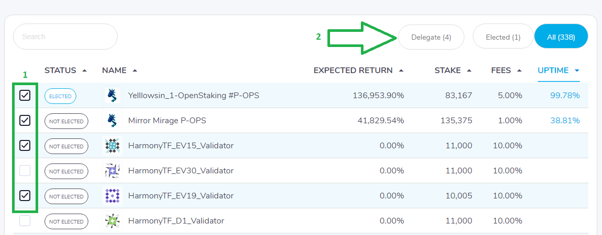
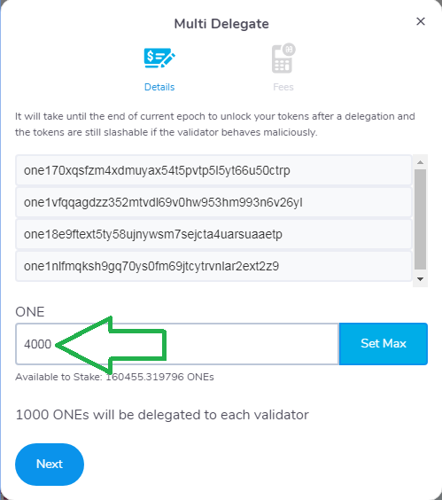

# Staking Transactions

## Delegating to A Validador

Check the validators page to see list of validators. Click on desired validator logo to direct to the Validator profile for more details.

Click on the "Delegate" button to delegate to this validator.

Enter the desired delegation amount or scroll the percentage slider in the pop-up Delegate window. Delegation must be at least 1000 ONE. Click on "Next" and confirm the signature request.

Different wallets use different ways to confirm signature request. Please check the [Wallet](https://app.gitbook.com/@harmony-one/s/home/~/drafts/-M7F2-rR3OLvk7_5kftG/wallets) section for details.

Once transaction is signed, Delegate window will pop-up on the staking dashboard and display the transaction status.

## Delegating to Multiple Validators

Check the validators page to see list of validators. Selected the validators you want to delegate to using the checkbox as shown by the image below, then click on "Delegate":

Now, on the new window, input the total amount you want to split between the validators you selected previously. On this example, we are delegating a total amount of 4000 ONE's which will be split equality between all the validators we selected. Each one of them will receive 1000 ONE's. You can split any amount you want, as long as the minimum amount per validator is 1000 ONE's.

Click on "Next" to confirm the delegations.

## Undelegating

If a delegator decides to stop delegating to a validator, he or she can choose to undelegate their tokens from the validator. After undelegation transaction is submitted, the undelegated tokens will be locked until the end of the current epoch. Note that the unlocked tokens can be used for a new delegation transaction only starting from next epoch. This means the same token can only possibly generate rewards for you starting from the epoch after next epoch.

Click the "Undelegate" button on validator profile.

Signing process same as Delegate transactions.

This transaction will display on the Pending Undelegations section on the Portfolio page.

## Claiming Rewards

The earned block rewards are stored in a separate reward balance of the delegator, which can be immediately withdrawn to the delegator’s account balance. The block rewards can also be staked again to achieve the compounding effect of staking. You can only claim full rewards, not partially.

Click on Claim Rewards button.

Click on "Next" to sign the transaction.

