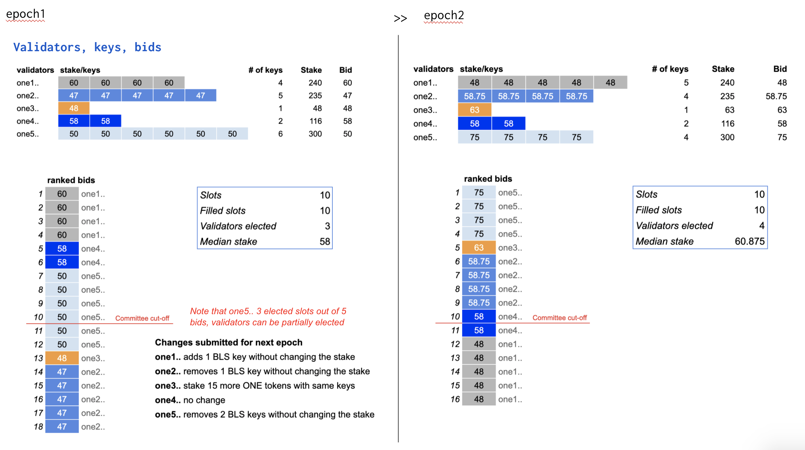
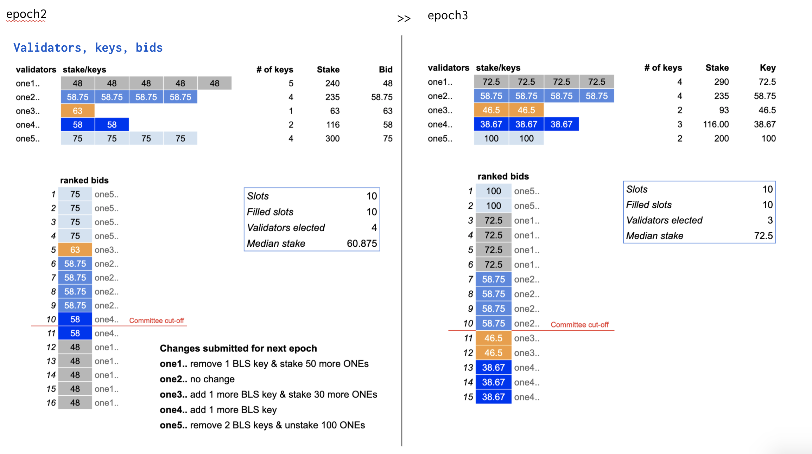
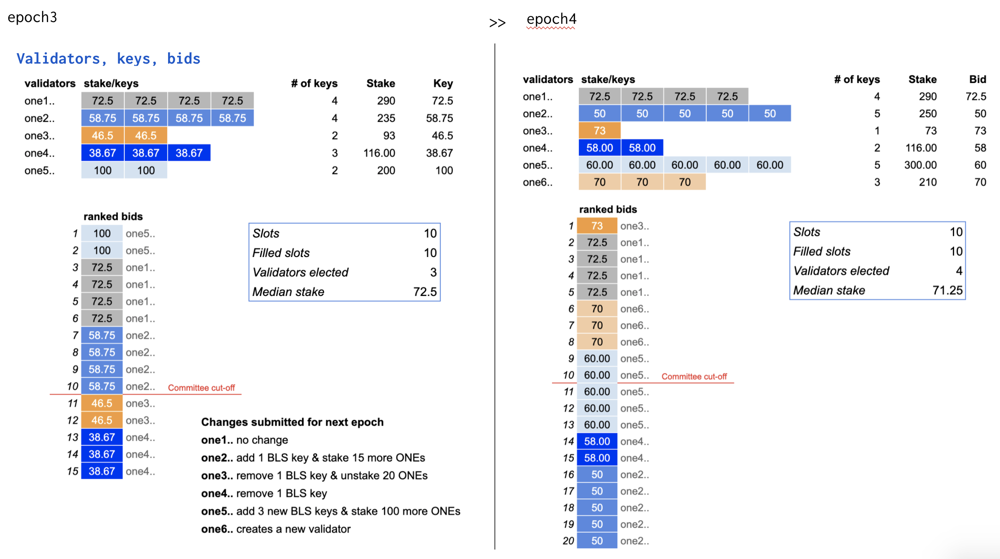

# Effective Proof-of-Stake





Effective stake is a new measure introduced in EPoS in order to prevent stake centralization and still provide capitalistic fairness. For exactly how it achieves that, [here](https://medium.com/harmony-one/introducing-harmonys-effective-proof-of-stake-epos-2d39b4b8d58) is the design rationale behind it.

Let’s call the bid price of the elected BLS keys the _raw stake_. The effective stake of an elected BLS key is a bounded value on its raw stake with a threshold around the median bidder’s raw stake \(denoted as median\_stake in the picture below\). The upper threshold is 115% of the median\_stake and the lower threshold is 85% of the median\_stake. For a key with raw stake that’s out of bound of the threshold, its effective stake will be bounded by the corresponding threshold, otherwise, the effective stake is the same as the raw stake.

The effective stake of each BLS key is determined at the last block of an epoch during the election process and will stay the same throughout the next epoch.

