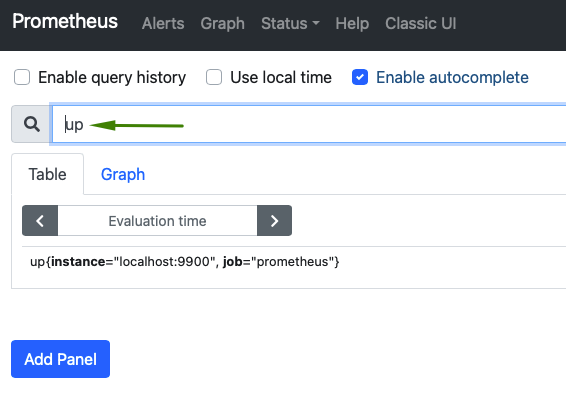
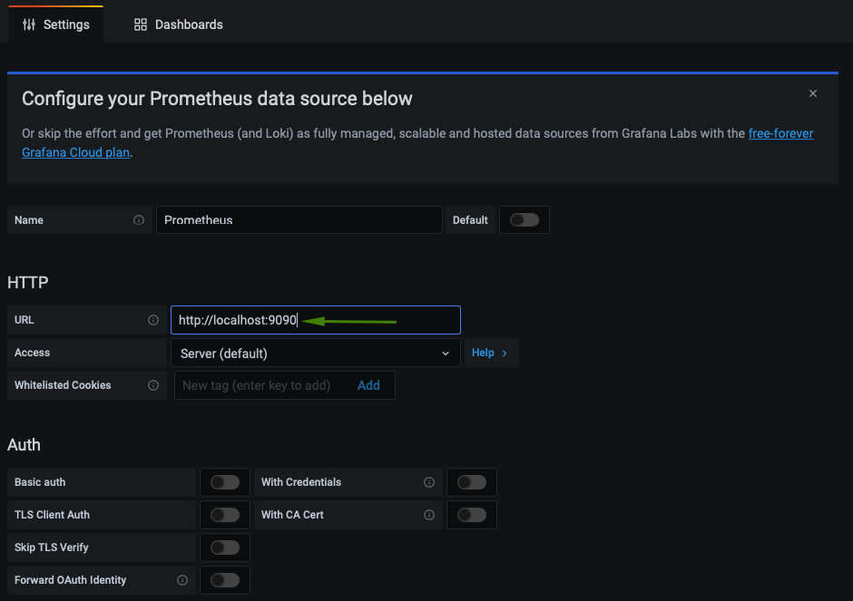
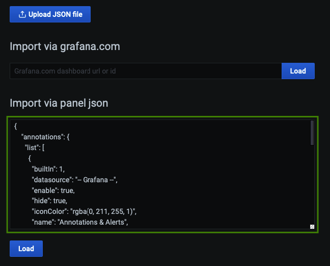

# Prometheus & Grafana

## Prerequisites

### Golang

Make sure you have Golang installed. For instructions on how to install here click [here](https://golang.org/doc/install). To make sure it is installed run correctly:

```bash
go version
```

Output example:

```bash
go version go1.16.3 linux/amd64
```

## Check Metrics

Make sure metrics are being exposed. For this check you can run:

```bash
curl localhost:9900/metrics | grep ^hmy
```

Output example:

```bash
 % Total    % Received % Xferd  Average Speed   Time    Time     Time  Current
                                 Dload  Upload   Total   Spent    Left  Speed
100  6087    0  6087    0     0   849k      0 --:--:-- --:--:-- -hmy_consensus_blskeys{index="0",pubkey="892f005b61d2c4f482a87a1da7226c210dbb6175b52ba391a941bcdab577f90767d0bbb5282f0d073b73eeb706c14810"} 0
-:--hmy_consensus_finality_bucket{le="800"} 1959
:-hmy_consensus_finality_bucket{le="1000"} 1960
- hmy_consensus_finality_bucket{le="1250"} 1960
 8hmy_consensus_finality_bucket{le="1562.5"} 1960
49hmy_consensus_finality_bucket{le="1953.125"} 1960
khmy_consensus_finality_bucket{le="2441.40625"} 1960 (...continues)
```

## Setup Prometheus

### Create User

```bash
sudo useradd -M -r -s /bin/false prometheus
```

### Create Directories

```bash
sudo mkdir /etc/prometheus /var/lib/prometheus
```

### Extract and Install

Download the latest version of Prometheus [here](https://prometheus.io/download/).


The example show below is for Prometheus 2.26.0. Change it accordingly to the version you have downloaded.


```bash
tar xzf prometheus-2.26.0.linux-amd64.tar.gz
sudo cp prometheus-2.26.0.linux-amd64/{prometheus,promtool} /usr/local/bin/
sudo chown prometheus:prometheus /usr/local/bin/{prometheus,promtool}
sudo cp -r prometheus-2.26.0.linux-amd64/{consoles,console_libraries} /etc/prometheus/
sudo cp prometheus-2.26.0.linux-amd64/prometheus.yml /etc/prometheus/prometheus.yml
```

### Configure Targets

Open `prometheus.yml` configuration file:

```bash
sudo vi /etc/prometheus/prometheus.yml
```

Change the default port to 9900 and save the file:

```text
static_configs:
- targets: ['localhost:9900']
```

### Setup Permissions

```bash
sudo chown -R prometheus:prometheus /etc/prometheus
sudo chown prometheus:prometheus /var/lib/prometheus
```

### Setup Systemd

Create prometheus systemd file:

```bash
sudo vi /etc/systemd/system/prometheus.service
```

Add the following to `prometheus.service` file:

```bash
[Unit]
Description=Prometheus Time Series Collection and Processing Server
Wants=network-online.target
After=network-online.target

[Service]
User=prometheus
Group=prometheus
Type=simple
ExecStart=/usr/local/bin/prometheus \
    --config.file /etc/prometheus/prometheus.yml \
    --storage.tsdb.path /var/lib/prometheus/ \
    --web.console.templates=/etc/prometheus/consoles \
    --web.console.libraries=/etc/prometheus/console_libraries

[Install]
WantedBy=multi-user.target
```

### Enable and Start Prometheus

```bash
sudo chmod 755 /etc/systemd/system/prometheus.service
sudo systemctl daemon-reload
sudo systemctl enable prometheus
sudo systemctl start prometheus
sudo systemctl status prometheus
```

### Check Metrics

You can now load Prometheus on your browser: `http://Your_IP_Address:9090`. You can run `up` or any other query to see if everthing is working as expected:



## Setup Grafana

### Install

Follow instructions [here](https://grafana.com/docs/grafana/latest/installation/) on how to download and install Grafana for your OS.


Make sure to enable and start Grafana server.


Once started, you should be able to load Grafana on your browser: `http://Your_IP_Address:3000`. Default user and password is `admin`.


### Add Prometheus Datasource

Go to `http://Your_IP_Address:3000/datasources`and add Prometheu as datasource:



### Import Dashboard

Go to `http://Your_IP_Address:3000/dashboard/import` and load the json file below:



Json file:

```bash
{
    "annotations": {
      "list": [
        {
          "builtIn": 1,
          "datasource": "-- Grafana --",
          "enable": true,
          "hide": true,
          "iconColor": "rgba(0, 211, 255, 1)",
          "name": "Annotations & Alerts",
          "type": "dashboard"
        }
      ]
    },
    "description": "Monitoring Dashboard",
    "editable": true,
    "gnetId": null,
    "graphTooltip": 0,
    "id": 1,
    "links": [],
    "panels": [
      {
        "collapsed": true,
        "datasource": null,
        "gridPos": {
          "h": 1,
          "w": 24,
          "x": 0,
          "y": 0
        },
        "id": 2,
        "panels": [],
        "title": "Status",
        "type": "row"
      },
      {
        "datasource": null,
        "fieldConfig": {
          "defaults": {
            "color": {
              "mode": "thresholds"
            },
            "mappings": [],
            "thresholds": {
              "mode": "absolute",
              "steps": [
                {
                  "color": "green",
                  "value": null
                },
                {
                  "color": "red",
                  "value": 80
                }
              ]
            }
          },
          "overrides": []
        },
        "gridPos": {
          "h": 5,
          "w": 6,
          "x": 0,
          "y": 1
        },
        "id": 4,
        "options": {
          "orientation": "auto",
          "reduceOptions": {
            "calcs": [
              "lastNotNull"
            ],
            "fields": "",
            "values": false
          },
          "showThresholdLabels": false,
          "showThresholdMarkers": true,
          "text": {}
        },
        "pluginVersion": "7.5.3",
        "targets": [
          {
            "exemplar": true,
            "expr": "up",
            "interval": "",
            "legendFormat": "",
            "refId": "A"
          }
        ],
        "timeFrom": null,
        "timeShift": null,
        "title": "Harmony Online",
        "type": "gauge"
      },
      {
        "datasource": null,
        "description": "",
        "fieldConfig": {
          "defaults": {
            "color": {
              "mode": "thresholds"
            },
            "mappings": [],
            "thresholds": {
              "mode": "absolute",
              "steps": [
                {
                  "color": "green",
                  "value": null
                },
                {
                  "color": "red",
                  "value": 80
                }
              ]
            },
            "unit": "short"
          },
          "overrides": []
        },
        "gridPos": {
          "h": 5,
          "w": 10,
          "x": 6,
          "y": 1
        },
        "id": 6,
        "options": {
          "orientation": "auto",
          "reduceOptions": {
            "calcs": [
              "lastNotNull"
            ],
            "fields": "",
            "values": false
          },
          "showThresholdLabels": false,
          "showThresholdMarkers": true,
          "text": {}
        },
        "pluginVersion": "7.5.3",
        "targets": [
          {
            "exemplar": true,
            "expr": "promhttp_metric_handler_requests_in_flight",
            "hide": true,
            "instant": false,
            "interval": "",
            "legendFormat": "",
            "refId": "Pending"
          },
          {
            "exemplar": true,
            "expr": "rate(promhttp_metric_handler_requests_total[5m])",
            "hide": false,
            "instant": false,
            "interval": "",
            "legendFormat": "",
            "refId": "Total"
          }
        ],
        "timeFrom": null,
        "timeShift": null,
        "title": "Metric Handler",
        "type": "gauge"
      }
    ],
    "refresh": false,
    "schemaVersion": 27,
    "style": "dark",
    "tags": [],
    "templating": {
      "list": []
    },
    "time": {
      "from": "now-6h",
      "to": "now"
    },
    "timepicker": {},
    "timezone": "",
    "title": "Harmony Dashboard",
    "uid": "V6MHr8_Gk",
    "version": 5
  }
```

### Load Dashboard

Once you save it you should see the dashboard loaded on Grafana:


