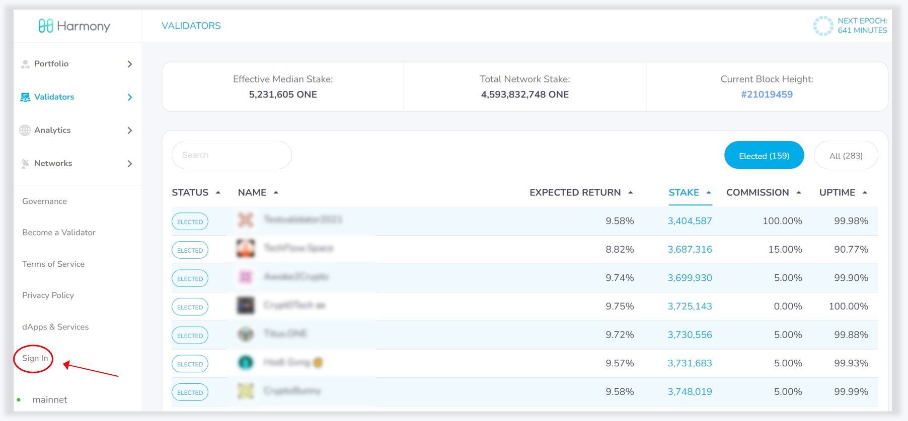
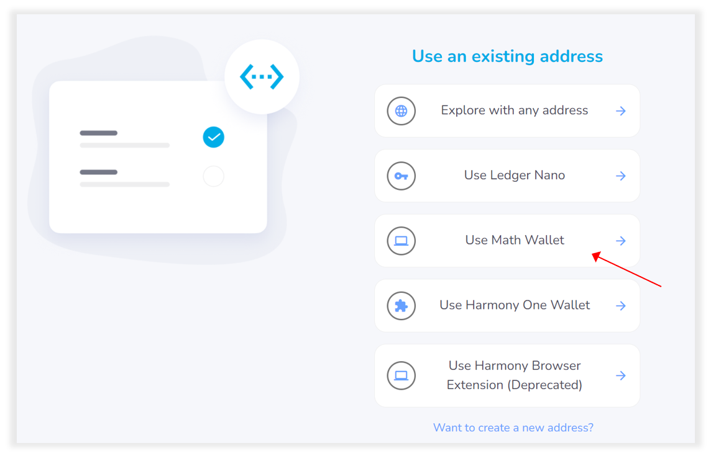
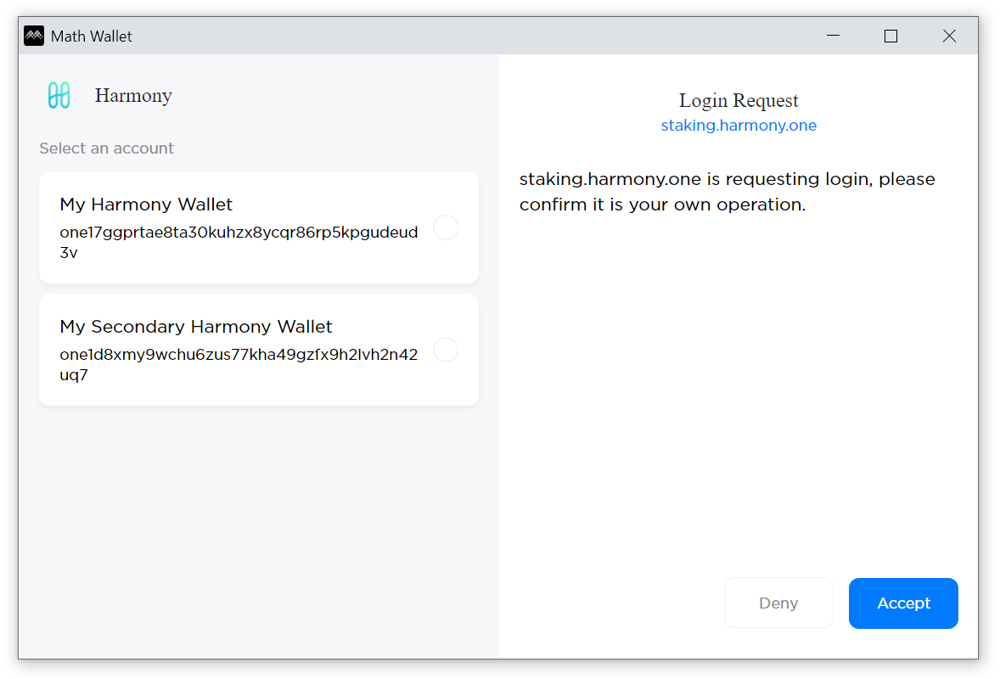
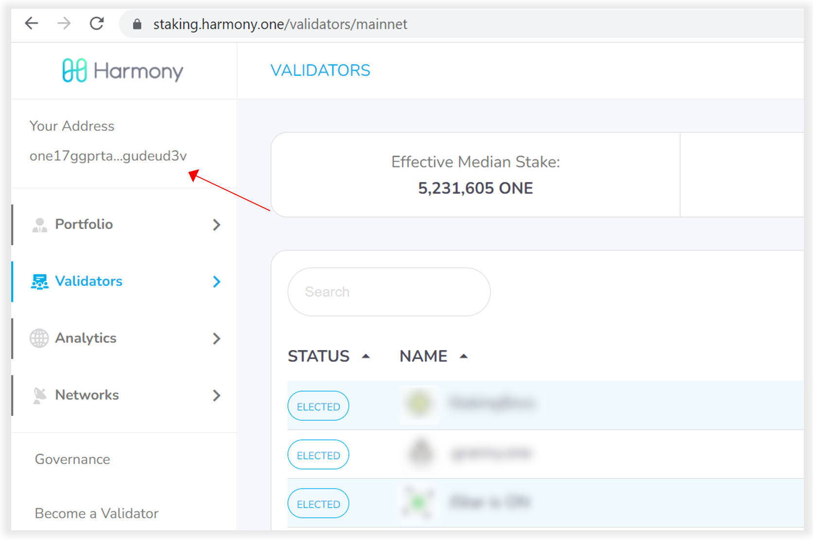
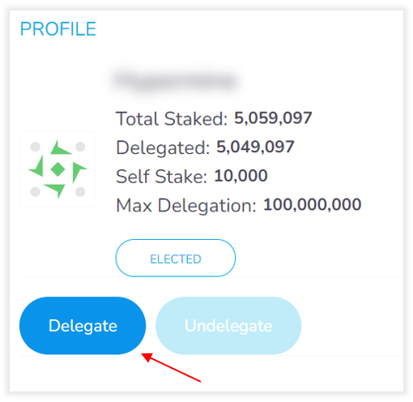
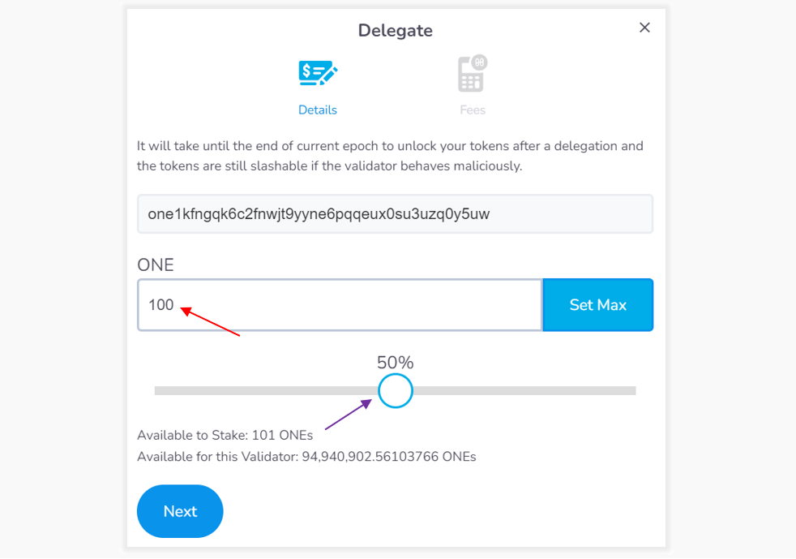
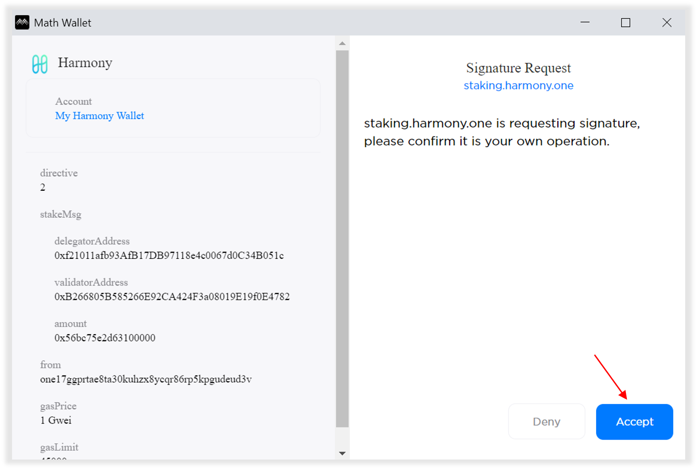
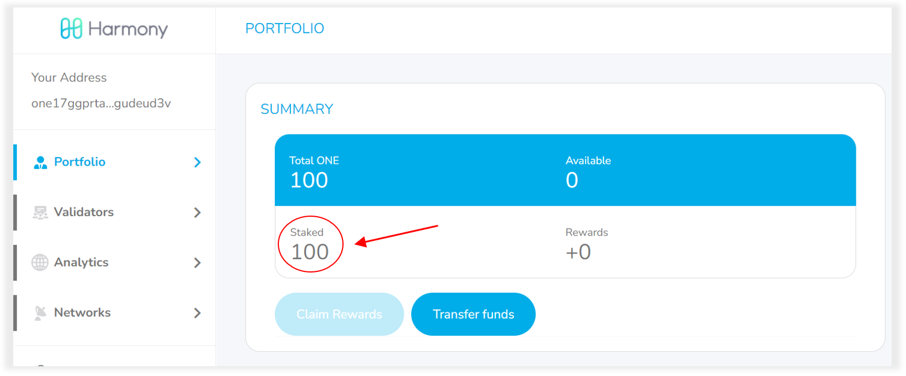

# Staking Transactions via Math Wallet

Visit the staking dashboard at [https://staking.harmony.one/](https://staking.harmony.one) and click **Sign In**.&#x20;

The screen will prompt you to make a selection.

Choose "**Use an Existing Address**".

Click "**Use Math Wallet**" from the next selection of options and then click "**Sign In**".

Sign in to your Math Wallet browser extension. You will see a Login Request pop up. Select your wallet and then click **Accept**.

You will be brought back to the **Validator** page of Staking Dashboard. You will be able to see your address on the top left corner under the Harmony logo which means you are now signed in to your account.

Locate and **click** on your preferred validator from the list.&#x20;

The validator profile page will open. Click on the **Delegate** button.&#x20;

**Option #1:** Enter the desired amount of tokens you would like to delegate and click next or...

**Option #2:** Use the slider to determine the percentage of your ONE you wish to stake.

Click **Next** and then click **Confirm and Sign**.

Click **Accept** to confirm the signature request on the Math Wallet pop-up window and wait a few seconds. If the transaction completes, you will find a success confirmation pop-up on your screen.

You are now staking your ONE with a validator and will begin earning rewards at the start of the following epoch.&#x20;

Click the **Portfolio** link on the left to view your stake amount, rewards accumulated, and a list of any validator to whom you have delegated your coins.

