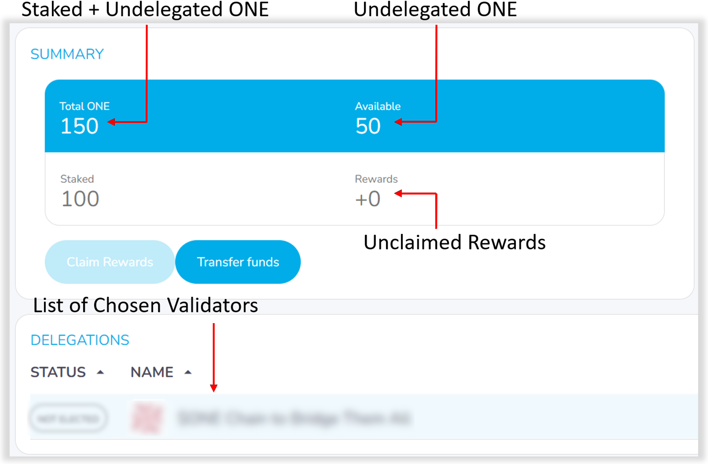
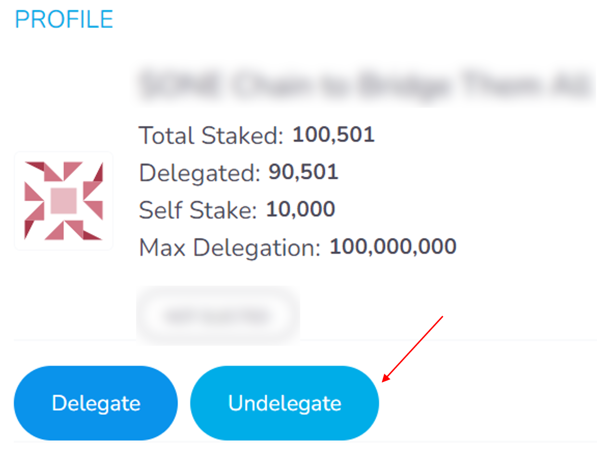
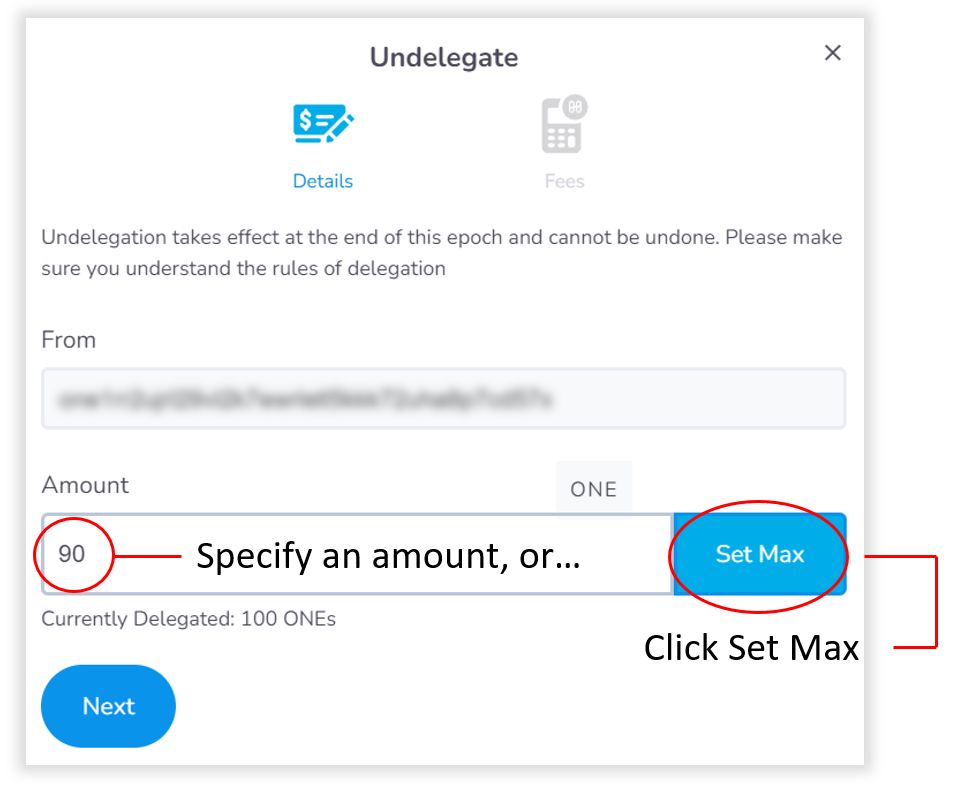
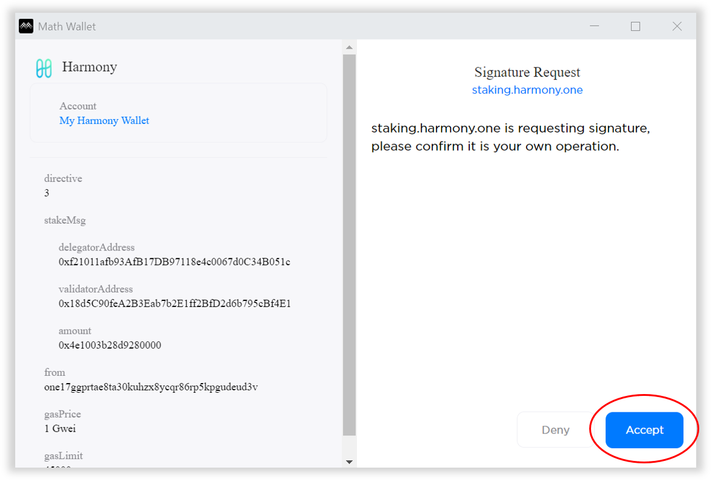
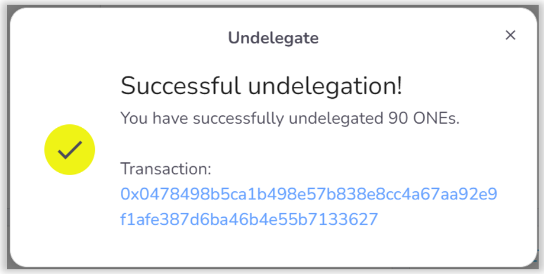

# Undelegating

Visit and sign into the staking dashboard at [https://staking.harmony.one/](https://staking.harmony.one), if you are signed out.

Click on the **Portfolio** link to the left.&#x20;

This page will display information about your staked ONE including a list of validators to which you've delegated your ONE, amount of staked ONE, and unclaimed rewards.

You can undelegate from one or more validators where your ONE is staked.

From the Portfolio view, select the validator(s) from which you wish to undelegate by clicking on their validator name. This brings up the validator profile page.

Click the **Undelegate** button.&#x20;

You will be prompted to specify how much you wish to undelegate from the validator. From here, specify an amount you wish to undelegate or click **Set Max** to undelegate all ONE from the validator.

Click **Next** and then click **Confirm and Sign**. This will open a window for Math Wallet.&#x20;

Click the **Accept** button to sign your undelegation / unstaking transaction.

You should see a notification for your successful undelegation.

Your ONE is now undelegated from the validator. You may have more ONE staked with other validators. To undelegate fully, repeat these steps again through the list of validators on your Portfolio page.
