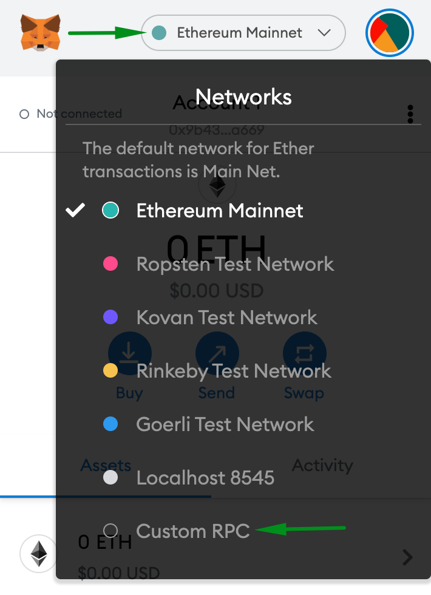
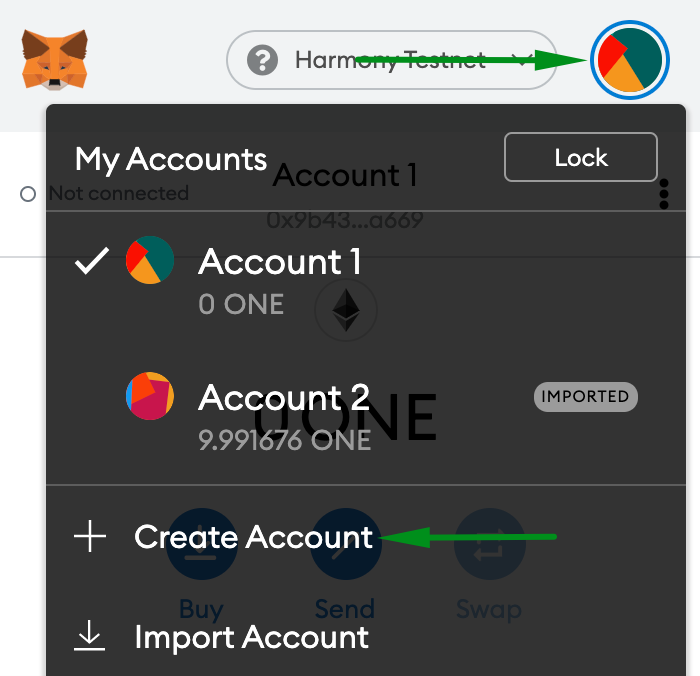
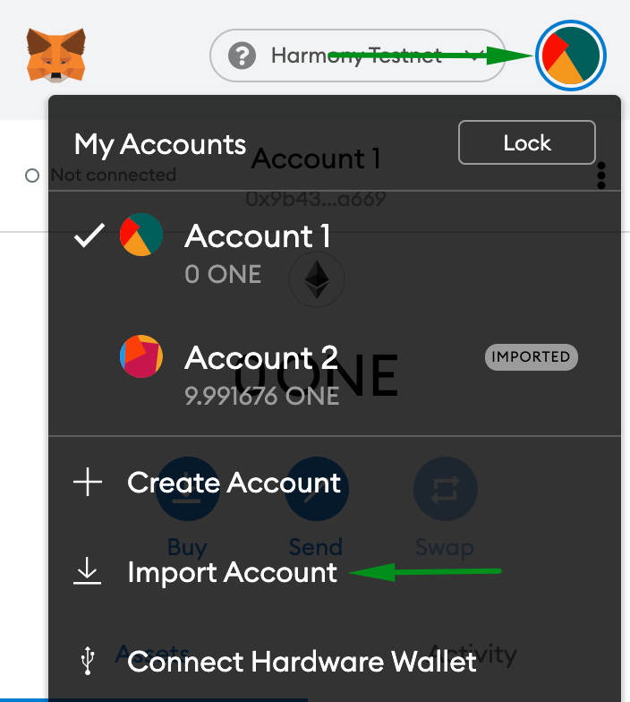
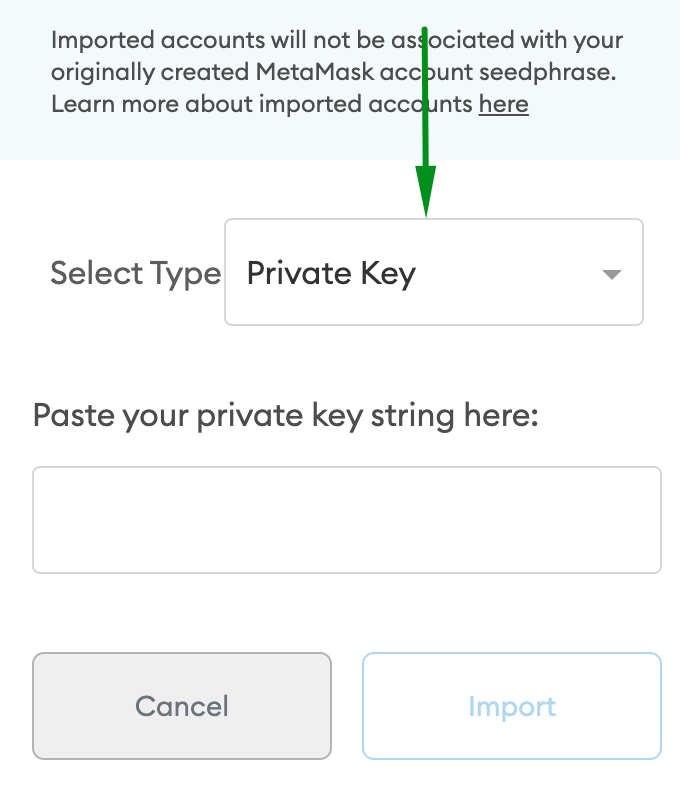
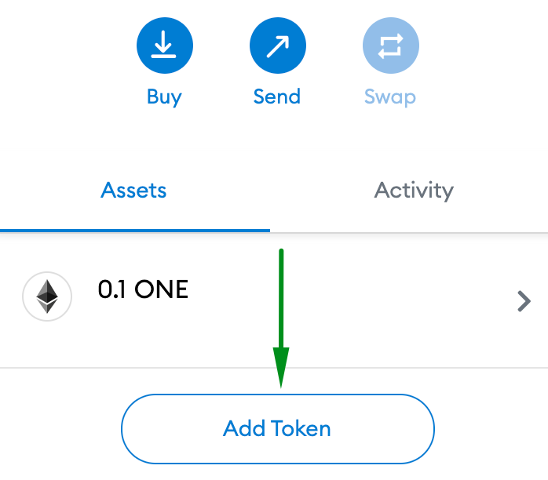
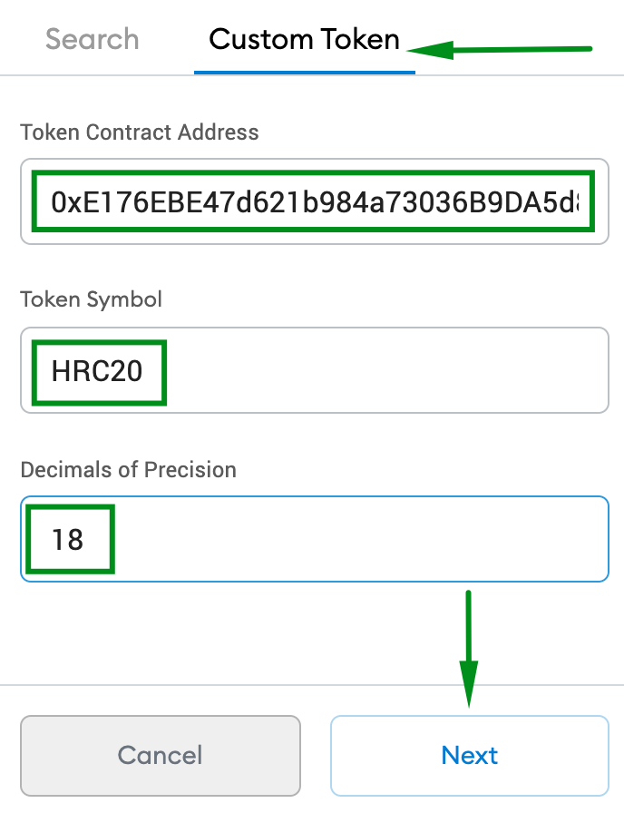

# Metamask

MetaMask is an extension for accessing Harmony enabled distributed applications, or "Dapps" in your browser!

The extension injects the Harmony web3 API into every website's javascript context, so that dapps can read from the blockchain.

## Installing Metamask

Click [here](https://chrome.google.com/webstore/detail/metamask/nkbihfbeogaeaoehlefnkodbefgpgknn) to install the Metamask extension on your browser. It can be installed using the Google Chrome Browser. Just click on the installation button and it should be automatically installed.

## Setting up Metamask

By default Metamask supports the Ethereum blockchain, but since Harmony is EVM compatible it can be used the same way by setting a custom RPC endpoint.

### 1. Adding a Custom RPC Endpoint

In order to connect to the Harmony Network, a custom RPC Endpoint needs to be added. On top click on the network you are connected to and then select **Custom RPC**:

### 2. Filling the Endpoint Information

Fill it accordingly to the Harmony Network and shard you want to connect to.


Use the RPC URL of Shard 0 if you want to send/receive transactions from exchanges or do any staking transaction type.


<table>
  <thead>
    <tr>
      <th style="text-align:left">Field</th>
      <th style="text-align:left">Mainnet</th>
      <th style="text-align:left">Testnet</th>
    </tr>
  </thead>
  <tbody>
    <tr>
      <td style="text-align:left"><b>Network Name</b>
      </td>
      <td style="text-align:left">Harmony Mainnet</td>
      <td style="text-align:left">Harmony Testnet</td>
    </tr>
    <tr>
      <td style="text-align:left"><b>New RPC URL</b>
      </td>
      <td style="text-align:left">
        
https://api.harmony.one

        
https://s1.api.harmony.one

        
https://s2.api.harmony.one
           https://s3.api.harmony.one

      </td>
      <td style="text-align:left">
        
https://api.s0.b.hmny.io

        
https://api.s1.b.hmny.io

        
https://api.s2.b.hmny.io

        
https://api.s3.b.hmny.io

      </td>
    </tr>
    <tr>
      <td style="text-align:left">
        
<b>Chain ID</b>
        

        
(use number only)

      </td>
      <td style="text-align:left">
        
Shard 0: <code>1666600000</code>
        

        
Shard 1: <code>1666600001</code>
        

        
Shard 2: <code>1666600002</code>
        

        
Shard 3: <code>1666600003</code>
        

      </td>
      <td style="text-align:left">
        
Shard 0: <code>1666700000</code>
        

        
Shard 1: <code>1666700001</code>
        

        
Shard 2: <code>1666700002</code>
        

        
Shard 3: <code>1666700003</code>
        

      </td>
    </tr>
    <tr>
      <td style="text-align:left"><b>Currency symbol (optional)</b>
      </td>
      <td style="text-align:left">ONE</td>
      <td style="text-align:left">ONE</td>
    </tr>
    <tr>
      <td style="text-align:left"><b>Block Explorer URL (optional)</b>
      </td>
      <td style="text-align:left"><a href="https://explorer.harmony.one/#/">https://explorer.harmony.one/</a>
      </td>
      <td style="text-align:left"><a href="https://explorer.pops.one/#/">https://explorer.pops.one/</a>
      </td>
    </tr>
  </tbody>
</table>


In order to configure Metamask with Binance Smart Chain \(BSC\) check the documenation [here](https://docs.binance.org/smart-chain/wallet/metamask.html).


The example below shows the configuration that needs to be done to connect to Harmony Mainnet on Shard 0:

Click now on the Save button and your configuration should be done!

## Creating a New Account

In order to create a new account, click on the icon on top as shown by the image below and then on **Create Account**:

On next window, fill it with the account you want to choose and click on **Create** button. You should have succesfully created a new account!

## Importing an Account

### 1. Using a Private Key

Click on the icon on top as shown by the image below and then on **Import Account**:

On next window, select the option to import from a Private Key, paste your key and click on **Import** button:

You should have successfully imported your account from the Private Key!

## Regular Transactions


Since Metamask does not allow you to send transactions to addresses starting with "**one1**", you need to get the equivalent **0x** address of this same address. For that, follow the procedures below.


### Getting the 0x Equivalent Address

* Go to [https://explorer.harmony.one/\#/](https://explorer.harmony.one/#/) \(Mainnet\) or [https://explorer.pops.one/\#/](https://explorer.pops.one/#/) \(Testnet\) and search for your address
* On top of the blockexplorer toogle the address format from ONE to ETH

* Copy the **0x** address format by clicking on the small icon right to the address

### Sending a Regular Transaction

To send a transaction on Metamask click on **Send** button and on next window copy paste the destination address starting with **0x**, fill the amount you want to send, click on **Next** and then on **Confirm**.

### Receiving a Regular Transaction

In order to receive a transaction, just share the **0x** address format. One Wallet supports sending regulars transactions to either addresses starting with **0x** or **one1**.

## HRC20/HRC721 Transactions

### Adding a Custom Token

On Metamask click on **Add Token** and on next window select **Custom Token**. Fill it with the contract address starting with **0x**, Token Symbol of the token and the Decimals of Precision which is usually 18:

Now click on **Next** and then **Add Tokens.** Your custom HRC20 Token will show up on a new page. It will also be available on the main Metamask window on the Assets tab.

### Sending a HRC20/HRC721 Transaction

Click on the asset you want to send your tokens from on the Asset tab. Click on **Send** button and on next window copy paste the destination address starting with **0x**, fill the amount you want to send, click on **Next** and then on **Confirm**.

### Receiving a HRC20/HRC721

In order to receive a transaction, just share the **0x** address format of your wallet. One Wallet supports sending HRC20/HRC721 transactions to either addresses starting with **0x** or **one1**.

## 1-Click for using Metamask on Harmony Mainnet

Applications can provide 1-click access to the Harmony mainnet. An example of this implementation is by Sushi where users can easily go from Ethereum to Harmony: [https://app.sushi.com/swap](https://app.sushi.com/swap)

Click on the top right where it says "Harmony" and it will open a simple drop down menu to select the network you want to use Sushi on.

