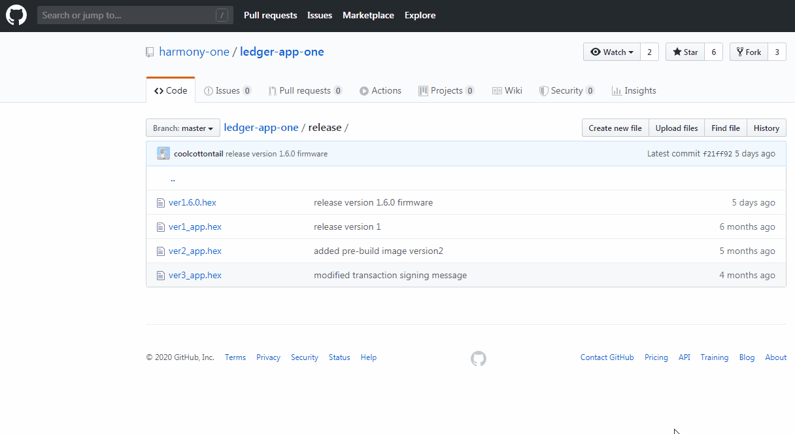

# Download & Setup


Currently Harmony is available only on Ledger Nano S. Please use preferably the "Installing using Ledger Live" method, as this is the easiest way to get your Harmony App installed on Ledger.


## Installing using Ledger Live \(RECOMMENDED\)

### **1. Turn on Developer**

Download and install the latest Ledger Live version onto your computer. Ledger Live is the app you use to manage your Ledger device.  Please follow the official installation instruction [here](https://support.ledger.com/hc/en-us/articles/360006395553).


Make sure to i[nstall the latest firmware](https://support.ledgerwallet.com/hc/en-us/articles/360002731113) on your device. This ensures compatibility with the Harmony app.


Open Ledger Live,  select Manager.  Turn on **Developer Mode** in Manager: Settings -&gt; Experimental Features -&gt; Developer Mode, as shown below:


### **2. Search for the App in the Catalog**

Ledger live provides app catalog for different types of apps, as shown below:


To find the Harmony app, type **harmony** in the search bar, as shown below:


### **3. Install/Remove the App**

There are two buttons associated with Harmony One app. The **install** button can be clicked to install Harmony One app to Ledger Nano. The app can be uninstalled by clicking the trash bin button.


### **4. Using the App**

To use Harmony One app, please check your Ledger Nano device and click both buttons to open the app.


## Installing Manually \(Windows\)


These instructions are only for advanced users who want to install Ledger manually.


### 1. Install Python

To install Python 3.8.1 for windows, go to this [website](https://www.python.org/downloads/release/python-381/). 


This is the latest version as 18th Jan 2019 that was tested, newer version could work or not‌.ese instructions install version 1.6.0. If you want to install another version, change the parameters on step 3.


At the end make sure you add the python binary to the path:


### 2. Install Packages

Execute the commands below on the windows terminal:

```bash
python -m pip install --upgrade pip
pip install virtualenv
virtualenv venv
cd venv
cd Scripts
Activate.bat
pip install ledgerblue
```

### 2. Download Latest Version

Click [here](https://github.com/harmony-one/ledger-app-one/tree/master/release) to download the latest avaialable version. Make sure you download it using the raw format from Github like shown below:



### 3. Install the App


These instructions install version 1.6.0. If you want to install another version, just download the corresponding version and change the parameters below accordingly.


Move the `ver1.6.0.hex` file downloaded before to`venv\Scripts` folder and execute the command below to install the app:

```bash
python -m ledgerblue.loadApp --appFlags 0x40 --path "44'/1023'" --curve secp256k1 --tlv --targetId 0x31100004 --targetVersion="1.6.0" --delete --fileName ver1.6.0.hex --appName One --appVersion 1.6.0 --dataSize 0 --icon 01ffffff00ffffff00ffffffffffffc7e1bbcdbbddbbcdbbc50bd8a3ddbbddbbddb3edc7e3ffffffff
```

Confirm the installation of the app on your Ledger.

## Installing Manually \(Ubuntu Linux\)


These instructions are only for advanced users who want to install Ledger manually.


### 1. Install Packages

```bash
sudo apt update
sudo apt install libudev1 libudev-dev libusb-1.0-0-dev python3-dev python3-pip python3-testresources git
sudo pip3 install -U setuptools
sudo pip3 install virtualenv
virtualenv -p python3 venv
source venv/bin/activate
pip install ledgerblue
```

### 2. Downloading the App

```bash
git clone https://github.com/harmony-one/ledger-app-one
cd ledger-app-one
```

### 3. Installing the App


These instructions install version 1.6.0. If you want to install another version, change the parameters below for any version available on the `release` folder.


```bash
sudo ~/venv/bin/python -m ledgerblue.loadApp --appFlags 0x40 --path "44'/1023'" --curve secp256k1 --tlv --targetId 0x31100004 --targetVersion="1.6.0" --delete --fileName release/ver1.6.0.hex --appName One --appVersion 1.6.0 --dataSize $((0x`cat debug/app.map |grep _envram_data | tr -s ' ' | cut -f2 -d' '|cut -f2 -d'x'` - 0x`cat debug/app.map |grep _nvram_data | tr -s ' ' | cut -f2 -d' '|cut -f2 -d'x'`))  --icon 01ffffff00ffffff00ffffffffffffc7e1bbcdbbddbbcdbbc50bd8a3ddbbddbbddb3edc7e3ffffffff
```

Confirm the installation of the app on your Ledger.

