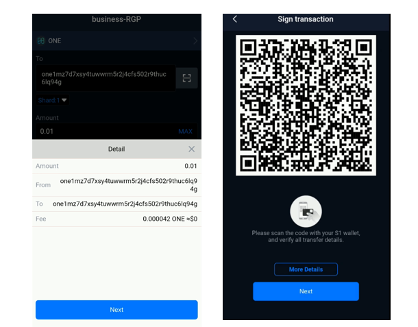

# Send transaction

## How to send ONE in SafePal？

1. Click on the 'Send' segment in SafePal App menu bar and select ONE.

1. Input the destination address by pasting the address or scanning the QR code. Enter all transaction details - amount, fee and don't forget to select the shard number.

1. Then clink “Send”to check the transaction details.

Tips: If you don't know the exact shard number, don't worry, you can simply use Shard 0 as the default shard.

1. Sign the order with your SafePal S1 hardware wallet.

1. Confirm the payment.The transfer is broadcasted on chain. Don't forget to check transfer status later.

{% embed url="https://www.dropbox.com/s/uo80rhxy0pnu9sa/SafePal%20Teaser.mp4?dl=0" caption="" %}

## How to receive ONE in SafePal?

To receive ONE tokens you need to provide the sender your ONE address which can be found using the SafePal app or wallet.

Using the SafePal App:

1. Select ONE which gives you the option of receive and send, click on receive 
2. You can either copy your ONE address for the wallet, save the QR code, or have the other party scan the QR code from your phone 

Using the SafePal Wallet:

1. Turn on the wallet 
2. Scroll to "Asset Management" in the main menu
3. Select "Harmony" out of all the options 
4. Click on receive, and then enter your PIN code
5. Your QR code, as well as the ONE address for the wallet will show for the other party to use

