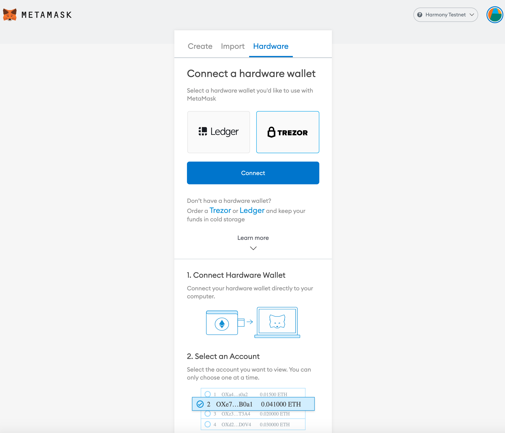
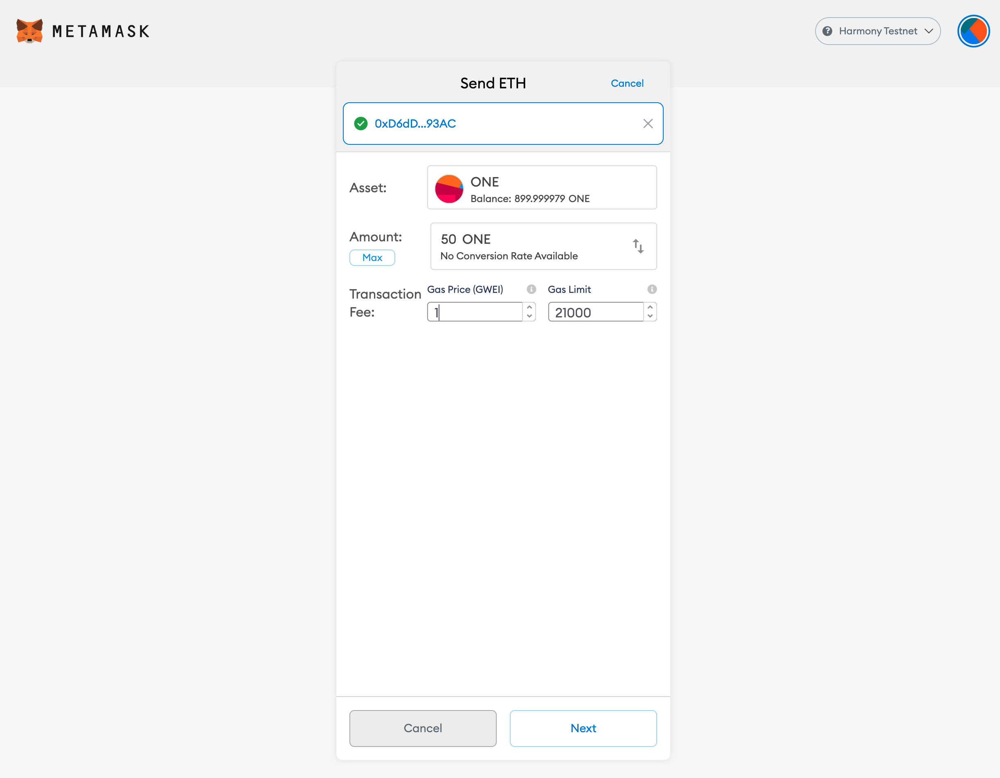
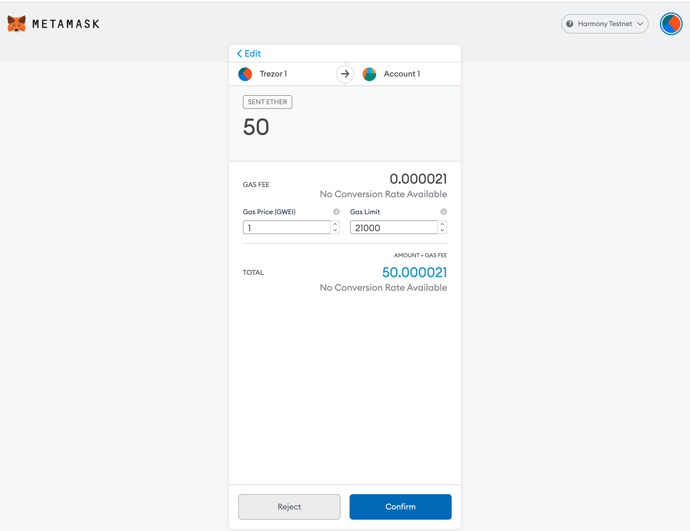

# Trezor

Trezor wallet can be used along with Metamask to perform ONE transfers on Harmony network. Follow the steps below.

Note that, load the Ethereum firmware \(or app\) for signing the transactions on the trezor device. Currently, Harmony does not have a separate trezor firware. There is a [bounty](https://github.com/harmony-one/bounties/issues/29) for adding Harmony to trezor firmware. After this bounty is finished, the users will be able to both transfer ONE and perform staking using trezor using Harmony firmware \(or app\). 

