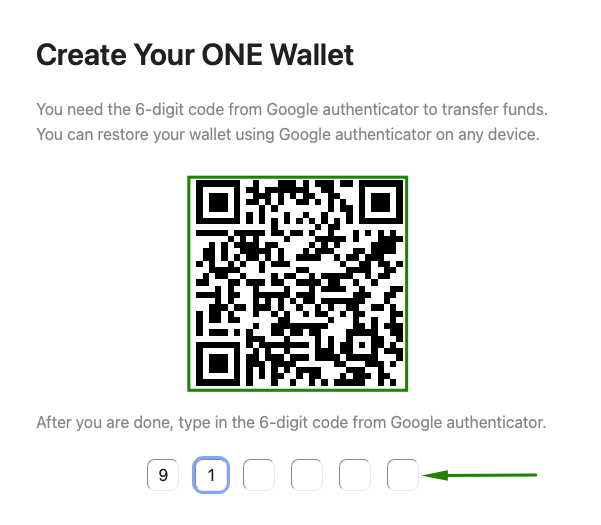
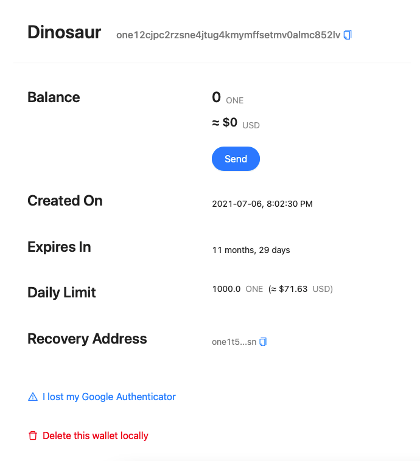

# User Guide

1Wallet: [1wallet.crazy.one](https://1wallet.crazy.one)

## Creating Your ONE Wallet

First, make sure to have Google Authenticator installed on your mobile device. Click on button **Create** and a QR Code similar to the image below will show up. Scan this QR Code using Google Authenticator app and type the random 6-digit code.

After inputing the 6-digit code you will be redirected to a new window. Fill the recovery address and click on **Create Now**.


Make sure to setup a recovery address you have the keys of. This is in the case you lose access to Google Authenticator.


If everything went alright you should see your wallet created:

## Videos



