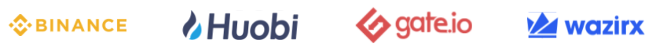
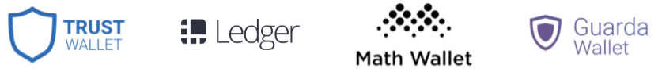
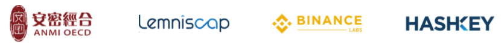

# Ecosystem

## Exchanges

Buy ONE Tokens From 9 Exchanges







































## Wallets

Secure ONE Tokens In 6 Wallets



























## Stakers

Delegate ONE Tokens To 16 Pools







































































## Partners

Integrate ONE Tokens With 9 Partners







































## Investors

Backed By 17 Global Investors







































































