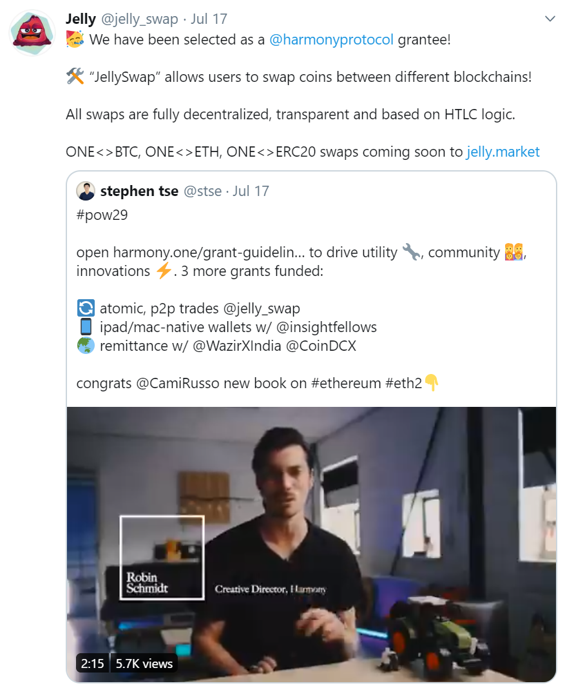

# DEX/Swaps

## [ViteX](https://vitex.net/)

A decentralized exchange developed by a company registered in the British Virgin Islands.

## [Switchain](https://www.switchain.com/)

Get the best cryptocurrency exchange rates with Switchain, the instant cryptocurrency exchange.

## [Jelly Swap](https://jelly.market/)

Platform for ONE token holders to convert their tokens into other crypto and fiat pairs with atomic swaps.

## Sesameseed Udex

Decentralized exchange for HRC20 token holders to convert tokens through automated price discovery, liquidity pools.

